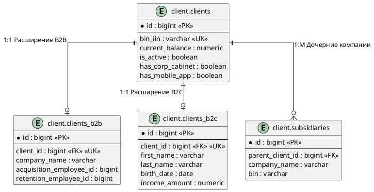
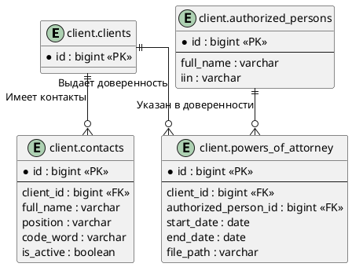
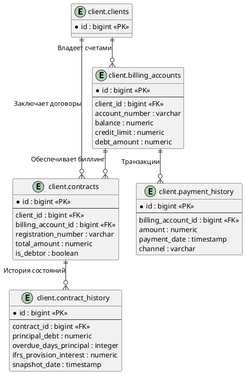
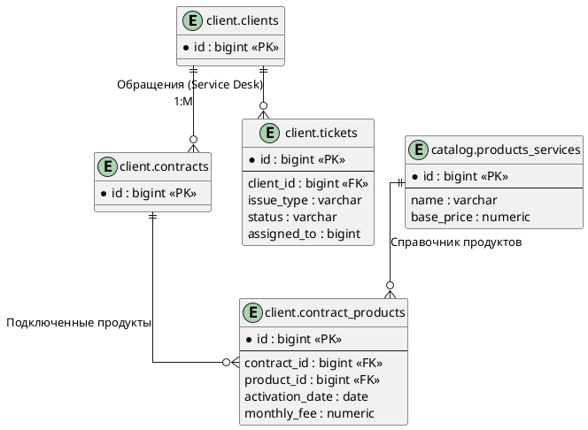
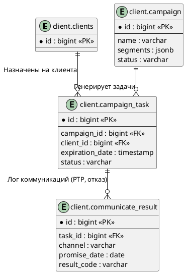
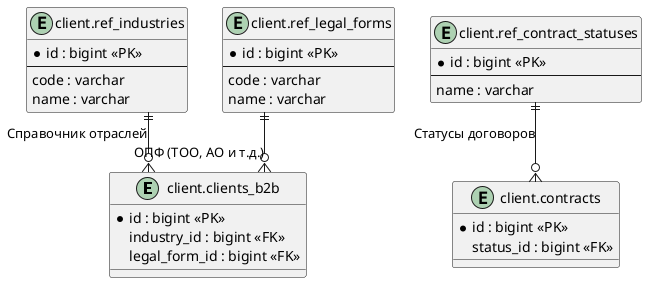

### Модуль 1: Ядро клиентов (Client Core)

**1. `client.clients`**

* **Назначение:** Главная мастер-таблица для хранения базовой информации обо всех клиентах (универсальная сущность, объединяющая физических и юридических лиц).
* **Основные поля:** `id` (PK), `bin_iin` (уникальный идентификатор БИН/ИИН), `current_balance`, `is_active`, флаги наличия мобильного приложения и корпоративного кабинета (`has_mobile_app`, `has_corp_cabinet`).
* **Связи:** Связана отношениями "один-к-одному" с расширяющими таблицами (`clients_b2b`, `clients_b2c`). Выступает как родительская сущность (Foreign Key) почти для всех остальных сущностей в схеме.
* **Роль в системе:** Обеспечивает единую точку входа (Single Source of Truth) для финансового и биллингового состояния клиента.

**2. `client.clients_b2b`**

* **Назначение:** Хранение специфичных атрибутов клиентов корпоративного сегмента (юридические лица).
* **Основные поля:** `client_id` (уникальный FK), `company_name`, `payment_terms`, идентификаторы индустрии, сегмента и менеджеров (`acquisition_employee_id`, `retention_employee_id`).
* **Связи:** 1:1 к `clients.id`.
* **Роль в системе:** Сегментация B2B профиля, закрепление менеджеров по продажам (Acquisition) и удержанию (Retention).

**3. `client.clients_b2c` / `client.individual_clients`**

* **Назначение:** Хранение персональных данных физических лиц.
* **Основные поля:** Имя, ИИН, гендер, дата рождения, хеш пароля, уровень и источник дохода (`income_amount`), статус ИИН, резидентство.
* **Связи:** 1:1 к `clients.id`.
* **Роль в системе:** Управление профилем розничного клиента B2C сегмента, хранение KYC-данных (Know Your Customer) для оценки платежеспособности.

**4. `client.subsidiaries`**

* **Назначение:** Таблица для выстраивания иерархии юридических лиц (дочерних компаний).
* **Основные поля:** `parent_client_id` (FK на родительскую компанию), `company_name`, `bin`.
* **Связи:** "Многие-к-одному" к таблице `clients` (иерархическая связь).
* **Роль в системе:** Учет структуры холдингов и филиальных сетей в B2B продажах.

---

### Модуль 2: Контактные лица и представители (Contacts & Representatives)

**5. `client.contacts`**

* **Назначение:** Хранение списка контактных лиц (сотрудников) со стороны клиента.
* **Основные поля:** ФИО, должность, кодовое слово (`code_word`), `is_active`, идентификатор роли.
* **Связи:** "Многие-к-одному" к `clients.id`.
* **Роль в системе:** Обеспечение авторизации и верификации лиц, с которыми ведутся переговоры или которые имеют доступ к услугам.

**6. `client.authorized_persons` и `client.powers_of_attorney`**

* **Назначение:** Учет доверенных лиц и выданных им доверенностей.
* **Основные поля:** Данные представителя, тип доверенности, даты начала и окончания (`start_date`, `end_date`), сканы документов (`file_path`).
* **Связи:** Доверенность связывает `client_id` (компанию), `contact_id` / `authorized_person_id` (лицо) по принципу "многие-ко-многим" с историчностью.
* **Роль в системе:** Юридическое разграничение прав действий от лица компании (важно для B2B телекома и финтеха).

---

### Модуль 3: Договоры, Биллинг и Финансы (Contracts & Billing)

**7. `client.contracts`**

* **Назначение:** Учет всех заключенных договоров с клиентами.
* **Основные поля:** `registration_number` (уникальный), даты, статусы, `billing_account_id`, `balance`, `is_debtor` (флаг должника), `total_amount`.
* **Связи:** "Многие-к-одному" к `clients`, связь с `billing_accounts` и внутренними менеджерами.
* **Роль в системе:** Управление жизненным циклом контрактов, контроль задолженностей и привязка к биллинговым счетам.

**8. `client.contract_history`**

* **Назначение:** Хранение исторических срезов по контрактам и кредитным показателям (включая МСФО/IFRS).
* **Основные поля:** Суммы долга (`principal_debt`, `interest_debt`), просрочка (`overdue_days_principal`), резервы по МСФО (`ifrs_provision_interest`), статусы взыскания (`collection_status`).
* **Роль в системе:** Мощный аналитический и аудиторский лог для скоринга, работы с просроченной задолженностью (NPL) и финансовой отчетности.

**9. `client.billing_accounts`**

* **Назначение:** Управление лицевыми счетами клиентов.
* **Основные поля:** `account_number`, `balance`, `debt_amount` (сумма долга), `credit_limit` (кредитный лимит).
* **Роль в системе:** Финансовый движок (Ledger-уровень), определяющий доступность услуг на основе текущего баланса и кредитных лимитов.

**10. `client.payment_history` и `client.payment_schedule`**

* **Назначение:** Хранение транзакций (платежей) и графиков погашения.
* **Основные поля:** Суммы, валюта, каналы оплат (`channel`), комиссии, даты платежей по графику.
* **Роль в системе:** Обеспечение прозрачности расчетов, сверка взаиморасчетов (Reconciliation).

---

### Модуль 4: Продукты, Услуги и Инциденты (Products, Services & ITSM)

**11. `client.contract_products` и `client.client_products`**

* **Назначение:** Маппинг подключенных услуг (тарифов, кредитных продуктов) на клиента/контракт.
* **Основные поля:** Идентификаторы продукта, даты активации/деактивации, разовые и абонентские платы (`one_time_fee`, `monthly_fee`), скидки (`discount`).
* **Связи:** Промежуточные таблицы "многие-ко-многим" между `contracts`/`clients` и каталогом `products_services`.
* **Роль в системе:** Биллинг услуг, расчет начислений, контроль подписок (Subscriptions).

**12. `client.activities` и `client.tickets`**

* **Назначение:** Учет обращений и активностей (Service Desk / CRM).
* **Основные поля:** Тип активности, тема, описание, статус, `assigned_to` (на кого назначено).
* **Связи:** Привязка к `client_id` (один-ко-многим).
* **Роль в системе:** Отслеживание истории обслуживания, фиксация жалоб, интеграция с внешними системами через `external_ticket_id`.

---

### Модуль 5: Кампании и Collection (Campaigns & Debt Collection)

*Это обширный модуль, ориентированный на исходящие коммуникации и работу с должниками.*

**13. `client.campaign`, `client.campaign_task`, `client.schedule_campaign`**

* **Назначение:** Настройка и маршрутизация исходящих кампаний (обзвоны, рассылки, взыскание).
* **Основные поля:** Сегменты (`segments` в JSONB), статус, приоритеты, дедлайны (`expiration_date`), привязка к расписаниям и скилл-группам (`skill_group_id`).
* **Связи:** Задачи создаются для связки "Клиент - Менеджер/Робот - Кампания".
* **Роль в системе:** Автоматизация массовых коммуникаций (Soft/Hard Collection, Cross-sell).

**14. `client.communicate_result` и `client.call_result`**

* **Назначение:** Логирование результатов контакта с клиентом.
* **Основные поля:** Тип канала (`channel`), статус обещания об оплате (`promise_date` - Promise To Pay), итог разговора (`result`).
* **Роль в системе:** Оценка эффективности менеджеров (операторов), построение воронок возврата долгов или продаж.

---

### Модуль 6: Справочники и метаданные (References / Dictionaries)

В схеме присутствуют десятки таблиц-справочников с префиксом `ref_` (например, `ref_address_types`, `ref_currencies`, `ref_contract_statuses`, `ref_departments`).

* **Роль в системе:** Нормализация данных, ограничение ввода (через FK), хранение статических значений для drop-down списков на UI.

---

### Общая архитектурная концепция базы данных

**Ключевые архитектурные паттерны БД:**

1. **Multi-segment Design:** Разделение логики B2B и B2C на уровне таблиц (Class Table Inheritance) с сохранением общего ядра (`clients`), что позволяет гибко развивать атрибутивный состав для юрлиц и физлиц независимо.
2. **Audit & Compliance Ready:** Строгое отслеживание исторических изменений в контрактах (`contract_history`) и доверенностях (`poa_change_history`), что соответствует требованиям финрегуляторов.
3. **JSONB для гибкости:** Использование типа `jsonb` в таблице `segment` (условия выборки) позволяет динамически формировать правила скоринга и обзвона без изменения схемы БД (NoSQL подход внутри реляционной базы).
4. **Событийно-ориентированная структура:** Таблицы `communicate_result` и логи задач явно указывают на интеграцию с внешней платформой контакт-центра (Cisco/Avaya/Asterisk) и системами IVR/Роботов (`schedule_campaign_robot`).
