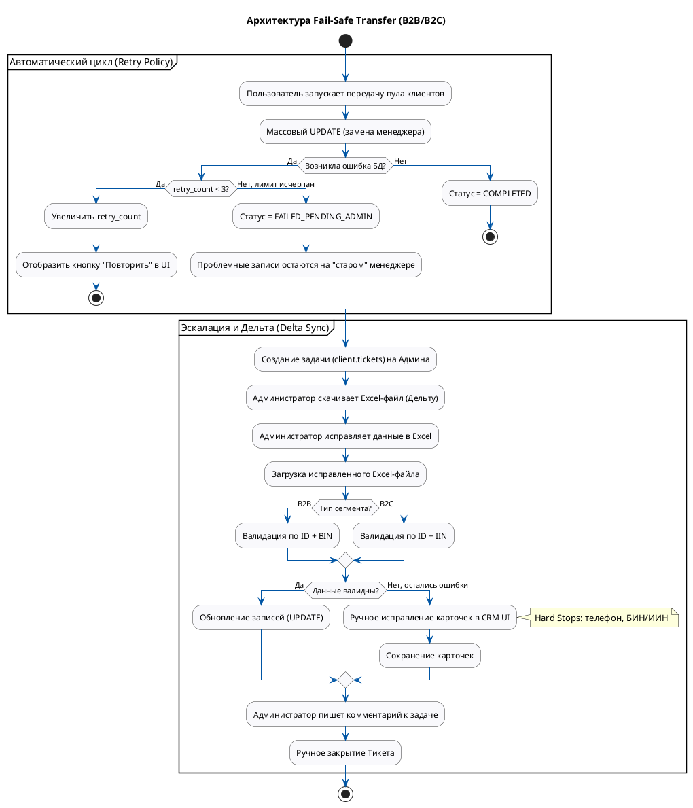

# Техническое задание: Модуль «Универсальное делегирование клиентов (Fail-Safe Transfer)»

**Система:** SapaCRM

**Версия:** 1.2 (B2B & B2C Unified Architecture & Data Mapping)

**Область применения:** Массовая передача портфеля клиентов (юрлиц и физлиц) при изменении ответственного сотрудника.

---

## 1. Общая информация и бизнес-правила

Модуль предназначен для безопасной и массовой передачи пула клиентов от одного ответственного сотрудника к другому с защитой от потери данных при системных сбоях.

**Ключевые бизнес-правила:**

1. **Универсальность:** Модуль обслуживает как сегмент B2B (`client.clients_b2b`), так и сегмент B2C (`client.clients_b2c`), используя единую архитектуру истории передач.
2. **Игнорирование SLA (B2C):** При технической массовой смене ответственного (через данный модуль) таймеры SLA для переданных клиентов **не учитываются** и не перезапускаются. Распределение считается техническим трансфером, а не поступлением новых лидов.
3. **Сохранение целостности:** При сбоях БД клиенты не «повисают в воздухе», а остаются закрепленными за предыдущим ответственным до ручного вмешательства администратора.

---

## 2. Архитектура процесса и обработка ошибок

### 2.1. Автоматический цикл (Retry Policy)

* **Инициация:** Система выполняет массовый `UPDATE` ответственного сотрудника (`users.users.id`) в целевых таблицах БД.
* **Механизм повторов:** При ошибке БД (нарушение констрейнтов) счетчик `retry_count` увеличивается.
* **Лимит:** Пользователю доступно **максимум 3 попытки** повторного запуска.
* **Эскалация:** На 4-й раз процесс останавливается, статус меняется на `FAILED_PENDING_ADMIN`.

### 2.2. Эскалация (Tickets)

* **Авто-тикет:** Система автоматически создает задачу в таблице `client.tickets` на роль «Администратор».
* **Контекст задачи:** В описании выводится сводка ( *«Успешно: 9987, Ошибок: 13»* ) и ссылка на лог дебаггера.

### 2.3. Обработка дельты (Delta Sync)

* **Выгрузка (Экспорт):** Из тикета скачивается Excel-файл, содержащий **только строки с ошибками** и причины из лога.
* **Двойной замок (Ключи сопоставления):** При обратном импорте исправленного файла система обновляет записи строго при совпадении двух параметров:
  * Для B2B: `ID` + `BIN`
  * Для B2C: `ID` + `IIN`

---

## 3. BPMN Диаграмма процесса

**Фрагмент кода**



---

## 4. Маппинг базы данных и Архитектура

### 4.1. Новая таблица: `client.transfer_history`

Центральная таблица логирования процесса делегирования.

| **Поле**   | **Тип данных БД** | **Описание / Источник**                                  |
| -------------------- | ---------------------------------- | ------------------------------------------------------------------------------ |
| `id`               | `bigint (PK)`                    | Идентификатор операции (Auto-generated).                  |
| `client_type`      | `varchar(10)`                    | Дискриминатор:`'B2B'`или `'B2C'`.                          |
| `from_employee_id` | `bigint (FK)`                    | ID старого сотрудника (ссылка на `users.users.id`). |
| `to_employee_id`   | `bigint (FK)`                    | ID нового сотрудника (ссылка на `users.users.id`).   |
| `entity_ids`       | `jsonb`                          | Массив ID переносимых клиентов.                       |
| `status`           | `varchar(50)`                    | `COMPLETED`,`FAILED_RETRY_LIMIT`,`FAILED_PENDING_ADMIN`.                 |
| `retry_count`      | `int`                            | Счетчик повторов (0-3).                                         |
| `last_error_text`  | `text`                           | Текст ошибки из Exception Message БД.                           |
| `error_log_link`   | `varchar(255)`                   | Ссылка на подробный лог (S3/Kibana).                       |

### 4.2. Модификация: `client.tickets`

Связь задачи администратора с процессом передачи.

| **Добавляемое поле** | **Тип данных БД** | **Описание**                                   |
| ----------------------------------------- | ---------------------------------- | ------------------------------------------------------------ |
| `transfer_id`                           | `bigint (FK)`                    | Внешний ключ на `client.transfer_history.id`. |

*(Поля `title`, `description`, `assigned_to` заполняются системой автоматически на основе данных из `transfer_history`).*

### 4.3. Маппинг файла Дельты (Excel Import/Export)

| **Колонка в Excel** | **Связь с БД (B2B)** | **Связь с БД (B2C)**       | **Назначение**                                  |
| --------------------------------- | ---------------------------------- | ---------------------------------------- | --------------------------------------------------------------- |
| **System ID**               | `clients_b2b.id`                 | `clients.id`/`clients_b2c.client_id` | **Ключ сопоставления №1**(Скрыто) |
| **BIN / IIN**               | `clients_b2b.bin_iin`            | `clients.iin`                          | **Ключ сопоставления №2**               |
| **Phone**                   | `clients_b2b.phone_b2b`          | `clients_b2c.phone`                    | Поле для ручного исправления           |
| **Error Reason**            | Log Generator                      | Log Generator                            | Read-only (Описание ошибки)                       |

---

## 5. Валидация (Hard Stops на сервере)

Для обеспечения целостности данных при ручном редактировании карточки или импорте Excel применяются строгие правила (Jakarta Bean Validation). Сохранение блокируется, если данные не соответствуют шаблону.

**Для сегмента B2B:**

**Java**

```
@NotBlank(message = "БИН компании не заполнен")
@Pattern(regexp = "^\\d{12}$", message = "БИН должен содержать ровно 12 цифр")
private String binIin;

@NotBlank(message = "Поле телефон не заполнено")
@Pattern(regexp = "^\\+7\\d{10}$", message = "Неверный формат телефона (ожидается +7 и 10 цифр)")
private String phoneB2b;
```

**Для сегмента B2C:**

**Java**

```
@NotBlank(message = "ИИН не заполнен")
@Pattern(regexp = "^\\d{12}$", message = "ИИН должен содержать ровно 12 цифр")
private String iin;

@NotBlank(message = "Поле телефон не заполнено")
@Pattern(regexp = "^\\+7\\d{10}$", message = "Неверный формат телефона (ожидается +7 и 10 цифр)")
private String phone;
```

---

## 6. Реестр API-методов

| **Группа** | **Метод** | **URL Путь**                   | **Описание**                                                                                                          |
| ---------------------- | -------------------- | ---------------------------------------- | ----------------------------------------------------------------------------------------------------------------------------------- |
| **B2B**          | POST                 | `/api/v1/b2b/transfers`                | Инициация передачи B2B клиентов. Обновляет `acquisition_employee_id`/`retention_employee_id`. |
| **B2C**          | POST                 | `/api/v1/b2c/transfers`                | Инициация передачи B2C клиентов. Обновляет `operator_id`(без перезапуска SLA).    |
| **Sync**         | POST                 | `/api/v1/transfers/{id}/retry`         | Ручной запуск повторной попытки (увеличивает `retry_count`).                               |
|                        | GET                  | `/api/v1/transfers/{id}/export-errors` | Выгрузка Excel-дельты. (Сервер определяет колонку BIN или IIN по типу).               |
|                        | POST                 | `/api/v1/transfers/{id}/import-fixes`  | Загрузка Excel-дельты (`multipart/form-data`). Валидация "Двойной замок".                      |
| **Tickets**      | PATCH                | `/api/v1/tickets/{id}/close`           | Закрытие задачи админом (требует текстовый `comment`в body).                                |

---

## 7. SQL DDL (Скрипты миграции)


```sql
-- 1. Создание таблицы истории передач
CREATE TABLE "client"."transfer_history" (
    "id" bigint PRIMARY KEY GENERATED ALWAYS AS IDENTITY,
    "client_type" varchar(10) NOT NULL CHECK ("client_type" IN ('B2B', 'B2C')),
    "from_employee_id" bigint NOT NULL,
    "to_employee_id" bigint NOT NULL,
    "entity_ids" jsonb NOT NULL,
    "status" varchar(50) DEFAULT 'IN_PROGRESS',
    "retry_count" int DEFAULT 0,
    "last_error_text" text,
    "error_log_link" varchar(255),
    "created_at" timestamp DEFAULT (now()),
    "updated_at" timestamp DEFAULT (now()),
    FOREIGN KEY ("from_employee_id") REFERENCES "users"."users" ("id"),
    FOREIGN KEY ("to_employee_id") REFERENCES "users"."users" ("id")
);

-- 2. Модификация таблицы тикетов
ALTER TABLE "client"."tickets" 
ADD COLUMN "transfer_id" bigint;

ALTER TABLE "client"."tickets" 
ADD CONSTRAINT "fk_tickets_transfer" 
FOREIGN KEY ("transfer_id") REFERENCES "client"."transfer_history" ("id");
```
