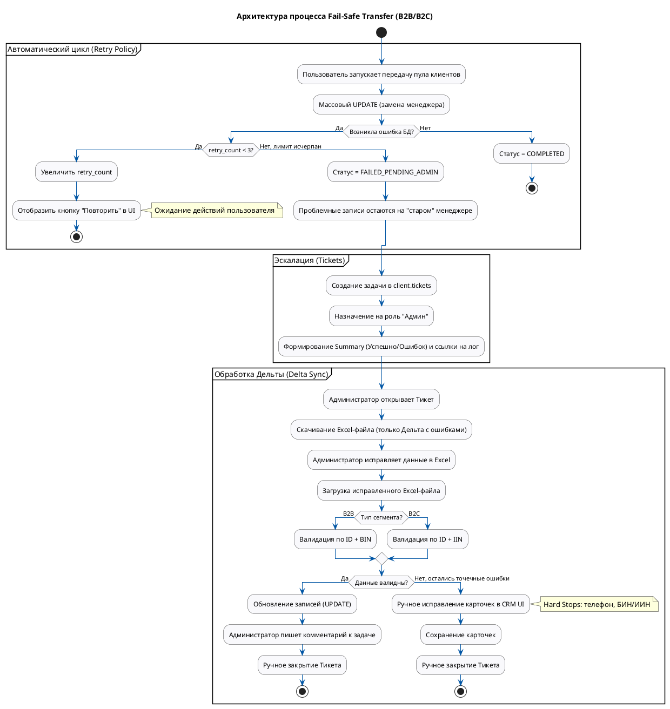

# Техническое задание: Модуль «Универсальное делегирование клиентов (Fail-Safe Transfer)»

**Система:** SapaCRM

**Версия:** 1.1 (B2B & B2C Unified Architecture)

**Область применения:** Массовая передача портфеля клиентов (юрлиц и физлиц) при изменении ответственного сотрудника.

---

## 1. Общая информация и бизнес-правила

Модуль предназначен для безопасной и массовой передачи пула клиентов от одного ответственного сотрудника к другому с защитой от потери данных при системных сбоях.

**Ключевые бизнес-правила:**

1. **Универсальность:** Модуль обслуживает как сегмент B2B (`client.clients_b2b`), так и сегмент B2C (`client.clients`, `client.clients_b2c`), используя единый механизм истории передач.
2. **Игнорирование SLA (B2C):** При технической массовой смене ответственного (через данный модуль) таймеры SLA для переданных клиентов **не учитываются** и не перезапускаются. Распределение считается техническим трансфером, а не поступлением новых лидов.

---

## 2. Архитектура процесса и обработка ошибок

Процесс разделен на автоматическую фазу и фазу ручного администрирования.

### 2.1. Автоматический цикл (Retry Policy)

* Инициация: Система пытается выполнить массовый `UPDATE` ответственного сотрудника в базе данных.
* Механизм повторов: Если БД возвращает ошибку (например, нарушение констрейнтов или блокировка строк), счетчик `retry_count` увеличивается.
* Лимит: Пользователю доступно максимум 3 попытки повторного запуска.
* Эскалация: На 4-й раз (когда `retry_count >= 3`) процесс останавливается, а статус передачи меняется на `FAILED_PENDING_ADMIN`.

### 2.2. Эскалация (Tickets)

* Защита данных: При достижении лимита ошибок проблемные (не перенесенные) записи остаются закрепленными за «старым» менеджером, чтобы не допустить появления «бесхозных» клиентов.
* Авто-тикет: Система автоматически формирует запись в таблице `client.tickets`, назначая её на системную роль «Админ» (или конкретного дежурного администратора).
* Контекст задачи: В описании тикета выводится summary вида:  *«Успешно: 9987, Ошибок: 13»* , а также прикрепляется ссылка на технический лог ошибок.

### 2.3. Обработка дельты (Delta Sync)

* Выгрузка: Администратор переходит в тикет и скачивает Excel-файл («Дельту»), содержащий  **только ошибочные строки** , с указанием причины ошибки (из лога дебаггера).
* Исправление: Администратор корректирует невалидные данные непосредственно в Excel-файле.
* Загрузка (Импорт): Исправленный файл загружается обратно в систему поверх старых данных.
* **Двойной замок (Ключи сопоставления):** При импорте система сопоставляет записи строго по двум параметрам, в зависимости от сегмента:
  * Для B2B: `ID` + `BIN`
  * Для B2C: `ID` + `IIN`

---

## 3. BPMN Диаграмма процесса (PlantUML)

**Фрагмент кода**

---

## 4. Маппинг базы данных и роутинг

#### 41. Сущность: История передачи (`client.transfer_history`)

Эта таблица хранит общую информацию о попытке массовой передачи пула клиентов.

| **Поле в UI / Логике (Payload)**   | **Источник / Логика**           | **Поле в БД** | **Тип данных БД** | **Обязательность** |
| --------------------------------------------------- | --------------------------------------------------- | -------------------------- | ---------------------------------- | -------------------------------------- |
| **ID операции**                       | Auto-generated                                      | `id`                     | `bigint (PK)`                    | Да                                   |
| **Тип сегмента**                   | Определяется по URL (B2B/B2C)         | `client_type`            | `varchar(10)`                    | Да (`'B2B'`,`'B2C'`)             |
| **Текущий ответственный** | Выбор пользователя (UI)            | `from_employee_id`       | `bigint (FK)`                    | Да                                   |
| **Новый ответственный**     | Выбор пользователя (UI)            | `to_employee_id`         | `bigint (FK)`                    | Да                                   |
| **Список клиентов**             | Массив ID выбранных клиентов | `entity_ids`             | `jsonb`                          | Да                                   |
| **Статус процесса**             | System Auto                                         | `status`                 | `varchar(50)`                    | Да (def:`'IN_PROGRESS'`)           |
| **Счетчик повторов**           | System Auto                                         | `retry_count`            | `int`                            | Да (def:`0`)                       |
| **Текст ошибки**                   | Ответ от БД (Exception Message)            | `last_error_text`        | `text`                           | Нет (только при сбое)  |
| **Ссылка на лог**                  | Генерация ссылки на S3/Kibana      | `error_log_link`         | `varchar(255)`                   | Нет                                 |

### 4.2. Сущность: Задача на администратора (`client.tickets`)

Создается автоматически при `retry_count >= 3`.

| **Поле в UI (Карточка задачи)** | **Источник / Логика**                                               | **Поле в БД** | **Тип данных БД** |
| -------------------------------------------------------- | --------------------------------------------------------------------------------------- | -------------------------- | ---------------------------------- |
| **Заголовок**                             | System:*"Ошибка массовой передачи [B2B/B2C] ID: [transfer_id]"* | `title`                  | `varchar(255)`                   |
| **Описание**                               | System:*"Успешно: X. Ошибок: Y. Причина: [last_error_text]"*      | `description`            | `text`                           |
| **Исполнитель**                         | System: ID системной роли "Администратор"                     | `assigned_to`            | `bigint (FK)`                    |
| **Связь с процессом**               | Идентификатор из `transfer_history.id`                                 | `transfer_id`            | `bigint (FK)`                    |
| **Приоритет**                             | System: Жестко задан (High/Critical)                                         | `priority`               | `varchar(50)`                    |

### 4.3 Маппинг файла Дельты

| **Колонка в Excel** | **Связь с БД (B2B)**   | **Связь с БД (B2C)**   | **Назначение**                                                            |
| --------------------------------- | ------------------------------------ | ------------------------------------ | ----------------------------------------------------------------------------------------- |
| **System ID**               | `clients_b2b.id`                   | `clients.id`                       | **Ключ сопоставления №1**(Скрытое поле)                |
| **BIN / IIN**               | `clients_b2b.bin`                  | `clients.iin`                      | **Ключ сопоставления №2**(Для двойной проверки) |
| **Phone**                   | `clients_b2b.phone_b2b`            | `clients_b2c.phone`                | Поле для ручного исправления администратором      |
| **Error Reason**            | Из логов валидатора | Из логов валидатора | Read-only (Описание, что именно нужно исправить)           |

### 4.4. Обновление таблицы Истории Передач (`transfer_history`)

Добавляется обязательное поле `client_type` для роутинга логики валидации и экспорта.

| **Поле в БД** | **Тип** | **Описание / Логика**                                             |
| -------------------------- | ---------------- | ------------------------------------------------------------------------------------- |
| `id`                     | `bigint`       | PK, Идентификатор операции                                       |
| `client_type`            | `varchar(10)`  | Дискриминатор:`B2B`или `B2C`                                      |
| `from_employee_id`       | `bigint`       | ID увольняющегося/переводимого сотрудника         |
| `to_employee_id`         | `bigint`       | ID нового ответственного сотрудника                     |
| `entity_ids`             | `jsonb`        | Массив ID переносимых клиентов                               |
| `status`                 | `varchar(50)`  | `COMPLETED`,`FAILED_RETRY_LIMIT`,`FAILED_PENDING_ADMIN`                         |
| `retry_count`            | `int`          | Счетчик (0-3)                                                                  |
| `last_error_text`        | `text`         | Читаемое описание последней ошибки для тикета |

### 4.5. Валидация

При ручном редактировании карточки или проверке загружаемой Excel-дельты применяются следующие правила (Jakarta Bean Validation):

**Для B2B:**

* `BIN`: `@NotBlank`, `@Pattern(regexp = "^\\d{12}$")`
* `phone_b2b`: `@NotBlank`, `@Pattern(regexp = "^\\+7\\d{10}$")`

**Для B2C:**

* `IIN`: `@NotBlank`, `@Pattern(regexp = "^\\d{12}$")`
* `phone`: `@NotBlank`, `@Pattern(regexp = "^\\+7\\d{10}$")`

---

## 5. Проектирование API-интерфейсов

Для чистоты архитектуры и удобства интеграции с Frontend, эндпоинты разделены по сегментам бизнеса, но методы работы с ошибками (Delta Sync) сделаны универсальными (тип определяется сервером на основе `transfer_id`).

| **Группа**            | **Метод** | **URL Путь**                   | **Описание**                                                                                                      |
| --------------------------------- | -------------------- | ---------------------------------------- | ------------------------------------------------------------------------------------------------------------------------------- |
| **B2B Transfers**           | POST                 | `/api/v1/b2b/transfers`                | Инициация массовой передачи пула B2B клиентов.                                             |
| **B2C Transfers**           | POST                 | `/api/v1/b2c/transfers`                | Инициация массовой передачи пула B2C клиентов (без запуска SLA).                 |
| **Delta Sync (Общие)** | POST                 | `/api/v1/transfers/{id}/retry`         | Ручной запуск повторной попытки (увеличивает `retry_count`).                           |
|                                   | GET                  | `/api/v1/transfers/{id}/export-errors` | Генерация Excel-дельты. (B2B выгрузит BIN, B2C выгрузит IIN).                                    |
|                                   | POST                 | `/api/v1/transfers/{id}/import-fixes`  | Загрузка Excel-дельты (`multipart/form-data`). Валидация "Двойной замок".                  |
| **Tickets**                 | PATCH                | `/api/v1/tickets/{id}/close`           | Ручное закрытие задачи с передачей обязательного комментария в `body`. |
