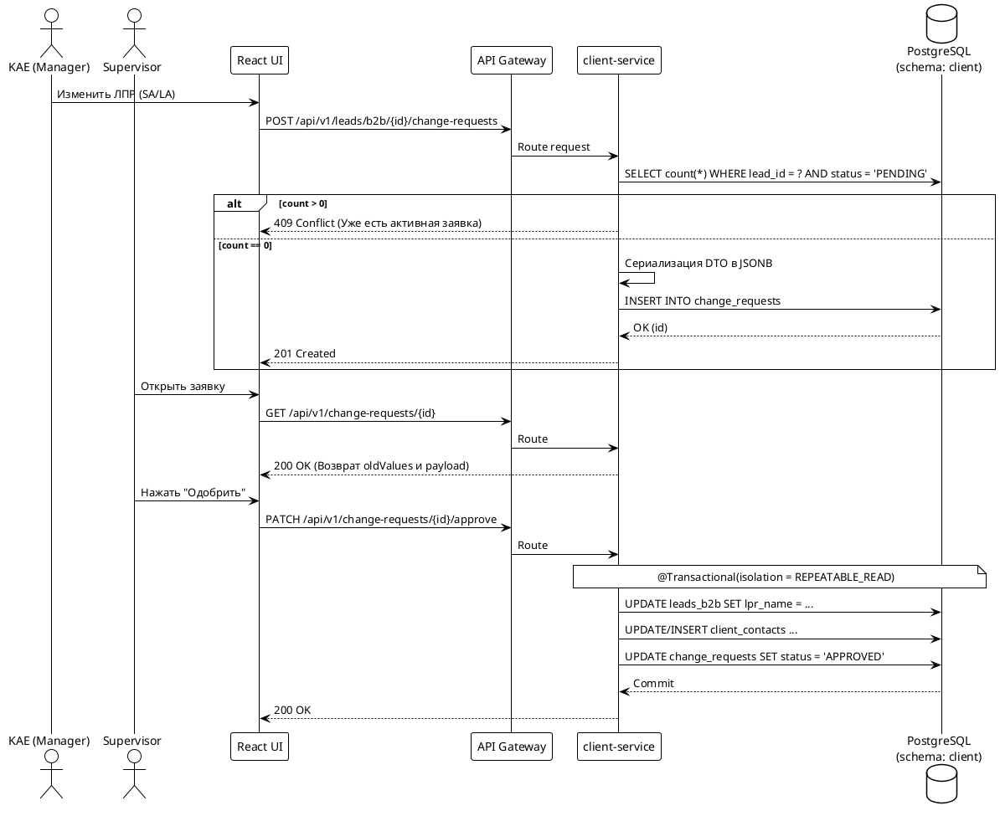
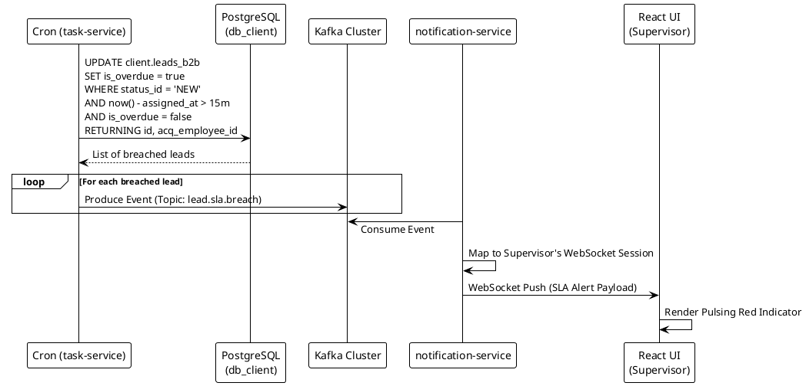
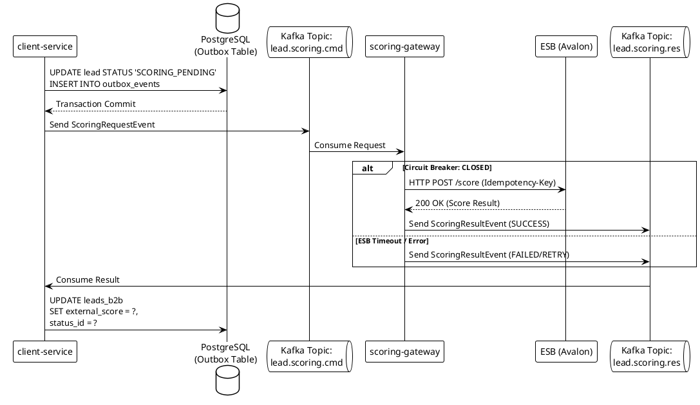
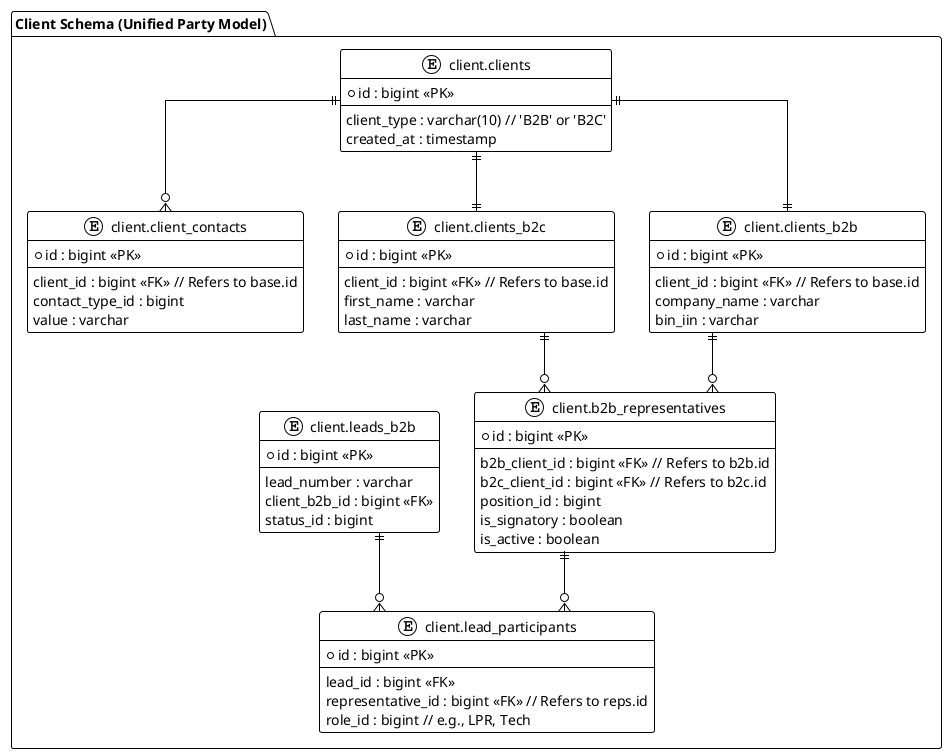
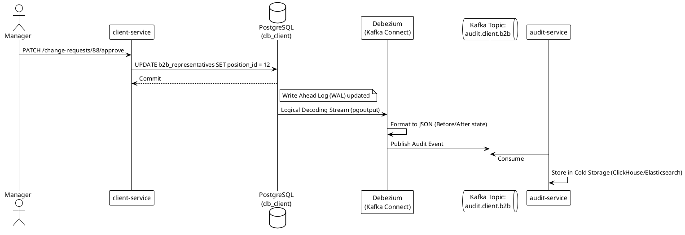

### 1. Iteration Scope

В этой итерации мы консолидируем структуру базы данных, устраняем расхождения между версиями v2.x и v3.0, и приводим схему к Enterprise-стандарту SapaCRM. Это фундамент для Java-разработчика (Entity mapping) и Базиста (Schema design).

### 2. Key Decisions

* **Pattern: Class Table Inheritance.** Базовая информация в `client.clients`, специфика B2B в `client.clients_b2b`. Связь через `client_id`.
* **Unified Contact Management.** Отказ от дублирования контактов. Все телефоны/email хранятся в `client.client_contacts` с привязкой к `client_id`.
* **Immutable Master Data.** Таблица `client.clients_b2b` является Read-Only для обычных операций. Все изменения атрибутов ЛПР в рамках сделки (SA/LA) пишутся в `client.change_requests`.
* **Strict Typing.** Использование только `bigint` для PK/FK и `numeric(38,2)` для финансовых полей.

### 3. Detailed Solution

#### 3.1. Схема базы данных (PostgreSQL)

```pgsql
-- Схема: client
-- Описание: Основа для микросервиса client

-- 1. Расширение профиля B2B
CREATE TABLE client.clients_b2b (
    id bigint PRIMARY KEY,
    client_id bigint NOT NULL UNIQUE, -- FK к client.clients
    bin_iin varchar(12) NOT NULL UNIQUE,
    company_name varchar(500) NOT NULL,
    category_id bigint NOT NULL, -- Ref: management.ref_business_categories (SME, SA, LA)
    segment_id bigint,
    industry_id bigint,
    created_at timestamp DEFAULT now(),
    updated_at timestamp DEFAULT now(),
    FOREIGN KEY (client_id) REFERENCES client.clients(id)
);

-- 2. Таблица лидов B2B (Transactional Hub)
CREATE TABLE client.leads_b2b (
    id bigint PRIMARY KEY,
    lead_number varchar(50) NOT NULL UNIQUE, -- Шаблон B-YYYYMM-XXXX
    client_b2b_id bigint NOT NULL,
    status_id bigint NOT NULL, -- Ref: management.ref_lead_statuses
    acq_employee_id bigint, -- Acquisition Manager
    ret_employee_id bigint, -- Retention Manager
    lpr_name varchar(255), -- Имя ЛПР в контексте данной сделки
    lpr_position_id bigint, -- Должность ЛПР
    total_amount numeric(38,2) DEFAULT 0,
    is_overdue boolean DEFAULT false,
    assigned_at timestamp,
    created_at timestamp DEFAULT now(),
    updated_at timestamp DEFAULT now(),
    FOREIGN KEY (client_b2b_id) REFERENCES client.clients_b2b(id)
);

-- 3. Контакты (Нормализованная таблица)
CREATE TABLE client.client_contacts (
    id bigint PRIMARY KEY,
    client_id bigint NOT NULL,
    contact_type_id bigint NOT NULL, -- 1: Phone, 2: Email, 3: WhatsApp
    value varchar(255) NOT NULL,
    is_main boolean DEFAULT false,
    created_at timestamp DEFAULT now(),
    FOREIGN KEY (client_id) REFERENCES client.clients(id)
);

-- 4. Буфер изменений (Change Requests)
CREATE TABLE client.change_requests (
    id bigint PRIMARY KEY,
    lead_id bigint NOT NULL,
    requested_by bigint NOT NULL,
    approved_by bigint,
    status varchar(50) DEFAULT 'PENDING', -- PENDING, APPROVED, REJECTED
    new_value jsonb NOT NULL, -- Snapshot изменений по ЛПР и контактам
    created_at timestamp DEFAULT now(),
    FOREIGN KEY (lead_id) REFERENCES client.leads_b2b(id)
);

-- Индексы для оптимизации High-Load
CREATE INDEX idx_leads_b2b_client ON client.leads_b2b(client_b2b_id);
CREATE INDEX idx_leads_b2b_status_overdue ON client.leads_b2b(status_id) WHERE is_overdue = false;
CREATE INDEX idx_contacts_client_main ON client.client_contacts(client_id) WHERE is_main = true;
```

### 4. Risks & Trade-offs

* **Risk: Deadlocks в Round Robin.** При частом обновлении `assigned_at` и `last_assigned_at` в таблице `users` возможны блокировки.
  * *Mitigation:* Использование `SELECT FOR UPDATE SKIP LOCKED` при распределении лидов в Java-сервисе.
* **Trade-off: JSONB в Change Requests.** Гибкость хранения данных в JSONB усложняет валидацию на уровне БД.
  * *Mitigation:* Обязательная JSON Schema Validation на уровне Spring Boot перед записью в БД.
* **Consistency:** При `APPROVED` статусе в `change_requests`, данные должны атомарно обновиться в `leads_b2b` и `client_contacts`. Требуется строгая транзакционность (Isolation Level: Read Committed / Repeatable Read).

### **Проектирование API и Маппинг DTO (Data Transfer Object)**

Анализ предоставленной структуры `LeadB2bResponseDto`, выявление архитектурных конфликтов с физической моделью PostgreSQL (DDL из Итерации 1) и устранение разногласий с DBA (базистом).

### 2. Key Decisions

* **Конвенция именования (Naming Convention):** В REST API (Spring Boot / Jackson) должен строго использоваться `camelCase`. Поле `client_id` заменено на `clientId`. Опечатка `contactsContacs` исправлена на `contacts`.
* **Отказ от null в `clientId` (Разрешение конфликта с DBA):** Согласно DDL из Итерации 1, поле `client_b2b_id` в таблице `client.leads_b2b` имеет ограничение `NOT NULL`. Это означает, что в SapaCRM выбран паттерн  **"Upfront Master Data"** : при создании нового лида система *обязана* сначала создать базовые записи в `client.clients` и `client.clients_b2b`, и только затем транзакцию в `leads_b2b`. Следовательно, `clientId`  **никогда не может быть null** .
* **Разделение ID:** В `clientDetails` добавлены и `clientId` (глобальный), и `clientB2bId` (специфичный для юрлица), чтобы фронтенд мог корректно строить ссылки на карточку компании.
* **Справочники (Joins):** Все текстовые названия (статусы, категории) подтягиваются из схемы `management` (слой Dictionaries).

### 3. Detailed Solution (Провалидированный и размеченный JSON)

Ниже представлен исправленный JSON с детальным маппингом на таблицы и колонки БД (в формате комментариев для разработчиков).

```JSON
{
  "id": 10245,                           // <- client.leads_b2b.id (PK)
  "leadNumber": "B-202604-088",          // <- client.leads_b2b.lead_number
  
  "clientDetails": {
    "clientId": 5051,                    // <- client.clients_b2b.client_id (FK to client.clients.id) [ОШИБКА ИСПРАВЛЕНА: Не может быть null]
    "clientB2bId": 800,                  // <- client.leads_b2b.client_b2b_id (FK to client.clients_b2b.id)
    "companyName": "Kcell JSC",          // <- client.clients_b2b.company_name
    "bin": "980540000397",               // <- client.clients_b2b.bin_iin
    "categoryId": 12,                    // <- client.clients_b2b.category_id
    "categoryName": "SME"                // <- management.ref_business_categories.name (JOIN по category_id)
  },
  
  "lprDetails": {
    "name": "Азамат Ахметов",            // <- client.leads_b2b.lpr_name (Имя ЛПР в рамках текущей сделки)
    "contacts": [                        // <- [ОШИБКА ИСПРАВЛЕНА: опечатка в ключе contactsContacs]
      {
        "id": 5540,                      // <- client.client_contacts.id
        "contactTypeId": 1,              // <- client.client_contacts.contact_type_id
        "contactTypeName": "Mobile Phone", // <- management.ref_contact_types.name (JOIN)
        "value": "+7701XXXXXXX",         // <- client.client_contacts.value (Где client_id = clientDetails.clientId)
        "isMain": true                   // <- client.client_contacts.is_main
      },
      {
        "id": 5541,
        "contactTypeId": 2,
        "contactTypeName": "Email",
        "value": "a.akhmetov@kcell.kz",
        "isMain": false
      }
    ]
  },
  
  "status": {
    "id": 2,                             // <- client.leads_b2b.status_id
    "code": "HOT",                       // <- management.ref_lead_statuses.code (JOIN по status_id)
    "name": "Горячий лид"                // <- management.ref_lead_statuses.name_ru
  },
  
  "assignments": {
    "acqManagerId": 884,                 // <- client.leads_b2b.acq_employee_id (FK to users.users.id)
    "retManagerId": 912                  // <- client.leads_b2b.ret_employee_id (FK to users.users.id)
  },
  
  "financials": {
    "totalAmount": 1500000.00,           // <- client.leads_b2b.total_amount
    "currency": "KZT"                    // <- Хардкод на уровне Backend (или добавить поле currency_code в leads_b2b, если мультивалютность)
  },
  
  "sla": {
    "isOverdue": false,                  // <- client.leads_b2b.is_overdue
    "assignedAt": "2026-04-09T14:40:00Z" // <- client.leads_b2b.assigned_at
  },
  
  "metadata": {
    "createdAt": "2026-04-09T14:30:00Z", // <- client.leads_b2b.created_at
    "updatedAt": "2026-04-09T14:45:00Z"  // <- client.leads_b2b.updated_at
  }
}
```

### 4. Risks & Trade-offs

* **Риск производительности (N+1 Select Problem):** Для формирования такого вложенного JSON (особенно блока `contacts` и справочников `management`) Spring Data JPA/Hibernate может генерировать множество мелких запросов.
  * *Решение для Java:* Использовать `@EntityGraph` или кастомные JPQL-запросы с `JOIN FETCH` для извлечения агрегата `Lead -> ClientB2B -> Contacts -> Status` за один проход в БД.
* **Trade-off "Client ID Nullability":** Если бизнес настаивает, что лид может существовать без заведения компании в базу (чтобы не плодить мусорные записи), тогда базисту придется изменить DDL: сделать `client_b2b_id NULLABLE` в таблице `leads_b2b`, и добавить поля `raw_bin` и `raw_company_name` прямо в таблицу лидов. *Текущая реализация предполагает жесткую нормализацию.*

### **Бизнес-логика и API для Change Requests (CR)**

Проектирование механизма отложенного обновления защищенных полей (ФИО ЛПР, должность, контакты) для сегментов SA и LA. Включает разработку структуры JSON-буфера, транзакционной модели подтверждения (Approve) и защиты от состояния гонки (Race Conditions).

### 2. Key Decisions

* **Ограничение "One Pending Rule":** На один `lead_id` может существовать только одна заявка в статусе `PENDING`. Это предотвращает конфликты слияния и логические коллизии при параллельной работе менеджеров.
* **CQRS-подобный паттерн для контактов:** Внутри JSON `new_value` массив контактов содержит поле `action` (`CREATE`, `UPDATE`, `DELETE`), чтобы Backend понимал, какую именно SQL-операцию применять к таблице `client.client_contacts` при одобрении.
* **Атомарность (ACID):** Процесс `Approve` выполняется строго в рамках одной транзакции (`@Transactional`). Если обновление контактов падает, откатывается и обновление лида, и статус заявки.
* **Audit Trail:** JSON-структура хранит не только новые, но и старые значения (`oldValues`) для отрисовки Side-by-Side (Diff) сравнения в интерфейсе React (Frontend) без дополнительных запросов к БД.

### 3. Detailed Solution

#### 3.1. Жизненный цикл Change Request (Sequence Flow)

1. Frontend проверяет сегмент лида (`categoryName` IN `['SA', 'LA']`).
2. При редактировании UI блокирует прямой вызов `PUT /leads`, отправляя `POST /change-requests`.
3. Backend валидирует запрос, сериализует DTO в JSONB и делает `INSERT INTO client.change_requests`.
4. Руководитель (Supervisor/Head) запрашивает список `GET /change-requests?status=PENDING`.
5. Руководитель отправляет `PATCH /change-requests/{id}/approve`.
6. Backend десериализует JSONB, выполняет `UPDATE leads_b2b` и `INSERT/UPDATE/DELETE client_contacts`, затем ставит статус `APPROVED`.

#### 3.2. Sequence Diagram (PlantUML)

**Фрагмент кода**



### 4. Examples (API & JSON Schema)

#### 4.1. Создание заявки (POST `/api/v1/leads/b2b/{id}/change-requests`)

**Request Payload (и структура сохранения в колонку `new_value`):**

```JSON
{
  "payload": {
    "lprName": "Азамат Ахметов",
    "lprPositionId": 45,
    "contacts": [
      {
        "action": "UPDATE",
        "id": 5540,
        "contactTypeId": 1,
        "value": "+77019998877",
        "isMain": true
      },
      {
        "action": "CREATE",
        "contactTypeId": 2,
        "value": "a.akhmetov@kcell.kz",
        "isMain": false
      }
    ]
  },
  "oldValues": {
    "lprName": "Иван Иванов",
    "lprPositionId": 12,
    "contacts": [
      {
        "id": 5540,
        "contactTypeId": 1,
        "value": "+77011112233",
        "isMain": true
      }
    ]
  }
}
```

#### 4.2. Одобрение заявки (PATCH `/api/v1/change-requests/{id}/approve`)

**Headers:** `Authorization: Bearer <token>` (Роль: SUPERVISOR/HEAD)

**Response: 200 OK** (Пустое тело, либо статус обновления).

**SQL, генерируемый под капотом (Spring Data JPA / Hibernate):**

```pgsql
BEGIN;
-- Обновление лида
UPDATE client.leads_b2b 
SET lpr_name = 'Азамат Ахметов', lpr_position_id = 45, updated_at = now() 
WHERE id = 10245;

-- Обновление существующего контакта
UPDATE client.client_contacts 
SET value = '+77019998877' 
WHERE id = 5540 AND client_id = 5051;

-- Добавление нового контакта (client_id берется из связи лид -> компания)
INSERT INTO client.client_contacts (id, client_id, contact_type_id, value, is_main) 
VALUES (nextval('...'), 5051, 2, 'a.akhmetov@kcell.kz', false);

-- Закрытие заявки
UPDATE client.change_requests 
SET status = 'APPROVED', approved_by = 999, updated_at = now() 
WHERE id = 88;
COMMIT;
```

### 5. Risks & Trade-offs

* **Схема данных внутри JSONB (Evolution Risk):** Если бизнес решит добавить новое поле в ЛПР (например, `lpr_department_id`), потребуется обновлять DTO сериализации в Java, а старые записи в статусе `PENDING` могут не примениться из-за расхождения структур.
  * *Mitigation:* Ограничить срок жизни заявки `PENDING` (например, авто-реджект через 7 дней через cron-джобу в сервисе `task`).
* **Консистентность контактов:** Так как `client_contacts` привязана к `client_id` (компании), изменение контакта в одном лиде затронет все остальные активные лиды этой же компании (SA/LA). Это ожидаемое поведение для Master Data Management, но операторы должны быть об этом явно предупреждены в UI.

### **Алгоритмы маршрутизации (Round Robin) и SLA Tracker**

Проектирование механизмов автоматического распределения лидов в условиях высокой конкуренции (High-Load) и архитектуры фонового мониторинга SLA (Service Level Agreement - 15 минут) с системой алертинга через WebSockets.

### 2. Key Decisions

* **Изоляция блокировок (Pessimistic Locking):** Для предотвращения гонки данных (Race Conditions) при распределении лидов используется паттерн `SELECT FOR UPDATE SKIP LOCKED`. Блокировка накладывается не на тяжелую таблицу `users.users`, а на выделенную в Итерации 1 таблицу-счетчик `users.assignment_metrics`.
* **Сверхкороткие транзакции:** Транзакция назначения лида выделяется в отдельный метод (`REQUIRES_NEW`), чтобы задержки внешних API или генерации PDF не удерживали лок пула операторов.
* **Distributed SLA Watchdog:** Фоновый процесс проверки SLA реализуется в сервисе `task`. Для избежания дублирования проверок в Kubernetes-кластере (где запущено несколько подов) используется механизм распределенных блокировок (например, библиотекой ShedLock) поверх базы данных.
* **Event-Driven Алертинг:** При нарушении SLA сервис `task` не ходит напрямую в UI. Он атомарно обновляет БД и публикует событие в Kafka. Сервис `notification` вычитывает топик и пушит алерт супервайзеру по WebSocket.

### 3. Detailed Solution

#### 3.1. Механизм Round Robin (Pessimistic Locking)

Алгоритм выбирает оператора с флагом `is_online = true`, нужной ролью (Acquisition или Retention) и самым старым временем `last_assigned_at`.

**SQL-логика (PostgreSQL):**

```sql
WITH next_operator AS (
    SELECT am.user_id
    FROM users.assignment_metrics am
    JOIN users.users u ON am.user_id = u.id
    WHERE u.is_online = true 
      AND u.role = 'ACQ_MGR' -- Или 'RET_MGR'
    ORDER BY am.last_assigned_at ASC
    LIMIT 1
    FOR UPDATE SKIP LOCKED -- Пропускаем заблокированные другими транзакциями строки
)
UPDATE users.assignment_metrics
SET last_assigned_at = now(), active_leads_count = active_leads_count + 1
WHERE user_id = (SELECT user_id FROM next_operator)
RETURNING user_id;
```

**Интеграция в Spring Data JPA:**

```java
public interface AssignmentMetricsRepository extends JpaRepository<AssignmentMetrics, Long> {
  
    @Lock(LockModeType.PESSIMISTIC_WRITE)
    @QueryHints({@QueryHint(name = "javax.persistence.lock.timeout", value = "-2")}) // SKIP LOCKED
    @Query(value = "SELECT am FROM AssignmentMetrics am JOIN am.user u WHERE u.isOnline = true AND u.role = :role ORDER BY am.lastAssignedAt ASC")
    Page<AssignmentMetrics> findNextAvailableOperator(String role, Pageable pageable);
}
```

#### 3.2. SLA Watchdog Architecture

Процесс запускается по cron (например, каждую минуту). Опирается на композитный индекс `idx_leads_b2b_status_overdue`.

**PlantUML Sequence: SLA Breach Flow**

**Фрагмент кода**



### 4. Examples (Events & DTOs)

**Kafka Event Payload (Topic: `lead.sla.breach`):**

```json
{
  "eventId": "evt-8475-abcf",
  "eventType": "SLA_BREACH",
  "timestamp": "2026-04-10T10:00:00Z",
  "payload": {
    "leadId": 10245,
    "leadNumber": "B-202604-088",
    "managerId": 884,
    "segment": "SA",
    "assignedAt": "2026-04-10T09:44:00Z",
    "overdueByMinutes": 1
  }
}
```

### 5. Risks & Trade-offs

* **Риск: Connection Pool Exhaustion.** Если бизнес-логика после `FOR UPDATE SKIP LOCKED` (например, отправка email или HTTP вызов в Avalon) зависнет, транзакция останется открытой, блокируя строку и удерживая connection к БД.
  * *Решение:* Логика распределения (Assignment) и обновления БД должна быть строго изолирована от любых синхронных I/O операций. I/O должно выполняться асинхронно после коммита транзакции распределения (паттерн Transactional Outbox или Spring `@TransactionalEventListener`).
* **Trade-off: Polling vs Delayed Queues.** Выбрано поллинговое решение (каждую минуту делать SELECT по БД), а не использование очередей с задержкой (RabbitMQ Delayed Message / Redis). Поллинг дает небольшую нагрузку на БД, но композитный индекс нивелирует её. Это значительно упрощает архитектуру и гарантирует консистентность по сравнению с управлением тысячами отложенных таймеров в памяти.

### **Итерация 5: Интеграционный слой и Скоринг (Avalon)**

Проектирование асинхронного взаимодействия с внешней системой финансового скоринга **Avalon** через корпоративную шину (ESB), используя **Kafka** в качестве брокера сообщений. Фокус на паттернах отказоустойчивости (Resilience) и обеспечении целостности данных при распределенных транзакциях.

### 2. Key Decisions

* **Transactional Outbox Pattern:** Поскольку нам нужно одновременно обновить статус лида в БД и отправить сообщение в Kafka, используется Outbox-таблица. Это гарантирует, что сообщение будет отправлено в Kafka *только* в случае успешного коммита транзакции в PostgreSQL.
* **Использование Kafka вместо RabbitMQ:** Kafka предоставляет нам персистентность сообщений и возможность их повторного чтения (replayability). Мы используем топики для разделения этапов скоринга: `lead.scoring.command` (запрос) и `lead.scoring.event` (результат).
* **Idempotent Consumer:** Сервис `client` должен быть готов к повторному получению одного и того же результата скоринга из Kafka (например, при ребалансировке consumer-группы). Идентификация идет по `leadId` + `processId`.
* **Circuit Breaker (Resilience4j):** В интеграционном шлюзе (`scoring-gateway`) вызовы к ESB/Avalon ограничиваются по времени и количеству ошибок. При недоступности Avalon лид переводится в статус `MANUAL_REVIEW`.

### 3. Detailed Solution

#### 3.1. Архитектура потока данных

1. **Client Service:** При переходе на этап скоринга сохраняет в БД статус `SCORING_PENDING` и записывает событие в таблицу `client.outbox`.
2. **Outbox Processor:** (Spring Scheduled или Debezium/CDC) вычитывает таблицу и отправляет сообщение в Kafka.
3. **Scoring Gateway (Интегратор):** Слушает Kafka, вызывает API Avalon.
4. **Avalon Response:** Результат возвращается в Kafka.
5. **Client Service:** Слушает топик результата, обновляет `leads_b2b.external_score`.

#### 3.2. Sequence Diagram (Kafka-based Flow)



### 4. Examples (Kafka DTO & SQL)

**Kafka Message DTO (lead.scoring.res):**

```json
{
  "header": {
    "sourceService": "scoring-gateway",
    "timestamp": "2026-04-10T11:20:00Z",
    "idempotencyKey": "B2B-SCORE-10245-v1"
  },
  "payload": {
    "leadId": 10245,
    "externalScore": 78.5,
    "decision": "APPROVED",
    "reason": "Stable financial history",
    "limit": 2500000.00
  }
}
```

**SQL для Outbox таблицы:**

```sql
CREATE TABLE client.outbox (
    id bigint PRIMARY KEY,
    aggregate_type varchar(50) NOT NULL, -- e.g., 'LEAD_B2B'
    aggregate_id bigint NOT NULL,
    payload jsonb NOT NULL,
    status varchar(20) DEFAULT 'PENDING', -- PENDING, SENT, ERROR
    created_at timestamp DEFAULT now()
);
CREATE INDEX idx_outbox_pending ON client.outbox(status) WHERE status = 'PENDING';
```

### 5. Risks & Trade-offs

* **Сложность Eventual Consistency:** Пользователь на фронтенде не видит результат мгновенно.
  * *Решение:* Использование WebSockets через сервис `notification` для мгновенного обновления карточки, когда результат из Kafka попадет в БД.
* **Порядок сообщений (Message Ordering):** Если скоринг запрашивается дважды подряд, сообщения могут прийти не по порядку.
  * *Решение:* Использование ключа партиционирования Kafka (Partition Key) на основе `leadId`. Это гарантирует, что все сообщения по одному лиду попадут в одну партицию и обработаются последовательно.
* **Trade-off:** Kafka требует более сложной настройки и мониторинга, чем RabbitMQ, но для Enterprise CRM это оправдано гарантией сохранности данных при пиковых нагрузках (High-load Telesales).

### **Итерация 6: Рефакторинг Data Model — Contacts Consolidation (Unified Party Model)**

Устранение архитектурного долга, связанного с дублированием контактов и уполномоченных лиц (Authorized Persons). Цель — переход к нормализованной "Party Model", где физлица (B2C клиенты, ЛПР, подписанты) и юрлица (B2B компании) используют единую инфраструктуру связей и контактов.

### 2. Key Decisions

* **Unified Party Pattern (Class Table Inheritance):** Любое физическое лицо (будь то покупатель в Online Shop или ЛПР корпорации) — это запись в базовой таблице `client.clients` с расширением в `client.clients_b2c`.
* **Удаление хардкода из Leads:** Сырые строковые поля `lpr_name` и `lpr_position_id` удаляются из `client.leads_b2b`.
* **Связующая сущность (B2B Representatives):** Вводится таблица `client.b2b_representatives` для описания связи "Юрлицо -> Физлицо" (должность, права подписи).
* **Участники сделки (Lead Participants):** Вводится таблица `client.lead_participants`, которая привязывает конкретного представителя к конкретной сделке с указанием его роли (LPR, Technical Contact, Signatory).
* **Single Source of Truth для контактов:** Таблица `client.client_contacts` остается единственным местом хранения контактов. Контакты ЛПР привязаны к его личному `client_id` (B2C профилю), а общие контакты компании — к `client_id` B2B профиля.

### 3. Detailed Solution

#### 3.1. Entity-Relationship Diagram (PlantUML)

**Фрагмент кода**



#### 3.2. DDL Scripts (PostgreSQL)

```sql
BEGIN;

-- 1. Создание таблицы представителей (Связь Company -> Person)
CREATE TABLE client.b2b_representatives (
    id bigint PRIMARY KEY,
    b2b_client_id bigint NOT NULL REFERENCES client.clients_b2b(id),
    b2c_client_id bigint NOT NULL REFERENCES client.clients_b2c(id),
    position_id bigint NOT NULL, -- Ref: management.ref_positions
    is_signatory boolean DEFAULT false,
    is_active boolean DEFAULT true,
    created_at timestamp DEFAULT now(),
    UNIQUE (b2b_client_id, b2c_client_id)
);

-- 2. Создание таблицы участников сделки
CREATE TABLE client.lead_participants (
    id bigint PRIMARY KEY,
    lead_id bigint NOT NULL REFERENCES client.leads_b2b(id),
    representative_id bigint NOT NULL REFERENCES client.b2b_representatives(id),
    role_id bigint NOT NULL, -- Ref: management.ref_participant_roles (1: LPR, 2: Signatory)
    created_at timestamp DEFAULT now(),
    UNIQUE (lead_id, representative_id, role_id)
);

-- 3. Рефакторинг Leads B2B (Удаление дублирующих/де-нормализованных полей)
ALTER TABLE client.leads_b2b 
    DROP COLUMN lpr_name,
    DROP COLUMN lpr_position_id;

-- 4. Индексы для JOIN'ов
CREATE INDEX idx_b2b_reps_b2b ON client.b2b_representatives(b2b_client_id);
CREATE INDEX idx_lead_parts_lead ON client.lead_participants(lead_id);

COMMIT;
```

### 4. Examples (JSON Mapping & Change Requests)

После рефакторинга формирование DTO требует графовой выборки (EntityGraph в Hibernate).

**Обновленный маппинг `lprDetails` в `LeadB2bResponseDto`:**

```json
"lprDetails": {
  "participantId": 8801,                  // <- client.lead_participants.id
  "roleId": 1,                            // <- client.lead_participants.role_id (LPR)
  "representativeId": 450,                // <- client.b2b_representatives.id
  "positionName": "Директор",             // <- JOIN management.ref_positions on reps.position_id
  "person": {
    "clientId": 9055,                     // <- client.clients.id (B2C Profile)
    "firstName": "Азамат",                // <- client.clients_b2c.first_name
    "lastName": "Ахметов",                // <- client.clients_b2c.last_name
    "contacts": [                         // <- SELECT * FROM client.client_contacts WHERE client_id = 9055
      {
        "contactTypeId": 1,
        "value": "+7701XXXXXXX",
        "isMain": true
      }
    ]
  }
}
```

**Влияние на Change Requests (CR):**

Теперь CR на изменение ЛПР содержит не просто замену строкового имени, а JSON-инструкцию на создание нового профиля B2C (если его нет), создание записи в `b2b_representatives` и обновление `lead_participants`.

### 5. Risks & Trade-offs

* **Риск: Нагрузка на БД при чтении (N+1 Problem).** Сборка карточки лида теперь требует JOIN 7+ таблиц (`leads` -> `participants` -> `representatives` -> `clients_b2c` -> `clients` -> `contacts`).
  * *Решение:* Строгое использование JPA `@NamedEntityGraph` или создание **Materialized View** (если чтение значительно превышает запись) для плоского вывода агрегированных данных на уровне БД.
* **Trade-off: Сложность миграции данных.** При выкатке релиза (Release/Deployment) потребуется сложный PL/pgSQL скрипт (через Liquibase/Flyway), который пройдет по всем активным лидам B2B, вытащит строки из `lpr_name`, создаст под них фейковые B2C профили в `clients_b2c`, свяжет их через `b2b_representatives` и `lead_participants`.
* **Риск: Orphan Records.** При удалении лида или компании могут остаться "висящие" B2C профили ЛПР-ов, у которых нет других связей. Требуется настройка `ON DELETE CASCADE` на связующих таблицах или логика soft-delete (архивирование).

### **Security, RBAC (Role-Based Access Control) & Audit Trail**

Проектирование эшелонированной системы безопасности для защиты мастер-данных (`client.clients_b2b`), разграничения прав доступа к сделкам (сегменты SME, SA, LA) и обеспечения неизменяемого журнала аудита (Immutable Audit Log) для Enterprise-комплаенса.

### 2. Key Decisions

* **Identity Provider (IdP):** Keycloak используется как единая точка входа (SSO) и управления ролями. Сервисы работают в режиме OAuth2 Resource Server, валидируя JWT-токены.
* **Гибридная модель авторизации (RBAC + ABAC):** Доступ к эндпоинтам контролируется на основе ролей (RBAC: `ROLE_KAE`, `ROLE_SUPERVISOR`), а доступ к конкретным данным (Data-Level Security) — на основе атрибутов (ABAC: `owner_id == jwt.sub` или `segment == 'LA'`).
* **Двухуровневый Audit Trail:**
  * *Уровень приложения:* Бизнес-аудит через таблицу `change_requests` (кто и когда согласовал изменение ЛПР).
  * *Уровень базы данных (CDC):* Использование  **Debezium** , который читает Write-Ahead Log (WAL) PostgreSQL. Это гарантирует, что любое изменение (даже сделанное DBA напрямую в БД или сервисным аккаунтом) будет зафиксировано и отправлено в Kafka.
* **Service-to-Service Security:** Межсервисное взаимодействие (например, `scoring-gateway` -> `client`) защищается через Client Credentials Grant и проверку специфичных `scopes`.

### 3. Detailed Solution

#### 3.1. Механизм авторизации (Spring Security)

Фильтрация данных на уровне SQL (через Hibernate `@Filter` или JPA Specifications) предотвращает утечку данных (Data Leakage) при массовых выборках. Менеджеры SME видят общий пул (Acquisition), КАЕ (Key Account Executives) видят только свой портфель (LA).

**Sequence Flow авторизации запроса:**

1. Фронтенд передает `Authorization: Bearer <JWT>`.
2. API Gateway (bi-gateway) делает первичную валидацию подписи JWT и проверяет срок жизни.
3. Запрос проксируется в `client-service`.
4. `SecurityFilterChain` извлекает `roles` из токена.
5. Метод контроллера защищен аннотацией `@PreAuthorize`, которая вызывает бин валидации владельца ресурса.

#### 3.2. Архитектура Audit Trail (CDC Pipeline)



### 4. Examples (Security Config, JWT & CDC Payload)

#### 4.1. Защита эндпоинтов (Spring Security `@PreAuthorize`)

```java
@RestController
@RequestMapping("/api/v1/leads/b2b")
public class LeadB2bController {

    // Одобрить заявку может только руководитель
    @PreAuthorize("hasAnyRole('SUPERVISOR', 'HEAD')")
    @PatchMapping("/{id}/change-requests/{crId}/approve")
    public ResponseEntity<Void> approveChangeRequest(...) { ... }

    // Просмотр лида: доступно руководителям, либо ответственному за этот лид (ABAC)
    @PreAuthorize("hasAnyRole('SUPERVISOR', 'HEAD') or @leadSecurity.isLeadOwner(authentication, #id)")
    @GetMapping("/{id}")
    public ResponseEntity<LeadB2bResponseDto> getLead(...) { ... }
}
```

#### 4.2. JWT Payload (Расширенный для SapaCRM)

```json
{
  "exp": 1712746800,
  "iat": 1712743200,
  "sub": "user-uuid-884",
  "preferred_username": "a.akhmetov",
  "realm_access": {
    "roles": ["KAE", "LA_MANAGER"]
  },
  "resource_access": {
    "sapa-crm-client": {
      "roles": ["read", "write"]
    }
  },
  "custom_claims": {
    "employeeId": 884,
    "allowedSegments": ["LA", "SA"]
  }
}
```

#### 4.3. Событие аудита (Debezium / Kafka Payload)

Пример того, что генерирует Debezium при обновлении таблицы `client.b2b_representatives` при аппруве `change_request`.

```json
{
  "op": "u",
  "ts_ms": 1712745600000,
  "source": {
    "db": "sapacrm",
    "schema": "client",
    "table": "b2b_representatives",
    "txId": 105432
  },
  "before": {
    "id": 450,
    "b2b_client_id": 800,
    "position_id": 8,
    "is_signatory": false
  },
  "after": {
    "id": 450,
    "b2b_client_id": 800,
    "position_id": 12,
    "is_signatory": true
  }
}
```

### 5. Risks & Trade-offs

* **Риск: Performance overhead при ABAC.** Оценка правил на уровне Java (`@leadSecurity.isLeadOwner`) требует загрузки сущности из БД до выполнения бизнес-логики.
  * *Решение:* Выполнять фильтрацию непосредственно в SQL-запросах (используя `employeeId` из JWT) на уровне Repository, чтобы база данных отсекала чужие лиды до сериализации.
* **Риск: Нагрузка от Debezium на Master-узел БД.** Logical Decoding в PostgreSQL может потреблять CPU и увеличивать объем WAL-файлов.
  * *Решение:* Подключать коннектор Debezium к выделенной реплике PostgreSQL (Logical Replication Standby), чтобы снять нагрузку с пишущего мастера (Master node).
* **Trade-off: Отзыв JWT-токенов.** В stateless-архитектуре отозвать скомпрометированный JWT до истечения его срока жизни (`exp`) сложно.
  * *Митигация:* Использовать короткий срок жизни Access Token (например, 5-10 минут) и управлять сессиями через долгоживущие Refresh Tokens, которые валидируются в Keycloak.
