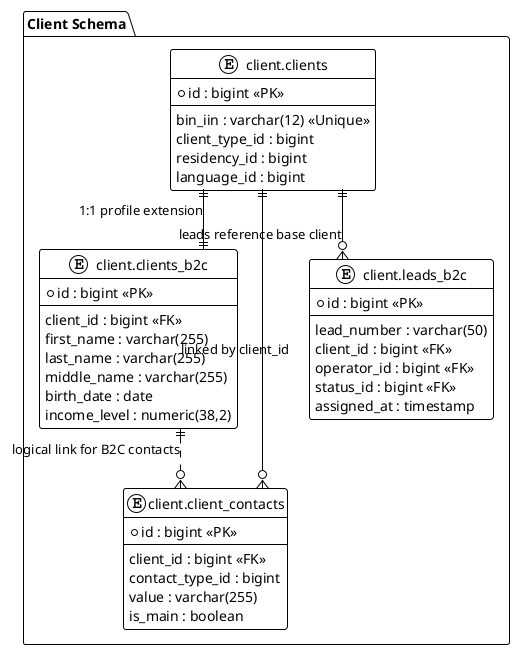

# Техническое задание: Модуль «CRM Лиды B2B» (v3.0)

**Система:** SapaCRM

**Роль:** Senior System Analyst & Enterprise Architect

**Микросервис:** `sapa-crm-kcell-client`

**Сектор:** Корпоративные продажи (SME, SA, LA)



## 1. Архитектурные принципы и Дедупликация

Модуль B2B спроектирован для работы с юридическими лицами. Ключевым идентификатором является  **БИН** .

### 1.1. Механизм дедупликации (Check-Before-Create)

Проверка выполняется по БИН организации до открытия формы создания лида.

| **Условие**                                        | **Сегмент** | **Действие системы**                                                                                          |
| --------------------------------------------------------------- | ------------------------ | ---------------------------------------------------------------------------------------------------------------------------------- |
| **БИН найден**(есть активный лид) | SME / SA                 | **Merge:**Новый запрос добавляется как активность в существующую карточку. |
| **БИН найден**(активный лид)          | LA                       | **Hard Block:**Редирект в карточку текущего КАЕ.                                                       |
| **БИН найден**(в портфеле КАЕ)       | LA                       | **Direct Route:**Назначение лида закрепленному менеджеру, минуя Round Robin.              |
| **БИН не найден**                              | Все                   | **New Lead:**Запуск алгоритма Round Robin.                                                                          |

---

## 2. Сквозные системные поля (Metadata)

Отображаются в Header-панели карточки. Все идентификаторы имеют тип `bigint`.

| **Поле в UI**      | **Источник / Логика** | **Таблица** | **Поле**  | **Тип** |
| ----------------------------- | ----------------------------------------- | ------------------------ | ------------------- | ---------------- |
| **ID лида**         | System Auto                               | `client.leads_b2b`     | `id`              | `bigint`       |
| **Номер лида** | B-YYYYMM-XXXX                             | `client.leads_b2b`     | `lead_number`     | `varchar`      |
| **Acquisition Mgr**     | Round Robin (Pool ACQ)                    | `client.leads_b2b`     | `acq_employee_id` | `bigint`       |
| **Retention Mgr**       | Round Robin (Pool RET)                    | `client.leads_b2b`     | `ret_employee_id` | `bigint`       |
| **Метка SLA**      | > 15 мин (assigned_at)                 | `client.leads_b2b`     | `is_overdue`      | `boolean`      |

---

## 3. Маппинг по этапам жизненного цикла

### Этап 1: ACQUAINTANCE (Данные компании и ЛПР)

Для сегментов **SA/LA** данные ЛПР (Лицо, принимающее решение) защищены механизмом Change Request.

| **Поле в UI**                    | **Обяз.** | **Таблица**   | **Поле**  | **Логика изменения (SA/LA)** |
| ------------------------------------------- | ------------------- | -------------------------- | ------------------- | ------------------------------------------------- |
| **БИН**                            | Да                | `client.clients_b2b`     | `bin_iin`         | Запрещено                                |
| **Название компании** | Да                | `client.clients_b2b`     | `company_name`    | Запрещено                                |
| **ФИО ЛПР**                     | Да                | `client.leads_b2b`       | `lpr_name`        | **Change Request**                          |
| **Должность ЛПР**         | Да                | `client.leads_b2b`       | `lpr_position_id` | **Change Request**                          |
| **Контакты ЛПР**           | Да                | `client.client_contacts` | `value`           | **Change Request**                          |

### Этап 2: NEEDS (Корзина продуктов)

| **Поле в UI**                | **Обяз.** | **Таблица** | **Поле** | **Комментарий** |
| --------------------------------------- | ------------------- | ------------------------ | ------------------ | -------------------------------- |
| **Продукт**                | Да                | `client.lead_items`    | `product_id`     | Связь с `ref_products`   |
| **Количество**          | Да                | `client.lead_items`    | `quantity`       |                                  |
| **Сумма контракта** | Да                | `client.leads_b2b`     | `total_amount`   | Auto-sum корзины          |

### Этап 3: VERIFICATION (Скоринг Avalon)

| **Поле в UI**                | **Обяз.** | **Логика**         | **Таблица** | **Поле** |
| --------------------------------------- | ------------------- | ------------------------------ | ------------------------ | ------------------ |
| **Прескоринг**          | Да                | CRM Internal Logic             | `client.leads_b2b`     | `prescoring_res` |
| **Внешний скоринг** | Да                | Интеграция с Avalon | `client.leads_b2b`     | `external_score` |

---

## 4. Управление изменениями (Change Requests)

При изменении данных ЛПР в сегментах SA/LA создается запись в `client.change_requests`.

**Структура JSON (`new_value`):**

```json
{
  "entity": "LEAD_B2B_LPR",
  "payload": {
    "lpr_name": "Ахметов Азамат",
    "contacts": [
      { "contactTypeId": 1, "value": "+7701XXXXXXX", "isMain": true }
    ]
  },
  "audit": {
    "old_values": { "lpr_name": "Иванов Иван" }
  }
}
```

---

## 5. REST API Спецификация (DTO)

Формат обмена данными поддерживает коллекцию контактов согласно таблице `client.client_contacts`.

**LeadB2bResponseDto:**

```json
{
  "id": 10245,
  "leadNumber": "B-202604-088",
  "companyName": "Kcell JSC",
  "bin": "980540000397",
  "lprDetails": {
    "name": "Ахметов Азамат",
    "contacts": [
      {
        "id": 5540,
        "contactTypeId": 1,
        "value": "+7701XXXXXXX",
        "isMain": true
      }
    ]
  },
  "status": { "id": 2, "code": "HOT" },
  "acqManagerId": 884,
  "isOverdue": false
}
```

---

## 6. ER-диаграмма (PlantUML)

**Фрагмент кода**

```plantuml

```
