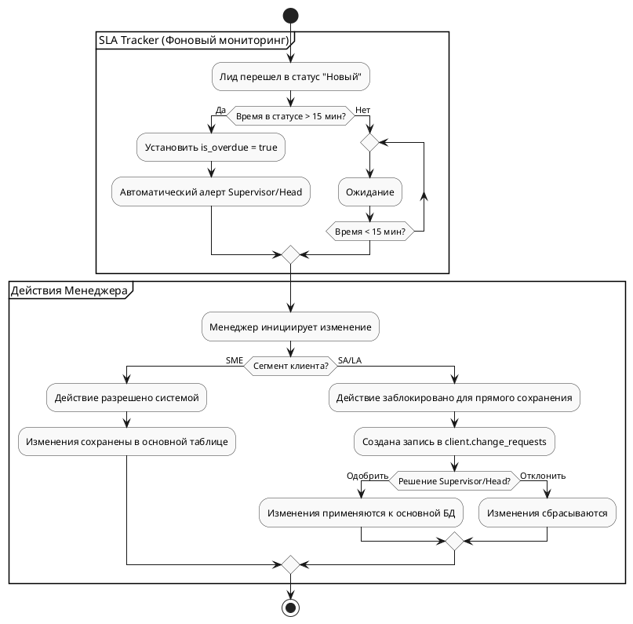

# Техническое задание: Модуль «CRM Лиды B2B»

**Система:** SapaCRM

**Версия:** 2.1 (Stage-Driven Architecture)

**Область применения:** B2B продажи (сегменты SME, SA, LA)

---

## 1. Общая информация и цели

Модуль предназначен для автоматизации полного цикла B2B-продаж. Данная спецификация спроектирована на основе воронки продаж (Pipeline-Driven). Поля и данные логически разбиты по этапам жизненного цикла сделки, что определяет момент их ввода пользователем или получения из внешних систем.

---

## 2. Ролевая модель и управление изменениями

1. **Разделение прав (SME vs SA/LA):**
   * Менеджер может закрывать сделки SME (малый бизнес) и менять ЛПР самостоятельно.
   * Для SA/LA (средний/крупный бизнес) смена ЛПР и перевод в отказ требуют участия Supervisor или Head.
2. **Change Requests (Заявки на изменение):**
   * Если менеджер меняет ЛПР в сделке SA/LA, создается заявка в `client.change_requests`. До одобрения руководителем изменения не применяются к основной таблице.
3. **SLA Tracker:**
   * Лид в статусе «Новый» более 15 минут получает метку «Просрочен» (`is_overdue = true`) с автоматической отправкой алерта руководителю.



---

## 3. Маппинг полей по этапам воронки продаж

Системные поля (в b2c это боковая панель со статичной информацией о лиде)

Генерируются при создании лида и отображаются на всех этапах в верхней панели (Header).

| **Поле в UI**         | **Источник / Логика** | **Таблица в БД** | **Поле в БД**  | **Тип** |
| -------------------------------- | ----------------------------------------- | -------------------------------- | --------------------------- | ---------------- |
| ID лида                      | System Auto                               | `client.leads_b2b`             | `id`                      | `bigint`       |
| Номер лида              | System (Формат: 2424#)              | `client.leads_b2b`             | `lead_number`             | `varchar(50)`  |
| Дата создания        | System Auto                               | `client.leads_b2b`             | `created_at`              | `timestamp`    |
| Направление           | User Input (Старт)                   | `client.leads_b2b`             | `direction_id`            | `bigint`       |
| Отдел                       | User Profile                              | `client.leads_b2b`             | `department_id`           | `bigint`       |
| Сектор                     | Auto по БИН                          | `client.leads_b2b`             | `sector_id`               | `bigint`       |
| Ответственный (Acq) | System Auto / Manual                      | `client.leads_b2b`             | `acquisition_employee_id` | `bigint`       |
| Ответственный (Ret) | System Auto / Manual                      | `client.leads_b2b`             | `retention_employee_id`   | `bigint`       |
| Метка "Просрочен"  | Auto (SLA > 15m)                          | `client.leads_b2b`             | `is_overdue`              | `boolean`      |

---

### Этап 1: NEW (Знакомство)

**Цель:** Идентификация компании, загрузка финансовых данных, фиксация ЛПР и верификация.

**Триггер перехода:** Введен OTP код (`is_otp_verified = true`).

| **Поле в UI**            | **Обяз.** | **Источник / Логика** | **Таблица в БД** | **Поле в БД**     |
| ----------------------------------- | ------------------- | ----------------------------------------- | -------------------------------- | ------------------------------ |
| БИН                              | Да                | User Input (Immutable)                    | `client.clients_b2b`           | `bin_iin`                    |
| Наименование            | Да                | Auto (ГБД ЮЛ по БИН)            | `client.clients_b2b`           | `company_name`               |
| Сегмент / Индустрия | Да                | Auto / Manual                             | `client.clients_b2b`           | `segment_id`,`industry_id` |
| Юридический адрес   | Нет              | Manual                                    | `client.clients`               | `legal_address`              |
| Текущий баланс (₸)    | Да                | Auto (из Nexign)                        | `client.clients`               | `current_balance`            |
| Задолженность (₸)     | Да                | Auto (из Nexign)                        | `client.clients`               | `charged_amount`             |
| Лицевой счет             | Да                | Auto (из Nexign)                        | `client.clients`               | `account_number`             |
| ФИО контакта (ЛПР)    | Да                | Manual                                    | `client.contacts`              | `full_name`                  |
| Телефон контакта     | Да                | Manual                                    | `client.contacts`              | `phone`                      |
| Роль контакта           | Да                | Manual (Справочник)             | `client.lead_contacts_link`    | `role_id`                    |
| Основной ЛПР (Флаг)  | Да                | Manual (Check)                            | `client.lead_contacts_link`    | `is_primary`                 |
| SMS OTP                             | Да                | System / Manual (Ввод 6 цифр)     | `client.leads_b2b`             | `is_otp_verified`            |

---

### Этап 2: HOT (Оффер и Спецификация)

**Цель:** Формирование корзины продуктов, бронирование оборудования и выбор типа оплаты.

**Триггер перехода:** Сформирована корзина, получен номер тикета брони.

| **Поле в UI**      | **Обяз.** | **Источник / Логика**    | **Таблица в БД** | **Поле в БД** |
| ----------------------------- | ------------------- | -------------------------------------------- | -------------------------------- | -------------------------- |
| Продукт / Услуга | Да                | Manual (Справочник)                | `client.lead_items`            | `product_id`             |
| Тип продукта       | Да                | Auto (Оборудование/Услуга) | `client.lead_items`            | `item_type`              |
| Количество          | Да                | Manual (Число > 0)                      | `client.lead_items`            | `quantity`               |
| Цена за ед.           | Да                | Manual                                       | `client.lead_items`            | `unit_price`             |
| Скидка                  | Нет              | Manual                                       | `client.lead_items`            | `discount`               |
| Тип оплаты           | Да                | Manual (Контракт/Полная)       | `client.leads_b2b`             | `payment_type_id`        |
| Адрес доставки   | *                   | Обязательно для SA             | `client.leads_b2b`             | `delivery_address`       |
| Номер брони         | Да                | Auto (от Support)                          | `client.leads_b2b`             | `support_ticket_id`      |

---

### Этап 3: THINKING (Возражения и Аналитика)

**Цель:** Сбор конкурентной аналитики, отработка возражений, назначение фоллоу-апа.

**Триггер перехода:** Заполнены конкурент и причина сомнений.

| **Поле в UI**        | **Обяз.** | **Источник / Логика** | **Таблица в БД** | **Поле в БД** |
| ------------------------------- | ------------------- | ----------------------------------------- | -------------------------------- | -------------------------- |
| Текущий оператор | Да                | Manual (Справочник)             | `client.leads_b2b`             | `competitor_id`          |
| Причина сомнения | Да                | Manual (Справочник)             | `client.leads_b2b`             | `objection_id`           |
| Комментарий          | Нет              | Manual (Свободный текст)    | `client.leads_b2b`             | `objection_comment`      |
| Дата след. звонка | Да                | Manual (Не в прошлом)           | `client.leads_b2b`             | `next_call_date`         |

---

### Этап 4: PAYMENT (Скоринг и Оплата)

**Цель:** Проверка надежности клиента через внешние системы, подготовка к оплате.

**Триггер перехода:** Статус скоринга APPROVED.

| **Поле в UI** | **Обяз.** | **Источник / Логика**           | **Таблица в БД** | **Поле в БД** |
| ------------------------ | ------------------- | --------------------------------------------------- | -------------------------------- | -------------------------- |
| Статус Avalon      | Да                | Auto (Интеграция со скорингом) | `client.leads_b2b`             | `scoring_status_id`      |

---

### Этап 5: CLOSED (WON / LOST)

**Цель:** Финализация сделки. Оплата и документы (WON) или фиксация причины отказа (LOST).

| **Исход сделки** | **Поле в UI**    | **Обяз.** | **Источник / Логика**        | **Таблица в БД** | **Поле в БД** |
| --------------------------------- | --------------------------- | ------------------- | ------------------------------------------------ | -------------------------------- | -------------------------- |
| Успех (CLOSED_WON)           | Факт оплаты       | Да                | Auto (Webhook из ESB)                          | `client.leads_b2b`             | `is_paid`                |
| Успех (CLOSED_WON)           | Скан договора   | Да                | Manual (Проверено менеджером) | `client.leads_b2b`             | `is_doc_verified`        |
| Отказ (CLOSED_LOST)          | Причина отказа | Да                | Manual (Справочник отказов)     | `client.leads_b2b`             | `rejection_reason_id`    |

---

## 4. Валидация данных (Regex и Логика)

* **БИН (`bin_iin`):** `^\d{12}$`. Не подлежит изменению (Immutable) после создания лида.
* **Телефон (`phone`):** `^\+77\d{9}$`.
* **OTP-код (`is_otp_verified`):** `^\d{6}$`.
* **Уникальность Лида:** Система блокирует создание новой сделки, если в БД уже существует активный (не закрытый) лид с таким же `client_b2b_id`.

---

## 5. Реестр API-методов

| **Группа** | **Метод** | **Путь**                    | **Описание**                                                                         |
| ---------------------- | -------------------- | ------------------------------------- | -------------------------------------------------------------------------------------------------- |
| Leads                  | GET                  | `/api/v1/b2b/leads`                 | Список лидов (фильтры: статус, ответственный, сегмент) |
|                        | POST                 | `/api/v1/b2b/leads`                 | Создание лида (Старт Этапа 1)                                                |
|                        | PATCH                | `/api/v1/b2b/leads/{id}/status`     | Смена этапа воронки (Проверка Hard Stops)                                 |
| Clients                | GET                  | `/api/v1/b2b/clients/search`        | Поиск компании по БИН                                                            |
|                        | GET                  | `/api/v1/b2b/clients/{id}/billing`  | Запрос баланса и долгов (из Nexign)                                          |
| Contacts               | POST                 | `/api/v1/b2b/leads/{id}/contacts`   | Привязка ЛПР                                                                            |
| Products               | PUT                  | `/api/v1/b2b/leads/{id}/items`      | Обновление состава корзины (Этап 2)                                    |
| Requests               | POST                 | `/api/v1/b2b/requests`              | Создание Change Request (Смена ЛПР для SA/LA)                                   |
|                        | PATCH                | `/api/v1/b2b/requests/{id}/resolve` | Обработка заявки руководителем                                         |
| Comms                  | POST                 | `/api/v1/b2b/leads/{id}/send-link`  | Отправка ссылок на оплату / договор (Этап 4/5)                    |

---

## 6. SQL DDL (Архитектура БД)

```sql
-- 1. Главная таблица сделок (Лидов)
CREATE TABLE "client"."leads_b2b" (
    "id" bigint PRIMARY KEY,
    "client_b2b_id" bigint NOT NULL,
    "lead_number" varchar(50) UNIQUE,
    "status_id" bigint NOT NULL,
    "direction_id" bigint,
    "department_id" bigint,
    "sector_id" bigint,
    "acquisition_employee_id" bigint,
    "retention_employee_id" bigint,
    "is_overdue" boolean DEFAULT false,
  
    -- Блок HOT (Оффер и Логистика)
    "delivery_address" text,
    "payment_type_id" bigint,
    "support_ticket_id" varchar(100),
  
    -- Блок THINKING (Возражения)
    "competitor_id" bigint,
    "objection_id" bigint,
    "objection_comment" text,
    "next_call_date" timestamp,
  
    -- Блок PAYMENT & FINAL
    "is_otp_verified" boolean DEFAULT false,
    "scoring_status_id" bigint,
    "is_paid" boolean DEFAULT false,
    "is_doc_verified" boolean DEFAULT false,
    "rejection_reason_id" bigint,
  
    "created_at" timestamp DEFAULT (now()),
    "updated_at" timestamp DEFAULT (now()),
  
    FOREIGN KEY ("client_b2b_id") REFERENCES "client"."clients_b2b" ("id")
);

-- 2. Таблица ролей контактов в конкретной сделке
CREATE TABLE "client"."lead_contacts_link" (
    "lead_id" bigint NOT NULL,
    "contact_id" bigint NOT NULL,
    "role_id" bigint NOT NULL,
    "is_primary" boolean DEFAULT false,
    "approval_status" varchar(50) DEFAULT 'ACTIVE',
    PRIMARY KEY ("lead_id", "contact_id"),
    FOREIGN KEY ("lead_id") REFERENCES "client"."leads_b2b" ("id")
);

-- 3. Корзина продуктов по сделке
CREATE TABLE "client"."lead_items" (
    "id" bigint PRIMARY KEY,
    "lead_id" bigint NOT NULL,
    "product_id" bigint NOT NULL,
    "item_type" varchar(50), 
    "quantity" int DEFAULT 1,
    "unit_price" numeric(38,2),
    "discount" numeric(38,2) DEFAULT 0,
    FOREIGN KEY ("lead_id") REFERENCES "client"."leads_b2b" ("id")
);

-- 4. Таблица заявок на изменение (Change Requests)
CREATE TABLE "client"."change_requests" (
    "id" bigint PRIMARY KEY,
    "lead_id" bigint NOT NULL,
    "requester_id" bigint NOT NULL,
    "approver_id" bigint,
    "entity_type" varchar(50), 
    "old_value_id" bigint,
    "new_value_id" bigint,
    "status" varchar(20) DEFAULT 'PENDING',
    "created_at" timestamp DEFAULT (now()),
    FOREIGN KEY ("lead_id") REFERENCES "client"."leads_b2b" ("id")
);
```
