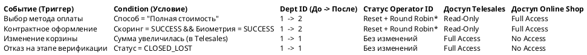
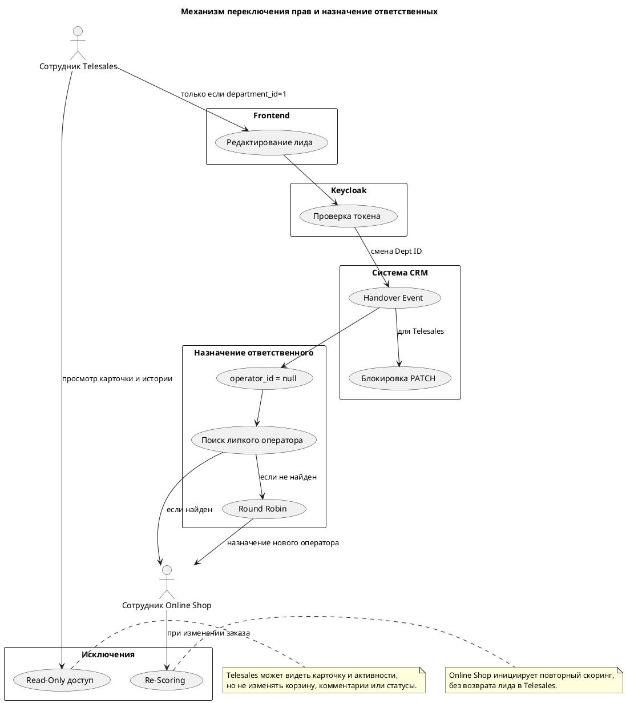
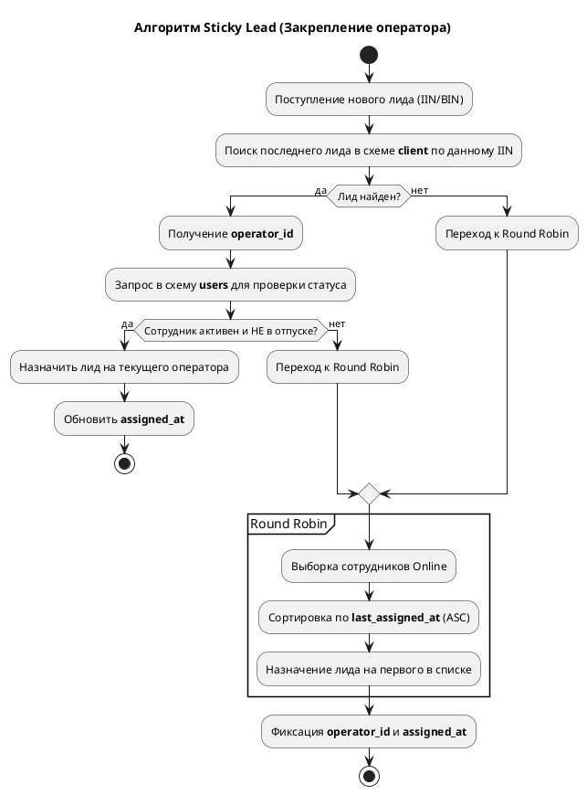
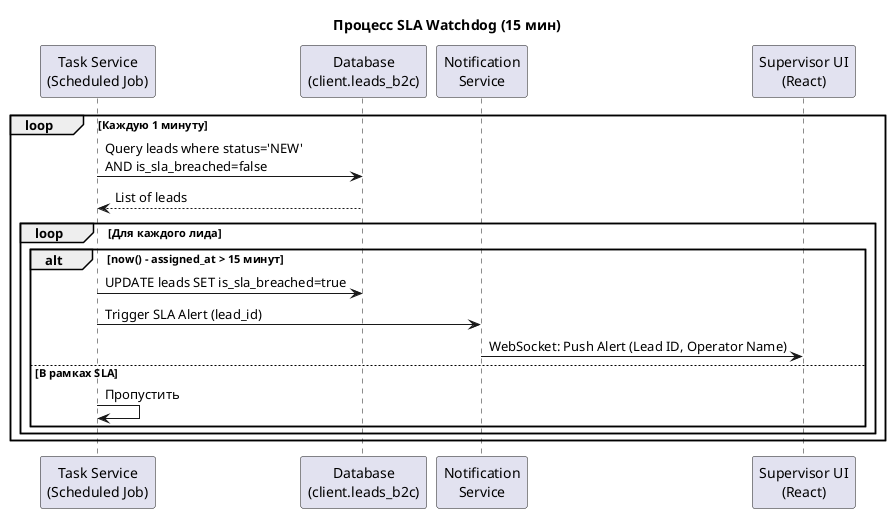
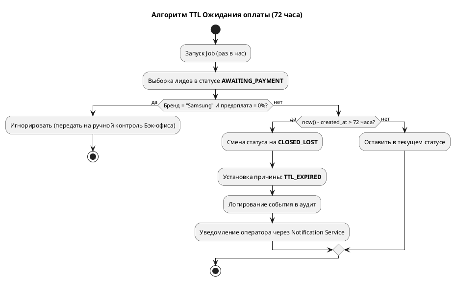
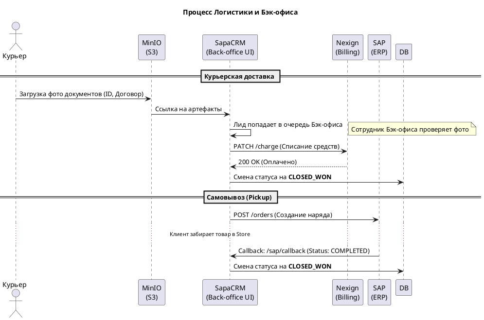

# Техническое задание: Модуль «CRM Лиды B2C» (v3.1)

## 1. Описание модуля

Модуль предназначен для автоматизации розничных продаж (B2C) через каналы **Online Shop** и  **Telesales** . Система обеспечивает бесшовную передачу лида между подразделениями, контроль юридической верификации (Биометрия/ЭЦП) и интеграцию с финансовым контуром SAP и биллингом Nexign.

**Технологический стек:**

* **Backend:** Java (Spring Boot), микросервисная архитектура.
* **Frontend:** React (SPA).
* **БД:** PostgreSQL (Схема `client`, все ID — `bigint`).
* **Интеграции:** SAP (ERP), Nexign (Billing), Astrum (Scoring), MinIO (S3).

---

## 2. Статусная модель и разграничение прав

Для управления доступом используется поле `current_department_id` (Telesales = 1, Online Shop = 2).

### 2.1. Логика Handover (Передача лида)

### Техническое описание логики

Данная таблица описывает поведение микросервиса `sapa-crm-kcell-client` при обработке перехода.

**1. Механизм переключения прав:**

* **Dept ID:** Ключевой переключатель. При значении `1` (Telesales) Frontend разрешает редактирование полей лида только пользователям с соответствующим `department_id` в токене Keycloak.
* **Handover Event:** Смена ID департамента инициирует событие в системе, которое блокирует `PATCH` методы для сотрудников первого уровня.

**2. Управление ответственными (*Round Robin):**

* При переходе в Online Shop текущий `operator_id` (сотрудник Telesales) заменяется на `null`.
* Система выполняет поиск «Липкого оператора» (Sticky Lead). Если в департаменте Online Shop есть сотрудник, ранее работавший с этим клиентом, лид назначается на него.
* Если «липкий» оператор не найден или недоступен, запускается стандартный алгоритм **Round Robin** среди доступных (Online) сотрудников нового департамента.

**3. Исключения:**

* **Read-Only:** Сотрудник Telesales сохраняет возможность просмотра карточки и истории активностей для отслеживания конверсии, но не может изменять состав корзины, комментарии или статусы.
* **Re-Scoring:** Если лид уже передан в Online Shop, но клиент решил изменить состав заказа, что привело к увеличению суммы, оператор Online Shop обязан инициировать процедуру скоринга повторно, не возвращая лид в Telesales.

### 2.2. Основные статусы лида

1. **NEW:** Новый лид, ожидает распределения.
2. **IN_PROGRESS:** В работе у оператора.
3. **VERIFICATION:** Прохождение биометрии/скоринга (ссылка активна  **15 минут** ).
4. **AWAITING_PAYMENT:** Ожидание предоплаты в Nexign (лимит  **72 часа** ).
5. **AWAITING_PICKUP:** Наряд передан в SAP, ожидание выдачи в Store.
6. **CLOSED_WON:** Сделка завершена (товар выдан/доставлен).
7. **CLOSED_LOST:** Отказ (с указанием причины).

---

## 3. Сквозной маппинг полей (БД)

| **Элемент UI**  | **Таблица** | **Поле**        | **Тип** | **Логика / Ограничение**           |
| ---------------------------- | ------------------------ | ------------------------- | ---------------- | --------------------------------------------------------- |
| **Системные** | `leads_b2c`            | `current_department_id` | `bigint`       | Владелец этапа (1 или 2)                  |
|                              | `leads_b2c`            | `operator_id`           | `bigint`       | Текущий ответственный                 |
|                              | `leads_b2c`            | `assigned_at`           | `timestamp`    | Время закрепления за опер.          |
| **Профиль**     | `clients`              | `bin_iin`               | `varchar(12)`  | Мастер-ключ клиента                      |
|                              | `clients_b2c`          | `last_name`             | `varchar`      | Персональные данные                     |
|                              | `clients_b2c`          | `phone`                 | `varchar`      | Маска +77XXXXXXXXX                                   |
| **Сделка**       | `lead_items`           | `product_id`            | `bigint`       | Справочник Nexign                               |
|                              | `leads_b2c`            | `total_amount`          | `numeric`      | Пересчет при изменении корзины |
|                              | `leads_b2c`            | `is_sla_breached`       | `boolean`      | Флаг нарушения (15 мин)                   |

---

## 4. Описание методов API

### 4.1. Взаимодействие с лидами

* **POST `/api/v1/leads/b2c`** — Создание лида (Сайт/Импорт/Ручное).
* **PATCH `/api/v1/leads/b2c/{id}/scoring`** — Запуск скоринга в Astrum. Для не-абонентов обязателен вызов `POST /otp/send`.
* **PATCH `/api/v1/leads/b2c/{id}/handover`** — Смена департамента-владельца.

### 4.2. Интеграция SAP (Pickup)

* **POST `/api/v1/integration/sap/order`** — Создание наряда на самовывоз.
* **POST `/api/v1/integration/sap/callback`** — Прием статуса `COMPLETED` от SAP. Автоматически переводит лид в `CLOSED_WON`.

---

## 5. Бизнес-логика и автоматизация

### 5.1. Алгоритм «Липкого» распределения (Sticky Lead)

Перед запуском Round Robin система выполняет проверку:

1. Поиск последнего `operator_id` для данного `bin_iin`.
2. **Валидация:** Если сотрудник активен (`is_active = true`) и не в отпуске (`on_vacation = false`), лид назначается на него.
3. **Fallback:** Если менеджер недоступен, лид уходит в общий Round Robin между сотрудниками со статусом `Online`.

### 5.2. SLA Watchdog (15 минут)

Фоновый процесс мониторит лиды в статусе `NEW`. Если `now() - assigned_at > 15 минут`, система:

* Устанавливает `is_sla_breached = true`.
* Отправляет WebSocket-алерт Супервайзеру.
* Логирует нарушение в историю лида.

### 5.3. TTL Ожидания оплаты (72 часа)

Spring Scheduled Job запускается каждый час и обрабатывает лиды в статусе `AWAITING_PAYMENT`:

* **Условие:** Прошло > 72 часов с момента создания заказа.
* **Исключение:** Лиды с продукцией **Samsung** и условием «0% предоплаты» не закрываются автоматически (требуют проверки Бэк-офисом).
* **Результат:** Перевод в `CLOSED_LOST`, причина `TTL_EXPIRED`.

### 5.4. Логистика и Бэк-офис

* **Курьерская доставка:** После загрузки фото документов курьером в MinIO, сотрудник Бэк-офиса через интерфейс подтверждает корректность данных, что инициирует финальное списание в биллинге и закрытие лида.
* **Корректировка:** При увеличении суммы заказа в Online Shop оператор обязан повторно запустить процедуру скоринга Astrum.
