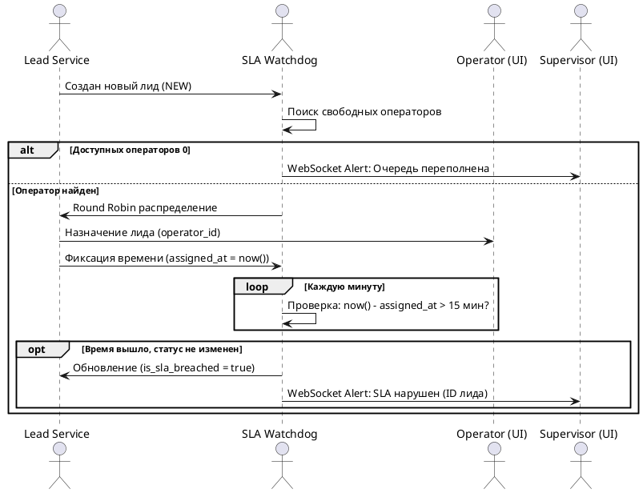

# Техническое задание: Модуль «CRM Лиды B2C» (Online Shop & Telesales)

**Система:** SapaCRM

**Версия:** 3.0 (Stage-Driven Architecture & SLA Tracking)

**Область применения:** B2C продажи (Физические лица)

---

## 1. Общая информация и цели

Модуль предназначен для автоматизации полного цикла B2C-продаж через онлайн-каналы (kcell.kz, activ.kz) и телемаркетинг.

Ключевые цели модуля:

* Ускорение обработки входящих заявок за счет алгоритма автоматического распределения Round Robin.
* Жесткий контроль времени реакции операторов (SLA Watchdog) для сбора метрик производительности.
* Обеспечение юридической чистоты сделок через интеграцию биометрической проверки и подписания документов с помощью облачной ЭЦП.
* Изоляция чувствительных персональных данных физических лиц (доходы, пароли) от B2B-сущностей.

---

## 2. Архитектура данных

Сущность физического лица нормализована и разделена на две таблицы:

1. **`client.clients`** : Базовая таблица (уже существует в БД). Выступает единой точкой входа, хранит общие идентификаторы (ИИН), настройки языка и резидентство.
2. **`client.clients_b2c`** : Новая детализирующая таблица. Хранит персональные данные физического лица (ФИО, контакты) и финансовые метрики (доходы). Связана с базовой таблицей отношением 1:1.

Для управления процессом продаж создается новая таблица  **`client.leads_b2c`** , где фиксируются движение по этапам воронки, тайминги SLA и статусы верификации.

---

## 3. Ролевая модель и контроль SLA

* **Алгоритм распределения (Round Robin):** Входящие лиды автоматически распределяются поровну между операторами, находящимися в статусе «Готов».
* **SLA Watchdog (Контроль времени):** При назначении лида на оператора система фиксирует точное время в поле `assigned_at`. Если лид не переведен в работу в течение 15 минут, система автоматически устанавливает флаг `is_sla_breached = true` и отправляет WebSocket-уведомление (Алерт) Супервайзеру.
* **Аналитика:** Поле `assigned_at` используется для построения исторических отчетов (Time to First Action, расчет нагрузки на смену).

---

## 4. Маппинг полей по этапам воронки продаж

Данные заполняются итеративно. Переход на следующий этап возможен только при выполнении условий (Hard Stops).

### Сквозные системные поля (Metadata)

Генерируются при поступлении лида (через API или вручную). Отображаются в верхней панели карточки (Header).

| **Поле в UI**                      | **Источник / Логика** | **Таблица в БД** | **Поле в БД** | **Тип** |
| --------------------------------------------- | ----------------------------------------- | -------------------------------- | -------------------------- | ---------------- |
| ID лида                                   | System Auto                               | `client.leads_b2c`             | `id`                     | `bigint`       |
| Номер лида                           | System (генерация)               | `client.leads_b2c`             | `lead_number`            | `varchar(50)`  |
| Канал поступления             | API / Manual                              | `client.leads_b2c`             | `source_id`              | `bigint`       |
| Ответственный (Оператор) | Auto (Round Robin)                        | `client.leads_b2c`             | `operator_id`            | `bigint`       |
| Время назначения               | System Auto                               | `client.leads_b2c`             | `assigned_at`            | `timestamp`    |
| Watchdog SLA                                  | SLA > 15 мин от `assigned_at`      | `client.leads_b2c`             | `is_sla_breached`        | `boolean`      |

---

### Этап 1: ACQUAINTANCE (Знакомство и Профиль)

**Цель:** Первичная идентификация клиента, создание или обновление профиля в БД.

| **Поле в UI**          | **Обяз.** | **Источник / Логика** | **Таблица в БД** | **Поле в БД** |
| --------------------------------- | ------------------- | ----------------------------------------- | -------------------------------- | -------------------------- |
| ИИН                            | Да                | User Input (Unique)                       | `client.clients`               | `bin_iin`                |
| Язык обслуживания | Да                | Manual (Справочник)             | `client.clients`               | `language_id`            |
| Резидентство          | Да                | Manual (Флаг)                         | `client.clients`               | `residency_id`           |
| Фамилия                    | Да                | Manual                                    | `client.clients_b2c`           | `last_name`              |
| Имя                            | Да                | Manual                                    | `client.clients_b2c`           | `first_name`             |
| Телефон                    | Да                | Manual                                    | `client.clients_b2c`           | `phone`                  |
| Email                             | Нет              | Manual                                    | `client.clients_b2c`           | `email`                  |

---

### Этап 2: NEEDS (Выявление потребности и Корзина)

**Цель:** Выбор продуктов, тарифов или оборудования. Формирование корзины заказа.

| **Поле в UI**    | **Обяз.** | **Источник / Логика**    | **Таблица в БД** | **Поле в БД** |
| --------------------------- | ------------------- | -------------------------------------------- | -------------------------------- | -------------------------- |
| Продукт / Тариф | Да                | Manual (Справочник)                | `client.lead_items`            | `product_id`             |
| Тип продукта     | Да                | Auto (Оборудование/Услуга) | `client.lead_items`            | `item_type`              |
| Количество        | Да                | Manual (Число > 0)                      | `client.lead_items`            | `quantity`               |
| Цена за ед.         | Да                | Auto (Прайс-лист)                   | `client.lead_items`            | `unit_price`             |

---

### Этап 3: VERIFICATION (Верификация и Скоринг)

**Цель:** Юридическая и финансовая проверка.

**Триггер перехода (Hard Stop):** Успешный статус биометрии и подписание ЭЦП (для контрактов).

| **Поле в UI**            | **Обяз.** | **Источник / Логика**            | **Таблица в БД** | **Поле в БД** |
| ----------------------------------- | ------------------- | ---------------------------------------------------- | -------------------------------- | -------------------------- |
| Сумма дохода             | *                   | Обязательно для рассрочки     | `client.clients_b2c`           | `income_amount`          |
| Источник дохода       | *                   | Обязательно для рассрочки     | `client.clients_b2c`           | `income_source_id`       |
| Семейное положение | *                   | Обязательно для рассрочки     | `client.clients_b2c`           | `marital_status_id`      |
| Статус Биометрии     | Да                | Auto (Интеграция с вендором)      | `client.leads_b2c`             | `biometric_status_id`    |
| Облачная ЭЦП             | Да                | Auto (Интеграция с eGov/вендором) | `client.leads_b2c`             | `cloud_sign_status_id`   |

---

### Этап 4: SALE & CLOSED (Логистика, Оплата и Финал)

**Цель:** Оформление доставки, подтверждение оплаты и закрытие сделки.

| **Исход сделки** | **Поле в UI**    | **Обяз.** | **Источник / Логика**    | **Таблица в БД** | **Поле в БД** |
| --------------------------------- | --------------------------- | ------------------- | -------------------------------------------- | -------------------------------- | -------------------------- |
| Все статусы             | Тип доставки     | Да                | Pickup / Courier                             | `client.leads_b2c`             | `delivery_type_id`       |
| Все статусы             | Адрес доставки | *                   | Обязательно при Courier        | `client.leads_b2c`             | `delivery_address`       |
| Успех (WON)                  | Статус оплаты   | Да                | Auto (Webhook из биллинга)         | `client.leads_b2c`             | `payment_status_id`      |
| Отказ (LOST)                 | Причина отказа | Да                | Manual (Справочник отказов) | `client.leads_b2c`             | `rejection_reason_id`    |

---

## 5. Инструментарий оператора (Actions)

В интерфейсе карточки лида B2C встроены инструменты быстрых коммуникаций:

* **Call:** Инициация исходящего вызова (интеграция с АТС / Call Center).
* **Listen:** Прослушивание записей звонков, привязанных к текущему ID лида.
* **Messenger:** Быстрый переход в чат (WhatsApp, SMS, почта) по номеру клиента.
* **SMS:** Отправка SMS-сообщений на основе предустановленных шаблонов.

---

## 6. Валидация данных (Regex и Логика)

* **ИИН (`bin_iin`):** `^\d{12}$`.
* **Телефон (`phone`):** `^\+77\d{9}$`.
* **Дубликаты:** Поиск активных лидов по совпадению ИИН для предотвращения создания множественных заявок от одного клиента.

---

## 7. SQL DDL (Архитектура БД)

Ниже представлены SQL-скрипты для создания новых сущностей, спроектированных специально для B2C-модуля.


```sql
-- 1. Расширенный профиль физического лица (Связь 1:1 с client.clients)
CREATE TABLE "client"."clients_b2c" (
    "id" bigint PRIMARY KEY,
    "client_id" bigint NOT NULL UNIQUE,
    "first_name" varchar(100) NOT NULL,
    "last_name" varchar(100) NOT NULL,
    "middle_name" varchar(100),
    "gender_id" bigint,
    "date_of_birth" date,
    "phone" varchar(20),
    "email" varchar(255),
  
    -- Финансовые и скоринговые атрибуты
    "income_amount" numeric(18,2),
    "income_source_id" bigint,
    "marital_status_id" bigint,
  
    -- Данные для Online Shop (kcell.kz / activ.kz)
    "password_hash" varchar(255),
  
    "created_at" timestamp DEFAULT (now()),
    "updated_at" timestamp DEFAULT (now()),
  
    FOREIGN KEY ("client_id") REFERENCES "client"."clients" ("id")
);

-- 2. Главная таблица сделок (Лидов) B2C
CREATE TABLE "client"."leads_b2c" (
    "id" bigint PRIMARY KEY,
    "client_id" bigint NOT NULL,
    "lead_number" varchar(50) UNIQUE,
    "status_id" bigint NOT NULL,
    "source_id" bigint,
  
    -- Блок распределения и SLA аналитики
    "operator_id" bigint,
    "assigned_at" timestamp,
    "is_sla_breached" boolean DEFAULT false,
  
    -- Блок верификации
    "biometric_status_id" bigint,
    "cloud_sign_status_id" bigint,
  
    -- Блок логистики и финализации
    "delivery_type_id" bigint,
    "delivery_address" text,
    "payment_status_id" bigint,
    "rejection_reason_id" bigint,
  
    "created_at" timestamp DEFAULT (now()),
    "updated_at" timestamp DEFAULT (now()),
  
    FOREIGN KEY ("client_id") REFERENCES "client"."clients" ("id")
);
```

---

## 8. Процесс распределения и контроля 


