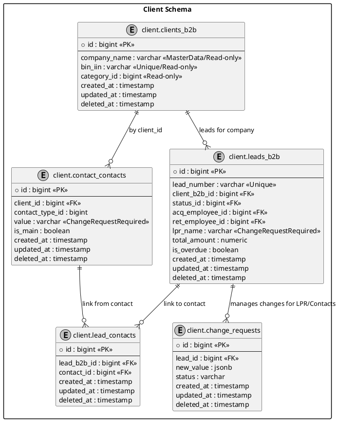

# Техническое задание: Модуль «CRM Лиды B2B» (v3.0)

**Система:** SapaCRM

**Роль:** Senior System Analyst & Enterprise Architect

**Микросервис:** `sapa-crm-kcell-client`

**Сектор:** Корпоративные продажи (SME, SA, LA)

---

## 1. Общие сведения и Архитектура

Модуль предназначен для управления полным циклом B2B-продаж. Основное отличие от B2C — работа с юридическими лицами, наличие сложных процедур согласования изменений (Change Requests) и интеграция с внешним финансовым скорингом.

**Ключевые принципы:**

* **Идентификация:** Основным ключом является  **БИН** .
* **Разделение прав:** Менеджеры SME имеют больше полномочий на прямое редактирование, в то время как для SA/LA внедрен механизм заявок на изменения.
* **Связь контактов:** Данные ЛПР (Лицо, принимающее решение) хранятся в `client.client_contacts` и связываются с компанией по `client_id`.

---

## 2. Механизм дедупликации (Check-Before-Create)

Проверка уникальности выполняется по БИН организации до инициализации новой карточки.

| **Условие**                               | **Сегмент** | **Действие системы**                                                                        |
| ------------------------------------------------------ | ------------------------ | ---------------------------------------------------------------------------------------------------------------- |
| **БИН найден**(активный лид) | SME / SA                 | **Merge:**Новый запрос добавляется как активность в текущий лид.   |
| **БИН найден**(активный лид) | LA                       | **Hard Block:**Редирект в карточку текущего КАЕ (Key Account Executive).             |
| **БИН найден**(портфель КАЕ) | LA                       | **Direct Route:**Назначение лида закрепленному менеджеру без Round Robin. |
| **БИН не найден**                     | Все                   | **New Lead:**Создание новой карточки и запуск Round Robin.                           |

---

## 3. Сквозные системные поля (Metadata)

Отображаются в верхней панели (Header) карточки лида.

| **Поле в UI**      | **Источник / Логика** | **Таблица в БД** | **Поле в БД** | **Тип** |
| ----------------------------- | ----------------------------------------- | -------------------------------- | -------------------------- | ---------------- |
| **ID лида**         | System Auto                               | `client.leads_b2b`             | `id`                     | `bigint`       |
| **Номер лида** | B-YYYYMM-XXXX                             | `client.leads_b2b`             | `lead_number`            | `varchar`      |
| **Acquisition Mgr**     | Round Robin (Pool ACQ)                    | `client.leads_b2b`             | `acq_employee_id`        | `bigint`       |
| **Retention Mgr**       | Round Robin (Pool RET)                    | `client.leads_b2b`             | `ret_employee_id`        | `bigint`       |
| **Метка SLA**      | > 15 мин от `assigned_at`          | `client.leads_b2b`             | `is_overdue`             | `boolean`      |

---

## 4. Маппинг по этапам жизненного цикла

### Этап 1: ACQUAINTANCE (Данные компании и ЛПР)

Для сегментов **SA/LA** данные ЛПР защищены. Прямое обновление запрещено.

| **Поле в UI**                    | **Обяз.** | **Таблица**   | **Поле** | **Логика изменения (SA/LA)** |
| ------------------------------------------- | ------------------- | -------------------------- | ------------------ | ------------------------------------------------- |
| **БИН**                            | Да                | `client.clients_b2b`     | `bin_iin`        | Запрещено (Мастер-данные)    |
| **Название компании** | Да                | `client.clients_b2b`     | `company_name`   | Запрещено                                |
| **Категория бизнеса** | Да                | `client.clients_b2b`     | `category_id`    | Запрещено (SME/SA/LA)                    |
| **ФИО ЛПР**                     | Да                | `client.leads_b2b`       | `lpr_name`       | **Change Request**                          |
| **Контакты ЛПР**           | Да                | `client.client_contacts` | `value`          | **Change Request**                          |

### Этап 2: NEEDS (Корзина продуктов)

| **Поле в UI**                | **Обяз.** | **Таблица** | **Поле** | **Комментарий**               |
| --------------------------------------- | ------------------- | ------------------------ | ------------------ | ---------------------------------------------- |
| **Продукт**                | Да                | `client.lead_items`    | `product_id`     | Ссылка на `ref_products`             |
| **Количество**          | Да                | `client.lead_items`    | `quantity`       |                                                |
| **Сумма контракта** | Да                | `client.leads_b2b`     | `total_amount`   | Авторасчет суммы корзины |

### Этап 3: VERIFICATION (Скоринг)

| **Поле в UI**                | **Обяз.** | **Логика**      | **Таблица** | **Поле** |
| --------------------------------------- | ------------------- | --------------------------- | ------------------------ | ------------------ |
| **Прескоринг**          | Да                | CRM Internal Logic          | `client.leads_b2b`     | `prescoring_res` |
| **Внешний скоринг** | Да                | Интеграция Avalon | `client.leads_b2b`     | `external_score` |

---

## 5. Системная логика

### 5.1. Управление изменениями (Change Requests)

Любое изменение ЛПР в сегментах SA/LA генерирует запись в `client.change_requests`.

**Структура JSON (`new_value`):**

```JSON
{
  "entity": "LEAD_B2B_LPR",
  "payload": {
    "lprName": "Азамат Ахметов",
    "contacts": [
      { "contactTypeId": 1, "value": "+7701XXXXXXX", "isMain": true }
    ]
  },
  "audit": { "oldValue": "Иван Иванов" }
}
```

### 5.2. Round Robin (Распределение)

* **Acquisition Pool:** Новые клиенты (на основе БИН).
* **Retention Pool:** Допродажи по существующей базе.
* **Выбор:** Сотрудник с минимальным `last_assigned_at` среди тех, кто в статусе `online`.

---

## 6. API Спецификация (DTO)

**LeadB2bResponseDto:**

```json
{{
  "id": 10245,
  "leadNumber": "B-202604-088",
  "clientDetails": {
    "companyName": "Kcell JSC",
    "bin": "980540000397",
    "categoryId": 12,
    "categoryName": "SME"
  },
  "lprDetails": {
    "name": "Азамат Ахметов",
    "contacts": [
      {
        "id": 5540,
        "contactTypeId": 1,
        "contactTypeName": "Mobile Phone",
        "value": "+7701XXXXXXX",
        "isMain": true
      },
      {
        "id": 5541,
        "contactTypeId": 2,
        "contactTypeName": "Email",
        "value": "a.akhmetov@kcell.kz",
        "isMain": false
      }
    ]
  },
  "status": {
    "id": 2,
    "code": "HOT",
    "name": "Горячий лид"
  },
  "assignments": {
    "acqManagerId": 884,
    "retManagerId": 912
  },
  "financials": {
    "totalAmount": 1500000.00,
    "currency": "KZT"
  },
  "sla": {
    "isOverdue": false,
    "assignedAt": "2026-04-09T14:40:00Z"
  },
  "metadata": {
    "createdAt": "2026-04-09T14:30:00Z",
    "updatedAt": "2026-04-09T14:45:00Z"
  }
}
```

---

## 7. ER-диаграмма (PlantUML)

**Фрагмент кода**


