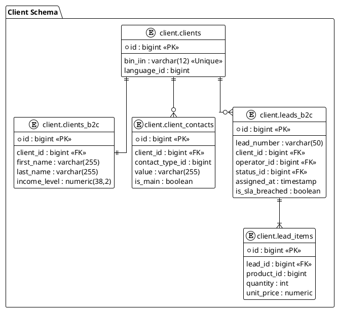

# Техническое задание: Модуль «CRM Лиды B2C» (v4.5)

**Система:** SapaCRM

**Микросервис:** `sapa-crm-kcell-client`

**Стек:** Java (Spring Boot), React, PostgreSQL

---

## 1. Общие сведения и Архитектура

Модуль предназначен для автоматизации продаж физическим лицам (Online Shop и Telesales). Система строится на принципе нормализации и защиты персональных данных.

**Ключевые принципы:**

* **Разделение данных:** Базовая информация хранится в `client.clients` (мастер-запись), расширенный B2C-профиль — в `client.clients_b2c` (связь 1:1), а контактные данные — в `client.client_contacts` (связь 1:N).
* **Типизация:** Использование `bigint` для всех ID и Foreign Keys.
* **SLA:** Жесткий лимит 15 минут на обработку нового лида оператором.

---

## 2. Сквозные системные поля (Metadata)

Генерируются системой и отображаются в Header-панели карточки.

| **Поле в UI**                    | **Источник / Логика** | **Таблица в БД** | **Поле в БД** | **Тип** |
| ------------------------------------------- | ----------------------------------------- | -------------------------------- | -------------------------- | ---------------- |
| **ID лида**                       | System Auto                               | `client.leads_b2c`             | `id`                     | `bigint`       |
| **Номер лида**               | L-YYYYMM-XXXX                             | `client.leads_b2c`             | `lead_number`            | `varchar(50)`  |
| **Канал поступления** | API / Manual                              | `client.leads_b2c`             | `source_id`              | `bigint`       |
| **Оператор**                  | Auto (Round Robin)                        | `client.leads_b2c`             | `operator_id`            | `bigint`       |
| **Время назначения**   | System Time                               | `client.leads_b2c`             | `assigned_at`            | `timestamp`    |
| **Watchdog SLA**                      | Boolean Flag                              | `client.leads_b2c`             | `is_sla_breached`        | `boolean`      |

---

## 3. Механизм дедупликации (Check-Before-Create)

Система обязана предотвращать создание дублей до инициализации карточки.

| **Параметр проверки** | **Условие совпадения**             | **Действие системы**                                                                               |
| ------------------------------------------- | --------------------------------------------------------- | ----------------------------------------------------------------------------------------------------------------------- |
| **ИИН (`bin_iin`)**              | Найден активный лид                      | **Hard Block:**Запрет создания, переход в активную карточку.                      |
| **ИИН (`bin_iin`)**              | Клиент есть, активных лидов нет | **Auto-link:**Создание лида с привязкой к существующему `client_id`.              |
| **Телефон (`value`)**        | Найден активный лид                      | **Soft Alert:**Предупреждение «Обнаружен дубликат по номеру телефона». |

---

## 4. Маппинг по этапам жизненного цикла

### Этап 1: ACQUAINTANCE (Профиль и Контакты)

**Цель:** Идентификация клиента и сбор способов связи.

| **Поле в UI**                          | **Обяз.** | **Таблица**   | **Поле** | **Логика**                             |
| ------------------------------------------------- | ------------------- | -------------------------- | ------------------ | -------------------------------------------------- |
| **ИИН**                                  | Да                | `client.clients`         | `bin_iin`        | Основной ключ дедупликации |
| **Фамилия**                          | Да                | `client.clients_b2c`     | `last_name`      | Из расширенного профиля       |
| **Имя**                                  | Да                | `client.clients_b2c`     | `first_name`     | Из расширенного профиля       |
| **Список контактов**         | Да                | `client.client_contacts` | `value`          | Массив: телефоны, email              |
| **Приоритетный контакт** | Да                | `client.client_contacts` | `is_main`        | Флаг для звонка в 1 клик         |

### Этап 2: NEEDS (Корзина)

**Цель:** Выбор продуктов и расчет стоимости.

| **Поле в UI**              | **Обяз.** | **Таблица** | **Поле** | **Комментарий**               |
| ------------------------------------- | ------------------- | ------------------------ | ------------------ | ---------------------------------------------- |
| **Продукт / Тариф** | Да                | `client.lead_items`    | `product_id`     | Ссылка на `ref_products`             |
| **Количество**        | Да                | `client.lead_items`    | `quantity`       | Число > 0                                 |
| **Цена**                    | Да                | `client.lead_items`    | `unit_price`     | Автозаполнение из прайса |

### Этап 3: VERIFICATION (Верификация)

**Цель:** Проверка легитимности сделки.

| **Поле в UI**          | **Обяз.** | **Интеграция** | **Поле в БД** |
| --------------------------------- | ------------------- | ------------------------------ | -------------------------- |
| **Биометрия**      | Да                | External SDK                   | `biometric_status_id`    |
| **Облачная ЭЦП** | Да                | eGov / Webhook                 | `cloud_sign_status_id`   |

### Этап 4: SALE & CLOSED (Логистика и Оплата)

**Цель:** Выбор доставки и закрытие сделки.

| **Исход** | **Поле в UI**              | **Таблица**             | **Поле**      |
| -------------------- | ------------------------------------- | ------------------------------------ | ----------------------- |
| Все               | **Тип доставки**     | `management.ref_delivery_types`    | `delivery_type_id`    |
| Все               | **Адрес доставки** | `client.leads_b2c`                 | `delivery_address`    |
| **WON**        | **Статус оплаты**   | `client.leads_b2c`                 | `payment_status_id`   |
| **LOST**       | **Причина отказа** | `management.ref_rejection_reasons` | `rejection_reason_id` |

---

## 5. Системная логика

### 5.1. Алгоритм Round Robin

При поступлении лида с внешних каналов:

1. Фильтрация сотрудников `users.users`, где `is_online = true`.
2. Выбор сотрудника с минимальным значением `last_assigned_at`.
3. Обновление `operator_id` в лиде и `last_assigned_at = now()` у сотрудника.

### 5.2. SLA Watchdog

Background Job (Scheduled):

1. Выборка лидов `status = NEW` и `now() - assigned_at > 15 min`.
2. Установка `is_sla_breached = true`.
3. Push-уведомление через WebSocket в интерфейс Супервайзера.

---

## 6. API Спецификация (DTO)

Формат `LeadB2cResponseDto` для фронтенда на React:


```json
{
  "id": 105,
  "leadNumber": "L-202604-0001",
  "clientBaseId": 500,
  "operatorId": 884,
  "sourceId": 2,
  "assignedAt": "2026-04-09T13:00:00Z",
  "b2cProfile": {
    "firstName": "Alex",
    "lastName": "Snow",
    "middleName": "Viktorovich",
    "binIin": "111111111111",
    "birthDate": "1990-01-01",
    "incomeLevel": 500000.00,
    "clientContacts": [
      {
        "id": 12345,
        "contactTypeId": 1,
        "value": "+7705XXXXXXX",
        "isMain": true
      },
      {
        "id": 12346,
        "contactTypeId": 2,
        "value": "alex.snow@example.com",
        "isMain": false
      }
    ]
  },
  "status": {
    "id": 1,
    "code": "NEW",
    "nameRu": "В работе"
  },
  "isSlaBreached": false
}
```

---

## 7. ER-диаграмма (PlantUML)

**Фрагмент кода**


