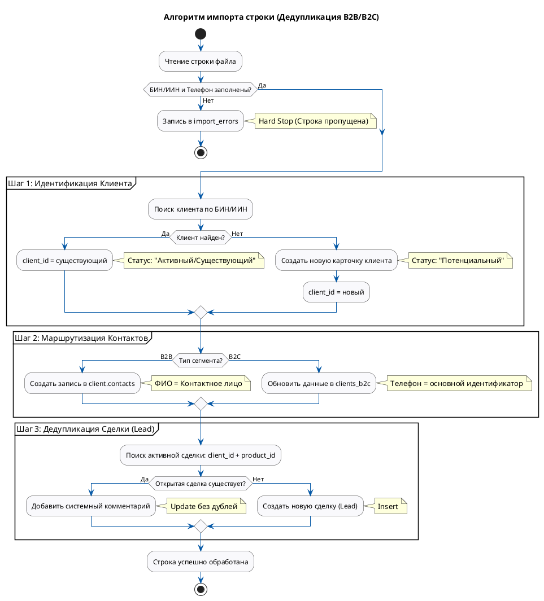

# Техническое задание: Модуль «ETL-Импорт Лидов (B2B/B2C)»

**Система:** SapaCRM

**Область применения:** Массовая загрузка лидов из Excel/CSV файлов маркетинговых кампаний.

---

## 1. Правила валидации файла 

Система применяет строгую стратегию валидации (Strict Mode) к каждой строке загружаемого файла.

| **Поле в файле** | **Тип проверки**                                               | **Действие при ошибке**                                                                                                                                                                              |
| -------------------------------- | ------------------------------------------------------------------------------- | --------------------------------------------------------------------------------------------------------------------------------------------------------------------------------------------------------------------------- |
| **БИН / ИИН**        | Строго обязательно (`@NotBlank`). Формат: 12 цифр. | **Hard Stop.**Строка отклоняется, не импортируется. В таблицу `import_errors`записывается: *"Отсутствует или некорректен БИН/ИИН"* . |
| **Телефон**         | Строго обязательно.                                            | **Hard Stop.**Строка отклоняется. Ошибка:*"Отсутствует контактный телефон"* .                                                                                          |
| **Продукт**         | Обязательно (для дедупликации).                       | **Hard Stop.**Строка отклоняется. Ошибка:*"Не указан продукт"* .                                                                                                                    |

---

## 2. Алгоритм обработки строки и Дедупликация

Для каждой валидной строки (где есть БИН/ИИН и Телефон) система выполняет следующий алгоритм маршрутизации и сохранения:

### Шаг 1: Идентификация Клиента

Система ищет клиента в базе:

* **Для B2C:** Поиск в `client.clients` по `iin = {ИИН из файла}`.
* **Для B2B:** Поиск в `client.clients_b2b` по `bin_iin = {БИН из файла}`.

**Ветвление:**

* **Найден:** Система берет существующий `client_id` и переходит к Шагу 2.
* **Не найден:** Система автоматически **создает нового клиента** (запись в `client.clients` + `client.clients_b2b`/`clients_b2c`).
  * Статус нового клиента: `LEAD` (Потенциальный).
  * Берет сгенерированный `client_id` и переходит к Шагу 2.

### Шаг 2: Обработка контактов 

* **Для B2B:** Значение из колонки «ФИО» файла записывается в таблицу **`client.contacts`** (как обычное контактное лицо, НЕ уполномоченное лицо). Привязывается к полученному `client_id`.
* **Для B2C:** Значение «ФИО» и «Телефон» обновляют/дополняют персональные данные в `client.clients_b2c`.

### Шаг 3: Дедупликация Лидов 

Система проверяет наличие открытых сделок по данному клиенту и продукту.

* **Условие поиска:** `client_id = {найденный/созданный}` AND `product_id = {из файла}` AND `status NOT IN ('CLOSED_WON', 'CLOSED_LOST')`.

**Ветвление (Критическая бизнес-логика):**

* **Открытая сделка НЕ найдена:** * Создается новая запись в `client.leads` (для B2C) или `client.leads_b2b` (для B2B).
* **Открытая сделка НАЙДЕНА (Дубликат):** * Новая сделка  **НЕ создается** .
  * Система берет существующую открытую сделку и  **добавляет системный комментарий** .
  * *Действие БД:* `UPDATE leads SET description = description + '\n[Система: Повторное обращение из кампании "Название" от DD.MM.YYYY]'`.

---

## 3. BPMN Диаграмма алгоритма 

---

## 4. Требования к новому шаблону импорта (Excel)

Чтобы алгоритм работал корректно, старый шаблон необходимо заменить. Администраторам и маркетологам будет выдаваться новый стандартный файл:

| **Обязательность** | **Название колонки** | **Описание / Пример**                                                                              |
| -------------------------------------- | ----------------------------------------- | ---------------------------------------------------------------------------------------------------------------------- |
| **Обязательно**       | **Тип клиента**           | `Юр. лицо`или `Физ. лицо`(Определяет роутинг B2B/B2C)                             |
| **Обязательно**       | **БИН / ИИН**                 | 12 цифр без пробелов (Ключ идентификации)                                              |
| **Обязательно**       | **Телефон**                  | Формат +7XXXXXXXXXX                                                                                              |
| **Обязательно**       | **Продукт**                  | Название продукта или ID из справочника (Для дедупликации сделок) |
| Желательно                   | ФИО                                    | B2B: Имя контактного лица. B2C: Имя клиента.                                               |
| Желательно                   | Название компании         | Только для B2B (записывается в `company_name`)                                                 |
| Опционально                 | Email                                     | Контактный email                                                                                             |
| Опционально                 | Кампания / Источник       | Название маркетинговой акции (пойдет в аналитику/комментарий)     |
