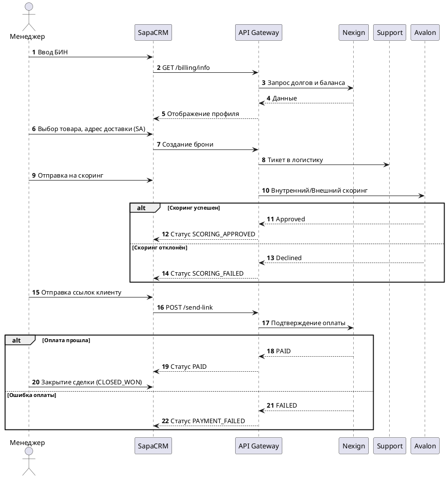
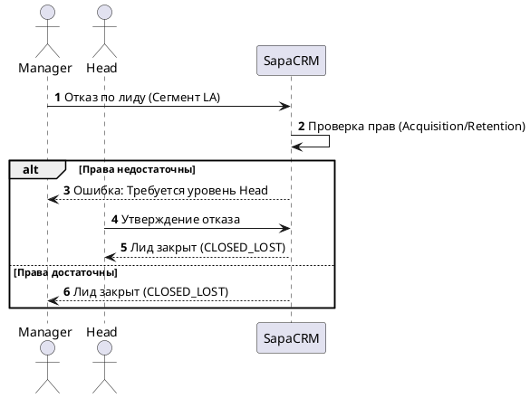

---

# Техническое задание: Модуль «CRM Лиды B2B»

**Система:** SapaCRM

**Область применения:** B2B продажи (сегменты SME, SA, LA)

---

## 1. Общая информация и цели

Модуль предназначен для автоматизации полного цикла B2B-продаж: от первичной квалификации юридического лица до подписания контракта и оплаты. Включает интеграцию с биллингом (Nexign), системой скоринга (Avalon), контроль логистики и гибкую ролевую модель для управления сделками крупного бизнеса.

---

## 2. Жизненный цикл Лида 

Переход между этапами строго контролируется системой (Hard Stops). Нарушение логики блокируется на уровне API.

| **Этап** | **Название**                | **Ключевые действия в интерфейсе**                                                                                                                                | **Триггер перехода (Hard Stop)**                                          |
| ------------------ | ----------------------------------------- | -------------------------------------------------------------------------------------------------------------------------------------------------------------------------------------------------- | ---------------------------------------------------------------------------------------------- |
| **Stage 1**  | **NEW (Знакомство)**      | Ввод БИН, автозаполнение реквизитов, загрузка данных из Nexign (баланс, долги). Привязка ЛПР и верификация (OTP). | Валидный БИН, успешная верификация OTP-кодом.               |
| **Stage 2**  | **HOT (Оффер)**                | Выбор оборудования/услуг. Выбор типа оплаты. Указание логистики (доставка обязательна для SA). Бронь.             | Создан тикет в Support (для бронирования оборудования). |
| **Stage 3**  | **THINKING (Возражения)** | Анализ конкурентов (выбор оператора), работа с сомнениями. Авторасчет суммы.                                                        | Заполнены поля `competitor_id`и `objection_id`.                              |
| **Stage 4**  | **PAYMENT (Оплата)**          | Внутренний и внешний (Avalon) скоринг.                                                                                                                                    | Статус скоринга =`APPROVED`.                                                   |
| **Stage 5**  | **WON / LOST**                      | Отправка ссылок на оплату/договор. Подтверждение оплаты. Перевод в отказ с указанием причины.                        | Оплата (ESB) + Ручная проверка скана договора.                |

---

## 3. Ролевая модель и управление доступом

Система разделяет ответственность между департаментами (Acquisition / Retention) и регулирует права на основе сегмента бизнеса (`clients_b2b.segment_id`).

1. **Сегмент SME (Малый бизнес):**
   * Менеджер имеет право самостоятельно изменять ЛПР и переводить лид в статус «Отказ».
2. **Сегменты SA / LA (Средний и Крупный бизнес):**
   * Смена основного ЛПР, изменение типа оплаты или параметров сделки доступно  **только через систему заявок (Change Request)** .
   * Перевод лида в статус «Отказ» недоступен Менеджеру и требует участия роли **Supervisor** или  **Head** .
3. **Контроль SLA (SLA Tracker):**
   * Если лид находится в статусе «Новый» (в очереди) более 15 минут, система автоматически устанавливает метку «Просрочен» и отправляет уведомление руководителю.

---

## 4. Модуль управления изменениями (Change Requests)

Для защиты данных от несанкционированного изменения внедрен процесс согласования:

1. **Инициация:** Менеджер инициирует изменение (например, смену ЛПР).
2. **Ожидание (Pending):** В БД создается заявка. В интерфейсе Менеджер видит новые данные с желтой плашкой «На согласовании». В основной таблице контактов данные  **не меняются** .
3. **Резолюция:** Supervisor одобряет (данные перезаписываются) или отклоняет заявку (данные откатываются к исходным).

---

## 5. Маппинг полей сущности Лид B2B с базой данных

### Таблица 1: Профиль организации

| **Поле**                | **Тип** | **Обяз.** | **Логика / Валидация**           | **Mapping (БД)**   |
| --------------------------------- | ---------------- | ------------------- | ----------------------------------------------------- | -------------------------- |
| **БИН**                  | Mask             | Да                | 12 цифр,**Immutable**(неизменное) | `clients_b2b.bin`        |
| Наименование          | Input            | Да                | Автозаполнение из ГБД ЮЛ         | `clients_b2b.name`       |
| Сегмент                    | Select           | Да                | SME / SA / LA                                         | `clients_b2b.segment_id` |
| Юридический адрес | Input            | Нет              | Текст                                            | `clients_b2b.address`    |

### Таблица 2: Контактные лица и ЛПР

| **Поле**              | **Тип** | **Обяз.** | **Логика / Валидация** | **Mapping (БД)**               |
| ------------------------------- | ---------------- | ------------------- | ------------------------------------------- | -------------------------------------- |
| ФИО контакта         | Input            | Да                | Текст                                  | `contacts.full_name`                 |
| Номер телефона     | Mask             | Да                | +7 (7XX) XXX-XX-XX                          | `contacts.phone`                     |
| Роль контакта       | Select           | Да                | Справочник `ref_contact_roles`  | `lead_contacts_link.role_id`         |
| Основной ЛПР         | Checkbox         | Да                | При SA/LA — запуск Change Request | `lead_contacts_link.is_primary`      |
| Статус одобрения | Label            | Да                | Enum: ACTIVE / PENDING / REJECTED           | `lead_contacts_link.approval_status` |

### Таблица 3: Сведения из Nexign (Readonly)

| **Поле**                                | **Описание**                                                   | **Mapping (БД)**       |
| ------------------------------------------------- | ---------------------------------------------------------------------------- | ------------------------------ |
| Текущий баланс                       | Остаток средств компании (₸)                          | `nexign_data.balance`        |
| Дебиторская задолженность | Наличие долгов по действующим контрактам | `nexign_data.debt`           |
| Лицевой счет                           | Основной ЛС в биллинге                                    | `nexign_data.account_number` |

### Таблица 4: Спецификация и Оффер

| **Поле**            | **Тип** | **Обяз.** | **Логика / Валидация**        | **Mapping (БД)**        |
| ----------------------------- | ---------------- | ------------------- | -------------------------------------------------- | ------------------------------- |
| Продукт / Услуга | Select           | Да                | Справочник `ref_products`              | `leads_b2b_items.product_id`  |
| Количество          | Input            | Да                | Число > 0                                     | `leads_b2b_items.quantity`    |
| Цена за ед.           | Money            | Да                | Индивидуальная цена сделки | `leads_b2b_items.unit_price`  |
| Тип оплаты           | Select           | Да                | Контракт / Полная стоимость | `leads_b2b.payment_type_id`   |
| Адрес доставки   | Input            | *                   | Обязательно, если сегмент SA | `leads_b2b.delivery_address`  |
| Номер брони         | Label            | Нет              | Генерируется Support-системой  | `leads_b2b.support_ticket_id` |

### Таблица 5: Аналитика и Возражения (THINKING)

| **Поле**                  | **Тип** | **Обяз.** | **Логика / Валидация** | **Mapping (БД)**     |
| ----------------------------------- | ---------------- | ------------------- | ------------------------------------------- | ---------------------------- |
| Текущий оператор     | Select           | Да                | Справочник конкурентов | `leads_b2b.competitor_id`  |
| Причина сомнения     | Select           | Да                | Справочник возражений   | `leads_b2b.objection_id`   |
| Дата след. контакта | Date             | Да                | Не может быть в прошлом  | `leads_b2b.next_call_date` |

### Таблица 6: Верификация и Финал

| **Поле**          | **Тип** | **Обяз.** | **Логика / Валидация**        | **Mapping (БД)**          |
| --------------------------- | ---------------- | ------------------- | -------------------------------------------------- | --------------------------------- |
| SMS OTP                     | Mask             | Да                | 6 цифр, проверка ЛПР                | `leads_b2b.is_otp_verified`     |
| Статус Avalon         | Label            | Да                | Approved/Rejected                                  | `leads_b2b.avalon_status`       |
| Факт оплаты       | Checkbox         | Да                | Read-only (из ESB/Nexign)                        | `leads_b2b.is_paid`             |
| Скан договора   | Checkbox         | Да                | Ручная проверка менеджером | `leads_b2b.is_doc_verified`     |
| Причина отказа | Select           | Нет              | Для CLOSED_LOST (справочник)          | `leads_b2b.rejection_reason_id` |

### Таблица 7: Метаданные сделки

| **Поле**              | **Тип** | **Обяз.** | **Логика / Валидация**     | **Mapping (БД)**     |
| ------------------------------- | ---------------- | ------------------- | ----------------------------------------------- | ---------------------------- |
| **ID лида**           | UUID             | Да                | Системный ключ                     | `leads_b2b.id`             |
| Номер лида             | String           | Да                | Формат: 2424#                             | `leads_b2b.lead_number`    |
| Дата создания       | Datetime         | Да                | Автоматическая генерация | `leads_b2b.created_at`     |
| Направление          | Select           | Да                | Продажа / Услуга                   | `leads_b2b.direction_id`   |
| Ответственный      | Search           | Да                | Сотрудник из `employees`           | `leads_b2b.responsible_id` |
| Отдел / Сектор       | Select           | Да                | Acquisition / Retention                         | `leads_b2b.sector_id`      |
| Метка "Просрочен" | Boolean          | Да                | Авторасчет по SLA                   | `leads_b2b.is_overdue`     |

---

## 6. Валидация данных

* **БИН:** `^\d{12}$`. Неизменяемое поле.
* **Телефон (РК):** `^\+77\d{9}$`.
* **OTP-код:** `^\d{6}$`.
* **Уникальность:** Запрет создания нового лида, если в БД существует незакрытый лид с аналогичным БИН.

---

## 7. Реестр API-методов

| **Группа** | **Метод** | **Путь**                    | **Описание**                                                                         |
| ---------------------- | -------------------- | ------------------------------------- | -------------------------------------------------------------------------------------------------- |
| **Leads**        | GET                  | `/api/v1/b2b/leads`                 | Список лидов (фильтры: статус, ответственный, сегмент) |
|                        | POST                 | `/api/v1/b2b/leads`                 | Создание лида                                                                          |
|                        | PATCH                | `/api/v1/b2b/leads/{id}/status`     | Смена статуса / Закрытие лида                                              |
| **Clients**      | GET                  | `/api/v1/b2b/clients/search`        | Поиск компании по БИН                                                            |
|                        | GET                  | `/api/v1/b2b/clients/{id}/billing`  | Запрос баланса и долгов (из Nexign)                                          |
| **Contacts**     | POST                 | `/api/v1/b2b/leads/{id}/contacts`   | Привязка ЛПР                                                                            |
| **Products**     | PUT                  | `/api/v1/b2b/leads/{id}/items`      | Обновление состава корзины                                                 |
| **Requests**     | POST                 | `/api/v1/b2b/requests`              | Создание Change Request (Смена ЛПР и др.)                                       |
|                        | PATCH                | `/api/v1/b2b/requests/{id}/resolve` | Обработка заявки руководителем                                         |
| **Comms**        | POST                 | `/api/v1/b2b/leads/{id}/send-link`  | Отправка ссылок на оплату / договор по SMS/Email                    |

---

## 8. Архитектура и Структура БД (SQL)


```SQL
-- Таблица связей Контактов (ЛПР) с поддержкой согласования
CREATE TABLE client.lead_contacts_link (
    lead_id UUID NOT NULL, 
    contact_id UUID NOT NULL,
    role_id INT NOT NULL, 
    is_primary BOOLEAN DEFAULT FALSE,
    approval_status VARCHAR(20) DEFAULT 'ACTIVE',
    PRIMARY KEY (lead_id, contact_id)
);

-- Таблица заявок на изменение (Change Requests)
CREATE TABLE client.change_requests (
    id UUID PRIMARY KEY DEFAULT gen_random_uuid(),
    lead_id UUID NOT NULL,
    requester_id INT NOT NULL,
    approver_id INT,
    entity_type VARCHAR(50), 
    old_value_id UUID,
    new_value_id UUID,
    status VARCHAR(20) DEFAULT 'PENDING',
    created_at TIMESTAMP DEFAULT CURRENT_TIMESTAMP
);
```

---

## 9. Диаграммы взаимодействия (Sequence Diagrams)

*Ниже представлены архитектурные схемы PlantUML для вставки в Wiki (Confluence/GitLab).*

### 9.1. Жизненный цикл Лида (Воронка)

**Фрагмент кода**



### 9.2. Управление правами 



---

## 10. Открытые вопросы к Заказчику

1. **Интеграция Nexign:** Подтвердить, допустимо ли кэшировать данные баланса на 1 час для снижения нагрузки на биллинг, или требуется строго Live-запрос при каждом открытии карточки?
2. **Срок жизни брони:** Через какое время тикет на бронь оборудования аннулируется, если клиент не перешел к оплате?
3. **Avalon:** Блокировать ли интерфейс менеджера (Read-only) на время ожидания ответа от скоринговой системы?
