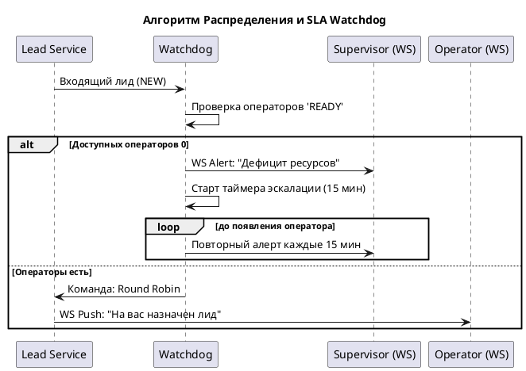
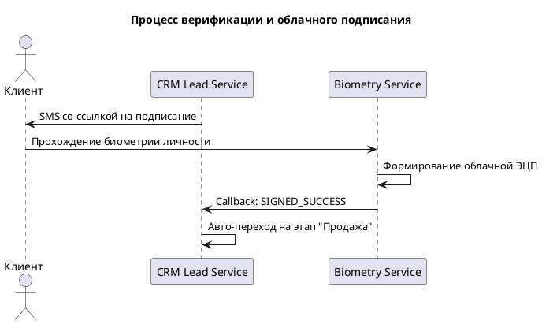

## Техническое задание: Модуль «CRM Лиды B2C» (Online Shop & Telesales)

## 1\. Общие сведения и Цели

**Назначение:** Автоматизация полного цикла B2C-продаж (физические лица) через онлайн-каналы (`kcell.kz`, `activ.kz`) и телемаркетинг.

**Цели:** \* Сокращение времени обработки лида за счет автоматического распределения и скоринга.

* Обеспечение юридической чистоты сделок через биометрию и облачную ЭЦП.
* Контроль SLA и дефицита ресурсов в режиме реального времени.

## 2\. Рабочее пространство (Этап 0)

### 2.1. Режим Канбан

Визуализация воронки в виде колонок:

1. **Новый:** Лиды в статусе `NEW`.
2. **Выявление потребности:** Статусы `ACQUAINTANCE` (Этап 1) и `NEEDS` (Этап 2).
3. **Верификация:** Статус `VERIFICATION` (Этап 3).
4. **Продажа:** Статус `SALE` (Этап 4).
5. **Архив:** Статусы `CLOSED_WON` и `CLOSED_LOST`.

### 2.2. Распределение и Watchdog (SLA Контроль)

* **Логика:** Распределение «поровну» (Round Robin) между операторами в статусе **«Готов»** .
* **Resource Watchdog:** Если в систему поступает лид, а доступных операторов — 0:
  * Мгновенное WebSocket-уведомление Супервайзеру: «Дефицит ресурсов».
  * **Escalation:** Если лид не распределен > 15 мин — критический алерт в UI Супервайзера.
* **Перераспределение:** Если лид закреплен за оператором, но не обработан в течение **$n$** минут — авто-перевод на другого активного сотрудника.

## 3\. Детальное описание воронки продаж (Карточка лида)

**Важное условие:** Смена статусов в обратном порядке (например, из «Продажи» в «Потребности») строго запрещена.

### 3.1. Этап 1: Знакомство

**Цель:** Идентификация клиента и первичный сбор данных.

| **Поле**                | **Тип** | **Обяз.** | **Валидация**                                      |
| --------------------------------- | ---------------- | ------------------- | ----------------------------------------------------------------- |
| Фамилия                    | Input            | Да                | Текст                                                        |
| Имя                            | Input            | Да                | Текст                                                        |
| Отчество                  | Input            | Нет              | Текст                                                        |
| ИИН                            | Mask             | Да                | 12 цифр, проверка контрольного числа |
| Номер телефона       | Mask             | Да                | +7 (7XX) XXX-XX-XX                                                |
| Email                             | Input            | Нет              | Email-формат                                                |
| Пол                            | Select           | Да                | Мужской / Женский                                   |
| Город                        | Select           | Да                | Справочник регионов                             |
| Язык обслуживания | Select           | Да                | Каз / Рус / Анг                                          |

**Сведения из системы Nexign (Read-only):**

Данные подгружаются асинхронно при вводе номера/ИИН и кэшируются в Redis.

| **Поле**                      | **Описание**                                 |
| --------------------------------------- | ---------------------------------------------------------- |
| **Баланс**                  | Текущий остаток на счету (₸)         |
| **Лицевой счет**       | Номер ЛС в биллинге                        |
| **Текущий ТП**           | Активный тарифный план                 |
| **Статус абонента** | Состояние (Активен / Блокирован) |
| **Дата активации**   | Дата первого подключения             |
| **Тип оплаты**           | Авансовый / Кредитный                    |

### 4.2. Этап 2: Потребности

**Цель:** Конфигурация коммерческого предложения (КП) и оффера.

| **Поле**                            | **Тип** | **Обяз.** | **Логика**                                        |
| --------------------------------------------- | ---------------- | ------------------- | ------------------------------------------------------------- |
| Интерес к продукту            | Select           | Да                | Рассрочка / Полная оплата                |
| Тип продукта                       | Select           | Да                | Тарифный план / Девайс / Комплект   |
| Модель / Тариф                     | Select           | Да                | Справочник `products_services`                    |
| Форма оплаты                       | Select           | Да                | Наличные / Карта / Безнал                  |
| Абонентская плата             | Money            | Да                | Автозаполнение из справочника ТП |
| Акция / Скидка                     | Select           | Нет              | Применяемый промо-код                      |
| **Итоговая стоимость** | Money            | Да                | **$Cost = (Base - Discount)$**                        |

**Действие:** Кнопка «Сформировать КП» генерирует PDF и переводит лид в статус `QUOTE`.

### 4.2. Этап 3: Верификация

**Цель:** Юридическая проверка и подписание документов.

| **Поле / Блок**               | **Описание**                                                                                                                 |
| ------------------------------------------- | ------------------------------------------------------------------------------------------------------------------------------------------ |
| **Кредитный скоринг** | Кнопка «Проверить КБКИ». При классе D/E кнопка перехода блокируется.                |
| **Биометрия**                | Генерация ссылки на Digital ID. Клиент должен подтвердить личность.                        |
| **Облачная ЭЦП**           | Формирование временной подписи после биометрии. API предоставляет Заказчик. |
| **Согласование**          | Блок параллельного аппрува Admin-ролями при нетиповых условиях сделки.             |

### 4.3. Этап 4: Продажа

**Цель:** Проверка стоков и логистика.

| **Поле**             | **Тип** | **Обяз.** | **Логика**                                               |
| ------------------------------ | ---------------- | ------------------- | -------------------------------------------------------------------- |
| Тех. возможность | Button           | Да                | REST-запрос в ERP (Mock-mode до готовности API)   |
| Тип доставки        | Select           | Да                | Курьер / Самовывоз                                    |
| Адрес доставки    | Input            | Да\*              | Обязательно только для типа «Курьер» |
| Способ оплаты      | Select           | Да                | При получении (Наличные / Карта)            |

### 4.4. Этап 5: Итог

**CLOSED\_WON** — сделка завершена.

**CLOSED\_LOST** — отказ с обязательным выбором причины:

* _Недозвон более 3 раз, Уже обновил девайс, Недоверие к компании, Просит удалить из базы, Не прошел скоринг._

---

## 5\. Техническая спецификация данных

### 5.1. DDL (Ключевые таблицы)

**SQL**

```sql
-- История изменений (Audit Trail)
CREATE TABLE client.lead_status_history (
    id int8 GENERATED BY DEFAULT AS IDENTITY PRIMARY KEY,
    lead_id int8 NOT NULL REFERENCES client.lead_appeals(id),
    old_status varchar(50),
    new_status varchar(50),
    changed_by uuid, -- Keycloak User ID
    changed_at timestamp DEFAULT now()
);

-- Параллельное согласование (Admin)
CREATE TABLE client.approval_requests (
    id int8 GENERATED BY DEFAULT AS IDENTITY PRIMARY KEY,
    contract_id int8 NOT NULL REFERENCES client.contracts(id),
    approver_role varchar(100) NOT NULL,
    status varchar(50) NOT NULL DEFAULT 'PENDING', -- PENDING, APPROVED, REJECTED
    comment text,
    created_at timestamp DEFAULT now()
);
```

### 5.2. Инструментарий оператора (Actions)

В интерфейсе карточки лида реализованы быстрые действия:

* `[Call]` — инициация вызова (интеграция с Call Center).
* `[Listen]` — прослушивание записей звонков по данному лиду.
* `[Messenger]` — переход в чат (WhatsApp/Telegram).
* `[SMS Template]` — отправка SMS с предзаполненным текстом.

---

## 6\. Визуализация процессов (PlantUML)

### 6.1. Алгоритм распределения и Watchdog

**Фрагмент кода**



### 6.2. Процесс верификации (Online Shop)

**Фрагмент кода**



---
