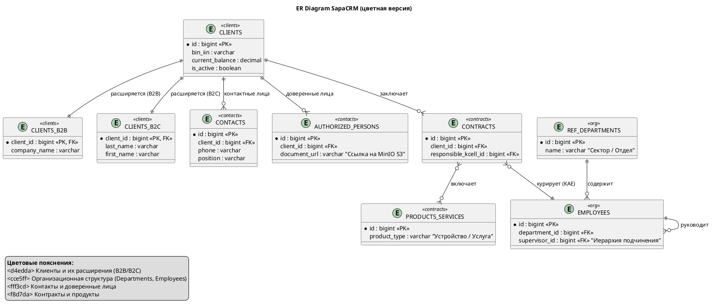
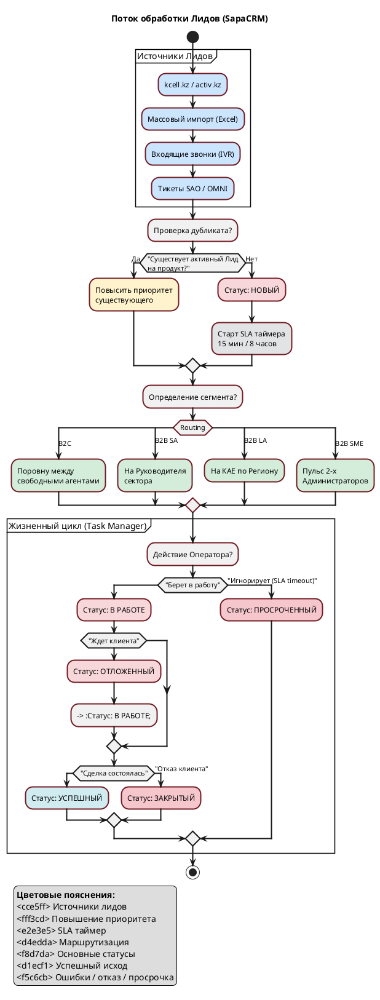
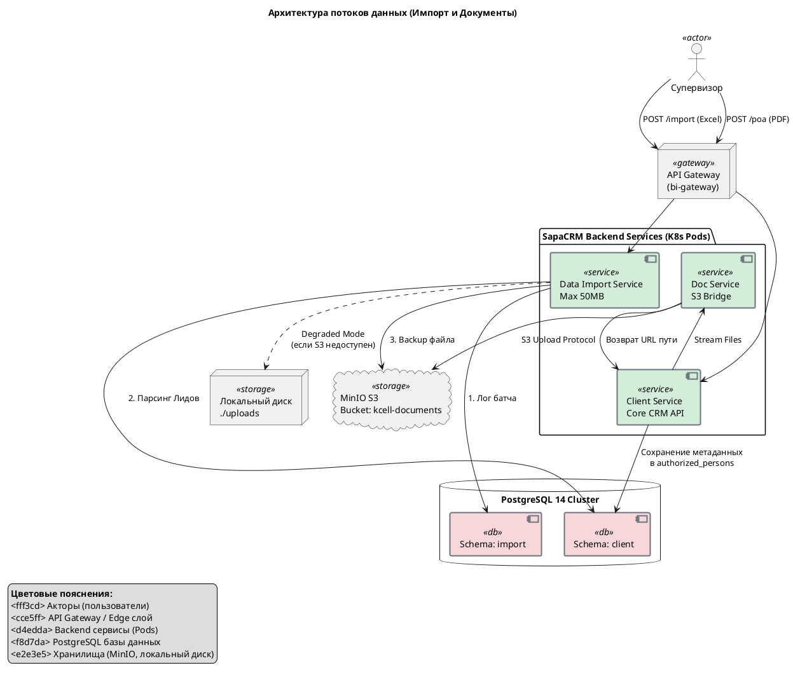
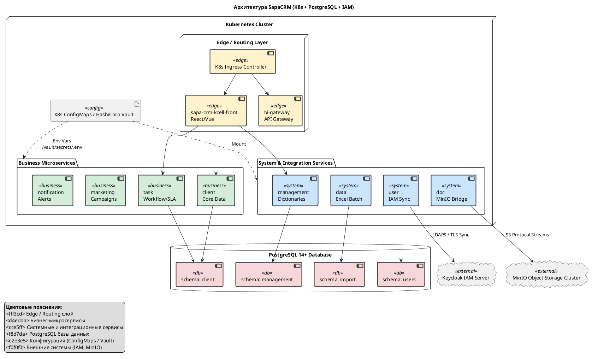

 Архитектура и устройство SapaCRM (АО «Kcell»)

---

 Глоссарий систем и терминов

Для корректной интерпретации архитектуры SapaCRM необходимо понимать роль смежных систем в ИТ-ландшафте:

* **Nexign (BSS):** Центральный биллинг. Мастер-система для финансовых операций, тарификации звонков и данных. CRM получает из неё балансы и историю начислений.
* **Шлюз ESB (Enterprise Service Bus):** Корпоративная шина (Atlas/Sirius/Avalon). Обеспечивает асинхронный обмен сообщениями между микросервисами CRM и тяжелыми legacy-системами.
* **CEIR:** Единый реестр IMEI-кодов. Используется для проверки легальности и статуса блокировки мобильных устройств.
* **SAO:** Система технического тикетинга (Service Desk). CRM интегрирована с ней для передачи заявок на ремонт или настройку связи.
* **MinIO:** S3-совместимое объектное хранилище. Используется для хранения бинарных данных (сканы документов), чтобы не перегружать реляционную БД.
* **Keycloak:** Система управления доступом (IAM), выступающая брокером аутентификации. В тестовом контуре используется сервер `kclk-test-nur.sapacrm.kz` с Realm `kcell_test`.
* **Active Directory (AD):** Корпоративное хранилище учетных записей сотрудников. Мастер-система для аутентификации.

---

 Глава 1. Бизнес-контекст и Глобальный ландшафт

 Подробный нарратив

SapaCRM — это высоконагруженная микросервисная платформа, выступающая связующим звеном между внешними каналами продаж (сайты `kcell.kz`, `activ.kz`) и внутренними учетными системами. Система консолидирует процессы продаж и обслуживания для B2C и B2B сегментов.

**Ключевые сегменты обслуживания:**

1. **B2C (Массовый рынок):** Процессы сфокусированы на скорости. Лиды из Online Shop требуют немедленной реакции (SLA 15 минут). Интеграция с телефонией Avaya POM позволяет операторам Telesales совершать звонки прямо из интерфейса.
2. **B2B (Корпоративный блок):** Процессы сфокусированы на иерархии и долгосрочных контрактах. CRM управляет сложными связями «Холдинг — Дочерняя компания — Контактное лицо».

**Архитектурный вызов:**
Проект сталкивается с вызовом поэтапного внедрения. Ядро CRM запускается раньше, чем обновленные ERP (SAP) и DWH. Это требует от системы избыточной гибкости — возможности работать в «автономном» режиме, где данные временно загружаются через Excel-импорт.

**Фрагмент кода**

```plantuml
@startuml
!include https://raw.githubusercontent.com/plantuml-stdlib/C4-PlantUML/master/C4_Context.puml

title Глобальный ландшафт SapaCRM (Kcell)

Person(agent_b2c, "Оператор B2C", "Telesales / Online Shop")
Person(agent_b2b, "Менеджер B2B", "KAE / Администраторы")
Person(client, "Клиент Kcell", "Оставляет заявки на сайтах, звонит в IVR")

System_Boundary(crm_boundary, "Контур SapaCRM") {
    System(sapacrm, "SapaCRM Backend (K8s)", "8+ микросервисов. Ядро бизнес-логики.")
}

System_Ext(ad, "Active Directory", "LDAPS. Мастер-система учеток.")
System_Ext(keycloak, "Keycloak IAM", "Брокер аутентификации (JWT).")
System_Ext(minio, "MinIO S3", "Хранилище скан-копий (kcell-documents).")
System_Ext(sites, "kcell.kz / activ.kz", "Витрины лидогенерации.")

System_Ext(esb, "Шлюз ESB (Atlas/Sirius)", "Корпоративная шина данных.")
System_Ext(avaya, "Avaya POM", "Телефония и обзвон.")
System_Ext(nexign, "Nexign BSS", "Биллинг. МГ/КТ, М2М, балансы.")
System_Ext(sap, "SAP ERP", "Склад, Бухгалтерия.")
System_Ext(sao, "SAO / CEIR", "Инциденты и реестры.")

Rel(client, sites, "Заполняет форму")
Rel(agent_b2c, sapacrm, "Обрабатывает лиды")
Rel(agent_b2b, sapacrm, "Ведет карточки B2B")

Rel(sites, sapacrm, "Передача лидов (REST API)")
Rel(sapacrm, keycloak, "Валидация доступа")
Rel(keycloak, ad, "Проверка паролей")
Rel(sapacrm, minio, "Стриминг файлов")

Rel(sapacrm, esb, "Интеграционный слой")
Rel(esb, nexign, "Выставление счетов")
Rel(esb, sap, "Проверка оборудования")
Rel(esb, sao, "Обмен тикетами")
Rel(sapacrm, avaya, "SIP WebSocket")

@enduml

```

---

 Визуализация: Sequence Diagram (Авторизация)

 Глава 2. Подсистема IAM и Безопасность

 Подробный нарратив

Безопасность SapaCRM строится на принципе централизованной авторизации через Keycloak (Identity Broker).

**Протокол авторизации и JWT:**
Система использует OAuth2 Resource Server. Процесс входа:

1. Пользователь вводит данные в UI.
2. Keycloak проверяет их в AD через LDAPS.
3. При успехе генерируется JWT-токен, подписанный Issuer: `https://kclk-test-nur.sapacrm.kz/realms/kcell_test`.
4. Микросервисы валидируют токен, проверяя `issuer-uri` и идентификатор клиента `kcell_test`.

**Решение проблемы доверия (The cacerts Fix):**
Ошибка `PKIX path building failed` при старте сервиса `user` устранена путем монтирования хранилища сертификатов `cacerts` в поды. Это позволяет сервису безопасно подключаться к `https://kclk-test-nur.sapacrm.kz/` для программной синхронизации 42 бизнес-ролей.

![img](http://www.plantuml.com/plantuml/svg/~1UDgTLLrF6qSKVTzVSGKlQwcM-OXGi925mT0wn0h2e3v6mtgmjwntjpkpICaJ7wAjb4Wqj9Nwr3QgrBwwBcuSKk0lpFoZdfcrIJQMyz0Nbjrxp_quvzxhLI5P8jDku4XV1fpKzwglJzMjFbP3zKRrz3Tgg2z83Kdzh6xmFzvLJxtBMPiiPkix3OUbCWhJxZvF78TvCafeHhr6h5DzhC_KbS6hwnbYWlO4V69azZq_Pg6acSqa2YKFMvcvdZTkfOWPSic5DMyz57bxesaZalk87R62zMaqdqucKQ_KZ-GAhyExh4mfx2BphgrPxu_2Rl5dNX2nG-jIhpRorged_IDEDJ_XfjTdrgjQSvns4gKngL_LR-eNzOVw2HoyfldofnXqcrQ6kE0GXP7abFZjZgJemFHAizLQxU76qYSZg7yDkP3jLf-e0PvzV3vHFGGq8OgLCIDKfaQKee7rA3pmsmqMa-inZoTIcEnZhnnWBOgaa0cBOpziaxkw7Ga9E3wbdlm8DQOICFKdHcbWPH_GWmKorQ7iWNexRZCw0cW4_inGJBFBSniRotC0luBZ6m3kqEE9kj4lr5lQVToaBrZO4XrsoFDv3RXCsq-QkrHYhQuVbXBEWgue7Ney24f95701X74hvffRc9kdTVXAtY8NMWsHwzoMUfDZM9-XZ3jm-nqClOA3OPsYzK9vwXxTsWZ7-90PUnE2swfcDpThrRLbnBdKvm1T4N3WJh-qbFGjVe3t2-373EpL3UUNi5h0Epp-DjsedjrVmwCL80FLtvDMJMM7TlZNAHUIt2Sn3-irCnuXpzIrd5Kms_1zNAjkDz6m3TMtlLmZWMlgmvgVqjBYKi41Y0MI5WdP1oCte-0Ww-DElq3zrse8Fp9nY_UrxF2laDL-7qjb-te0bVP2N9XEbFZFUSjwc2QCGoQa-br_YqodfcF3DMX7Dco1Vfcz_6KvGTfHyJtBZRiubstFZUcL1uARI9dKvvC5DbFFuqAyht1iK3_OMS_KpUH-zELkqGYDdCRKcsohQeFHRdJ8m_kMFfpEppVCFCT-wMY-52VHWOyZxQvnbi2Ay0KBch9-bwChSNLVaDc2fp5FkhuGFXOuZ_vWXcv1M3-RKwEXuSwEAo4OBWnE-Xa8WgJw79YYkJQm_6Ff1xM6IAo7NP60j_6aW1yOMLVsAzYJ_jZnVYRqXLdox5heY_9AQRzYl4Udh_8_Jz_Aw9nK9Yx7ocZ5AbDNTTh2ePci9STPnL_yTlu7Vl5R3m00)

---

 Глава 3. Ядро системы — Доменная модель "Карточка Клиента"

 Нарратив: Нормализация и структура БД

Вся информация о клиентах инкапсулирована в микросервисе `client` (PostgreSQL, 51 таблица). Для поддержания третьей нормальной формы (3НФ), учитывая колоссальную разницу атрибутов между физическими и юридическими лицами, применен паттерн  **Class Table Inheritance** .

**Иерархия клиентов:**

* Таблица `clients` выступает общим фундаментом. Она содержит общие финансовые агрегаты (`current_balance`, лимиты), флаги блокировок и уникальный идентификатор интеграции `bin_iin`.
* Специфичные данные вынесены в таблицы-наследники, связанные по `client_id` (1:1): `clients_b2b` (название компании) и `clients_b2c` (Фамилия, Имя, Отчество).

**Организационная структура (Routing Foundation):**
База данных CRM выступает не только хранилищем, но и двигателем бизнес-процессов. Таблица `employees` хранит данные сотрудников и связана со справочником `ref_departments`. Рекурсивное поле `supervisor_id` позволяет алгоритмам маршрутизации программно вычислять иерархию (например, найти "Начальника сектора B2B", чтобы эскалировать на него VIP-лид).

**Архитектурный долг (Контакты vs Доверенные лица):**
В текущей физической модели БД заложен риск дублирования информации. Присутствуют две независимые таблицы:

1. `contacts` — Контактные лица компании (например, CTO, Финансовый директор).
2. `authorized_persons` — Доверенные лица (лица, имеющие юридическую силу, для которых через API загружается скан-копия доверенности в формате PDF).
   Поскольку один и тот же человек может быть и контактом, и доверенным лицом, изменение его номера телефона потребует ручной синхронизации в двух разных интерфейсах карточки клиента. Это архитектурное ограничение зафиксировано "Как есть" (As-Is).

 Визуализация: ER-диаграмма домена "Клиент"



---

 Глава 4. Управление бизнес-процессами: Лиды, Активности и SLA

 Нарратив: Жизненный цикл продаж и маршрутизация

Микросервис `task` (Task Manager) отвечает за "конвейер" обслуживания. В SapaCRM существуют две основные транзакционные сущности: **Лиды** (потенциальные сделки) и **Активности** (коммуникации с клиентом: звонки, встречи, email).

**Омниканальное распределение (Routing):**
Все поступающие лиды проходят этап дедупликации (если клиент уже подавал заявку на этот продукт, повышается приоритет старого лида). Далее применяется матрица маршрутизации:

* **B2C (Online Shop / Telesales):** Лиды распределяются системой строго поровну между свободными операторами (статус «Онлайн»).
* **B2B SME (Малый/Средний бизнес):** Лиды поступают в общий пул, где два выделенных администратора распределяют их вручную.
* **B2B SA (Стратегические аккаунты):** Лиды автоматически маршрутизируются на Руководителя подразделения.
* **B2B LA (Крупный бизнес):** Алгоритм распределяет лиды на КАЕ (Key Account Executive) в зависимости от региона клиента.

**Сквозной SLA и Конечный Автомат (State Machine):**
Жизненный цикл лида строго детерминирован.
При создании лид получает статус  **«Новый»** . В этот момент запускаются жесткие таймеры: 15 минут для массового сегмента B2C и 8 часов для B2B.
Оператор обязан взять лид  **«В работу»** . Если таймер истекает до этого действия, лид переходит в статус **«Просроченный»** (SLA breached), что влияет на KPI сотрудника. Лид "В работе" может быть временно переведен в **«Отложенный»** (если клиент попросил перезвонить), а финальной резолюцией сделки является **«Успешный»** (договор заключен) или **«Закрытый»** (отказ).

 Визуализация: Flowchart (Жизненный цикл Лида)



---

 Глава 5. Интеграционный слой и Хранилище документов

 Нарратив: Взаимодействие с внешним миром и тяжелыми данными

CRM-система обрабатывает гигабайты информации, несовместимой с реляционной базой данных (бинарные файлы и массовые Excel-выгрузки). Для защиты ядра от перегрузок памяти (OOM) выделены специализированные "буферные" микросервисы.

**Data Import Service (Модуль массовой загрузки):**
Когда супервизор выгружает базу на тысячи контактов для обзвона (Telesales), этот файл попадает в `Data Import Service`.

* **Лимиты:** Установлено жесткое ограничение загрузки файла `UPLOAD_MAX_SIZE_MB=50` и пула соединений БД (`DB_POOL_SIZE=10`).
* **Изоляция:** Сервис ведет логи импорта в собственной схеме `import`, а проверенные данные записывает напрямую в бизнес-схему `client`.
* **Отказоустойчивость (Degraded Mode):** Если объектное хранилище MinIO (куда складываются резервные копии Excel-файлов) недоступно, сервис не падает. Он сохраняет файлы на локальный диск пода (`UPLOAD_DIR=./uploads`) и продолжает бизнес-процесс, откладывая синхронизацию на планировщик.

**Doc Service (Управление документами):**
Реляционная PostgreSQL хранит только метаданные: статус, размер, имя и путь документа (например, `/docs/poa/18/utemisov.pdf`). Физические файлы скан-копий договоров и доверенностей по протоколу S3 отправляются через `Doc Service` в бакет `kcell-documents` объектного хранилища  **MinIO** .

**Интеграция через ESB:**
Связь с биллингом Nexign, складскими системами SAP и CEIR осуществляется через шину ESB (Atlas/Sirius/Avalon). Документооборот тикетов с системой SAO реализован через хранение идентификаторов (например, `SAO-2026-20451`) и статусов (`open`/`resolved`) в таблице `client.tickets`, что позволяет реализовать асинхронный поллинг или прием вебхуков об изменении статуса проблемы клиента.

 Визуализация: Component Diagram (Импорт и Хранилище)



---

 Глава 6. Инфраструктура, Развертывание и Конфигурация

 Нарратив: Топология кластера и Динамические конфигурации

Платформа SapaCRM спроектирована как Cloud-Native приложение и разворачивается в кластере **Kubernetes (K8s)** с использованием пакетного менеджера  **Helm** .
Такой подход гарантирует эластичное масштабирование: в периоды пиковых нагрузок на `kcell.kz` Kubernetes может автоматически создавать новые копии (реплики) сервисов `front` и `client`, не тратя ресурсы на тяжеловесные интеграционные поды.

**Ландшафт микросервисов (Helm-чарты):**
Инфраструктура Фазы 1 состоит из следующих упакованных контейнеров (`.tgz`):

* `front` и `bi-gateway` (Пользовательский интерфейс SPA и единый API-шлюз).
* `client` (Ядро клиентских данных).
* `task` (Модуль SLA и маршрутизации бизнес-процессов).
* `notification` (Модуль уведомлений операторов).
* `marketing` (Модуль рассылок и кампаний).
* `data` и `doc` (Импорт и документооборот).
* `user` и `management` (IAM синхронизация и конфигурации).
  *(Примечание: Сервис `message`, упомянутый в текстовых инструкциях по развертыванию, в текущем срезе Helm-чартов отсутствует, что указывает на перенос его релиза на следующие этапы).*

**Management Service (Динамические справочники):**
Для устранения зависимости бизнеса от циклов разработки (Release Cycles), управление справочниками (списки городов `ref_cities_regions`, источники лидов, статусы маркетинга) вынесено в специализированный микросервис `management`.
Данные хранятся в универсальных таблицах `web_config` и `web_config_content` (с поддержкой мультиязычности и иерархических JSON-связей). Так как эти списки требуются фронтенду при отрисовке почти каждой формы, микросервисы кэшируют эти данные в оперативной памяти (In-Memory), чтобы не истощать жестко заданный пул подключений (10 соединений) к PostgreSQL.

**Секреты и конфигурация (ConfigMap & Vault):**
В исходном коде отсутствуют захардкоженные пароли. Учетные данные к БД (`DB_PASSWORD`), ключи MinIO (`MINIO_SECRET_KEY`) и URL-адреса Keycloak внедряются в поды динамически в момент старта контейнера через `.env` файлы, смонтированные из `/vault/secrets/` или K8s ConfigMaps.

 Визуализация: Component Diagram (Топология развертывания K8s)


