# Архитектура и устройство SapaCRM (АО «Kcell»)

*Комплексная техническая документация. Версия 2.1.3*

---

## Глоссарий систем и терминов

Для эффективного взаимодействия бизнеса и IT в рамках проекта SapaCRM, ниже приведены определения ключевых элементов ландшафта:

* **Nexign (BSS — Business Support System):** Сердце финансовых операций оператора (биллинг). Система хранит информацию о тарифных планах, начислениях, балансах и трафике. CRM обращается к Nexign, чтобы показать сотруднику актуальный финансовый статус клиента.
* **Шлюз ESB (Enterprise Service Bus — Atlas/Sirius/Avalon):** Корпоративная «почтовая служба». Централизованный узел, который переводит запросы с языка микросервисов (JSON) на язык старых систем (XML/SOAP) и гарантирует, что сообщение не потеряется при передаче в биллинг или ERP.
* **CEIR (Central Equipment Identity Register):** Национальный реестр IMEI-кодов. Интеграция необходима для проверки «белых» и «черных» списков мобильных устройств при обращениях абонентов.
* **SAO (Service Desk):** Система для инженеров. Если у клиента плохо ловит сеть, оператор CRM создает заявку, которая через интеграцию мгновенно улетает в SAO для технической отработки.
* **MinIO:** Высокоскоростное «облако» внутри Kcell. Здесь хранятся тяжелые файлы (сканы паспортов, PDF-договоры), чтобы основная база данных работала быстро и не переполнялась.
* **Keycloak:** Цифровой «вахтер». Система, которая выдает сотруднику пропуск (JWT-токен) после того, как он ввел правильный логин и пароль.
* **Active Directory (AD):** Главная книга сотрудников Kcell. Хранит учетные записи и пароли. Keycloak всегда спрашивает разрешение у AD перед тем, как впустить пользователя в CRM.

---

## Глава 1. Бизнес-контекст и Глобальный ландшафт

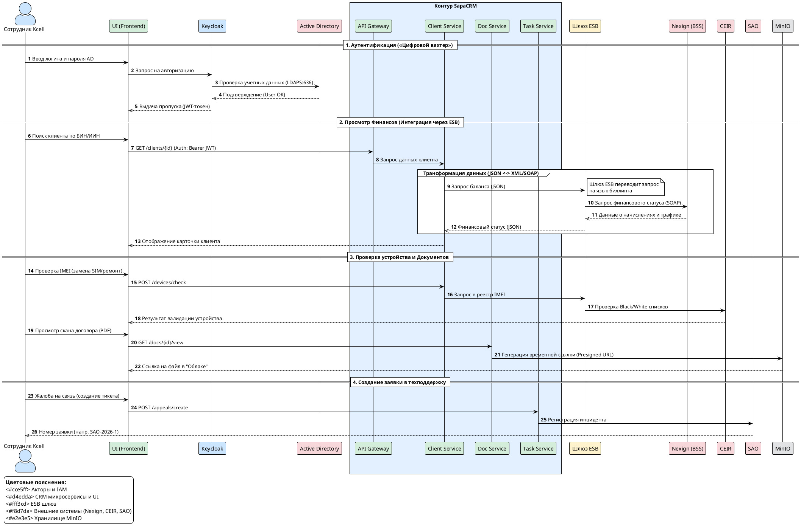

### Нарратив: Зачем Kcell нужна SapaCRM?

SapaCRM — это не просто база данных, а инструмент для создания единого клиентского опыта. В условиях жесткой конкуренции телеком-оператору важно, чтобы менеджер B2B в Алматы и оператор Telesales в Астане видели одну и ту же информацию о клиенте в реальном времени.

**Для бизнеса:**
Система автоматизирует воронку продаж. Теперь лид (заявка) не может «потеряться» в Excel-таблицах менеджеров. Система сама следит за сроками: если заявка на iPhone не обработана за 15 минут, она подсвечивается красным. Если контракт с крупным холдингом (LA сегмент) не согласован за 8 часов, уведомление уходит руководителю.

**Для специалистов:**
Архитектура построена на микросервисах Java Spring Boot. Это позволяет обновлять функционал «Карточки клиента», не останавливая работу «Маркетинга». Система интегрирована с внешними витринами (`kcell.kz`, `activ.kz`) через REST API, что обеспечивает моментальное попадание заказов из корзины в CRM.

**Архитектурный вызов (Phase Gap):**
Проект запускается итеративно. В первой фазе CRM работает в условиях отсутствия прямой связи с SAP ERP. Это значит, что информация о наличии роутеров на складе временно вносится вручную через модуль импорта, пока не будет реализован сквозной API к февралю 2027 года.

### Визуализация: Ландшафт системы (C4 Context)

**Фрагмент кода**

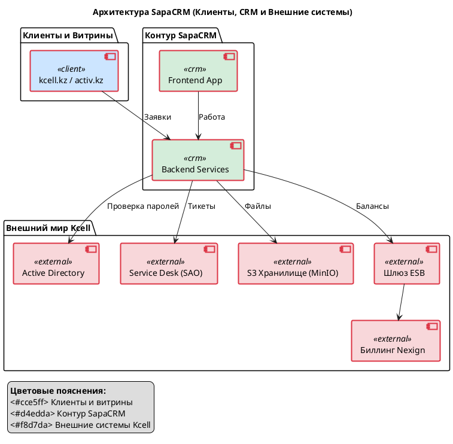

---

## Глава 2. Подсистема IAM и Безопасность (Эксплуатационный уровень)

### 1. Нарратив: Архитектура доверия и конфигурация Resource Server

В новой редакции мы переходим от общего описания безопасности к конкретной эксплуатационной модели. Безопасность SapaCRM реализована по стандарту  **OAuth2 / OpenID Connect** , где каждый микросервис выступает в роли  **Resource Server** , делегируя проверку прав центральному узлу аутентификации.

**Технический стек и параметры среды:**
Центральным брокером авторизации является сервер  **Keycloak** . Для тестового контура зафиксированы следующие параметры подключения, которые используются микросервисами (через переменные окружения в `bootstrap.yml` / `application.yml`):

* **Keycloak Server URL:** `https://kclk-test-nur.sapacrm.kz/`
* **Realm:** `kcell_test` (изолированное пространство пользователей и ролей Kcell).
* **Client ID:** `kcell_test`
* **Client Secret:** `yvUPQq5doqoqp2NrfYvJ8H2kmf7po57z`
* **JWT Issuer URI:** `https://kclk-test-nur.sapacrm.kz/realms/kcell_test`

**Механизм аутентификации пользователя:**
При входе сотрудника в систему Frontend перенаправляет его на страницу логина Keycloak. Keycloak выполняет роль моста (Federated Identity) к корпоративной  **Active Directory (AD)** . Проверка пароля осуществляется по защищенному протоколу  **LDAPS (порт 636)** . При успешном ответе от AD, Keycloak генерирует JWT-токен, подписанный секретным ключом Realm.

**Проверка токена микросервисами:**
Каждый запрос от Frontend к Backend (например, к `client` или `task`) содержит заголовок `Authorization: Bearer <JWT>`. Микросервис, выступая как Resource Server, не запрашивает Keycloak при каждом вызове. Он валидирует подпись токена самостоятельно, используя открытый ключ, полученный по адресу `issuer-uri`. Это обеспечивает высокую производительность и снижает нагрузку на сеть.

**Решение инфраструктурной блокировки (PKIX Fix):**
Для обеспечения доверия между Java-приложением и сервером Keycloak, защищенным корпоративным SSL-сертификатом, в инфраструктуру внедрено хранилище сертификатов  **`cacerts`** . Оно монтируется в каждый Pod микросервиса. Это критически важно для работы `KeycloakRoleInitializer`, который синхронизирует бизнес-роли (всего 42 роли) между базой данных CRM и Keycloak.

---

### 2. Визуализация: Sequence Diagram (Эксплуатационный цикл)

Ниже представлена диаграмма, отражающая взаимодействие компонентов с использованием реальных эндпоинтов тестового контура.

### Визуализация: Процесс входа

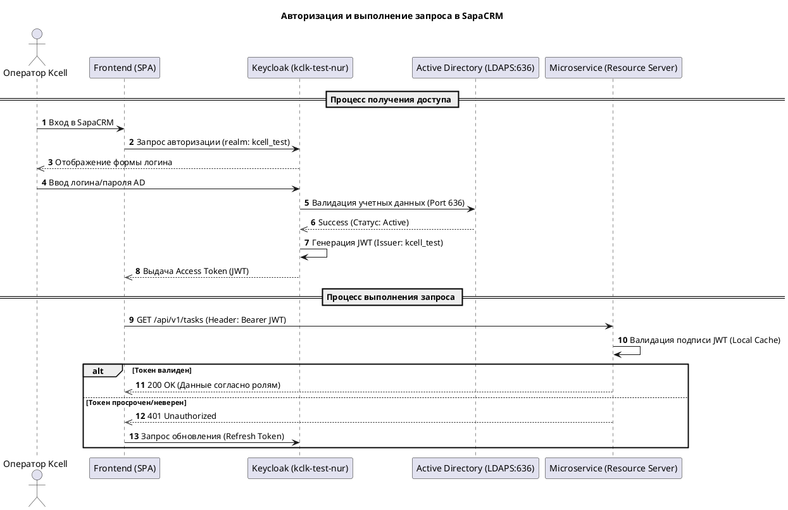

---

## Глава 3. Ядро системы — Доменная модель "Карточка Клиента"

### Нарратив: Кто наш клиент?

В базе данных SapaCRM (схема `client`, 51 таблица) клиент представлен как сложный цифровой объект. Мы разделили данные так, чтобы система «летала», даже если в ней миллионы записей.

**Для бизнеса:**
Система понимает разницу между студентом, покупающим тариф «Безлимит», и заводом, подключающим 1000 датчиков IoT.

* **B2C:** Упор на персональные данные (ИИН, кодовое слово для звонка в call-центр).
* **B2B:** Упор на полномочия (кто имеет право подписи, а кто просто технический контакт). Мы разделили «Контакты» (с кем поговорить) и «Доверенные лица» (кто юридически значим).

### Технические особенности схемы:

1. **Наследование (Table Inheritance):** Реализовано разделение общей сущности `clients` и её расширений `clients_b2b` (юрлица) и `clients_b2c` (физлица). Связь идет по первичному ключу (`PK` = `FK`).
2. **Иерархия сотрудников:** Таблица `employees` связана сама с собой через `supervisor_id`, что позволяет строить дерево подчинения для маршрутизации лидов.
3. **CRM-блок:** Таблицы `activities` и `tickets` связывают клиентов с конкретными сотрудниками, ответственными за обработку обращений (включая интеграцию с внешней системой SAO).
4. **Разделение полномочий:** Как отмечалось ранее, в системе разделены контактные лица (`contacts`) и уполномоченные представители (`authorized_persons`), имеющие право подписи.

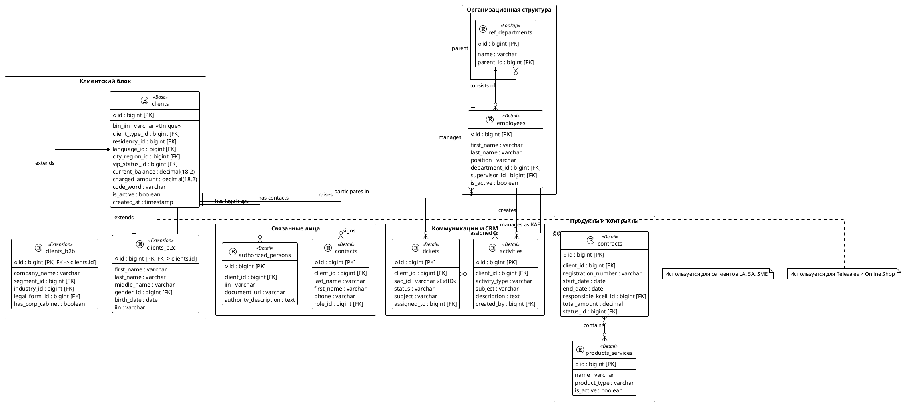

****Для специалистов:**
Применен паттерн  **Class Table Inheritance** .**

* `clients`: общие поля (баланс, язык обслуживания, регион).
* `clients_b2b`: расширение (БИН, название компании, бизнес-сегмент LA/SA/SME).
* `clients_b2c`: расширение (ФИО, дата рождения, пол).
  Данные хранятся в PostgreSQL (`kcell_test_db`). Все таблицы нормализованы (3НФ), что гарантирует отсутствие дублей.

### Ключевые связи на диаграмме:

* **Иерархия B2B/B2C:** Позволяет хранить общую историю (активности, договоры) в одной точке (`clients`), но разделять специфику сегментов.
* **Ответственность:** Каждый договор (`contracts`) и каждый тикет (`tickets`) привязан к конкретному сотруднику (`employees`), что критично для контроля SLA.
* **Интеграционный след:** Поле `sao_id` в таблице `tickets` является внешним ключом к системе Service Desk, обеспечивая прозрачность решения проблем клиента.

---

## Глава 4. Управление бизнес-процессами: Задачи и Уведомления

### Нарратив: Оперативное реагирование и координация

Эффективность CRM-системы напрямую зависит от скорости взаимодействия между её компонентами. В SapaCRM связка микросервисов `task` и `notification` обеспечивает мгновенную реакцию на изменения в жизненном цикле клиента. Когда система фиксирует новое событие (например, поступление лида или угрозу нарушения SLA), механизмы "событийной модели" гарантируют, что ответственный сотрудник получит информацию без задержек.

**Для бизнеса:**
Система минимизирует "простои" в обработке заявок. Оператор не обязан постоянно обновлять страницу в ожидании новых задач — система сама присылает персональные алерты. Это позволяет контролировать дисциплину исполнения и гарантирует, что ни один высокоприоритетный запрос не останется незамеченным.

**Для специалистов:**
Взаимодействие сервисов стандартизировано через REST-интерфейсы:

* **Создание задач:** Весь поток бизнес-задач проходит через эндпоинт `/task/api/v1/task/create`. Сервис `task` валидирует параметры задачи и сохраняет её в транзакционном контексте.
* **Персональные уведомления:** Сервис `notification` выступает агрегатором событий. Через эндпоинт `/notification/api/v1/internal-notifications/my` фронтенд получает список алертов (новые лиды, уведомления об истекающем SLA).
* **Безопасность вызовов:** Для сопоставления прав доступа к эндпоинтам используется метод `/users/api/v1/users/role/apis/search`, который сопоставляет роли из Keycloak с разрешенными операциями в конкретном микросервисе.

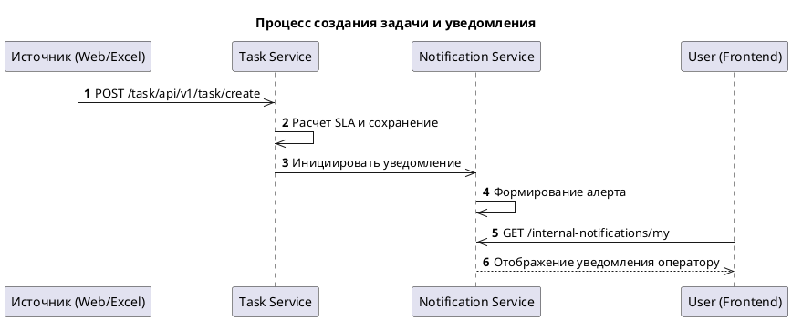

* **Изоляция данных:** Сервис использует собственную схему `task` в базе `kcell_test_db`.
* **Миграции:** В отличие от некоторых других модулей, в `task` включен **Liquibase** (`enabled: true`), что позволяет автоматически обновлять структуру таблиц при деплое через файл `db.changelog-client.x`
* **Пул соединений:** HikariCP настроен на `maximum-pool-size: 10`, что балансирует нагрузку на базу при массовой обработке задач.

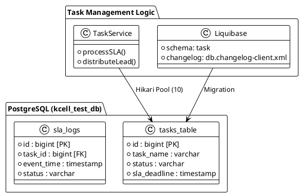

**Для специалистов:**
Распределение лидов работает по алгоритму **Round Robin** (поровну между активными). Система проверяет статус сотрудника: если он на «Обеде» или «Перерыве», лиды на него не падают. Если лид — дубликат, система не создает новую запись, а привязывает его к уже открытому лиду, повышая его приоритет.

### Визуализация: Жизненный цикл заявки

**Фрагмент кода**

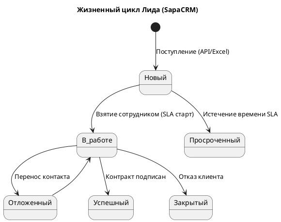

---

## Глава 5. Интеграционный слой и Реестр API

### Нарратив: Endpoint Registry и унификация доступа

Для обеспечения масштабируемости и удобства интеграции, SapaCRM использует строгую иерархию URL. Все микросервисы скрыты за единым шлюзом API Gateway (`bi-gateway`), который маршрутизирует трафик на основе пути. Это позволяет внешним системам и фронтенду использовать единую точку входа `api-kcell.sapacrm.kz`.

**Для бизнеса:**
Единый стандарт API означает, что система готова к быстрому расширению. Подключение нового канала продаж или интеграция с новым партнером не требует переписывания всей системы — достаточно добавить новый маршрут в реестр шлюза.

Вы можете загружать базы для обзвона файлами до  **50 МБ** . Если интернет до хранилища файлов временно пропадет, система перейдет в «режим выживания» ( **Degraded Mode** ) и сохранит файл на свой диск, чтобы вы могли продолжить работу.

CRM не должна хранить PDF-файлы внутри базы данных — это делает её медленной. Для этого есть микросервисы `data` и `doc`.

**Для специалистов:**
Принята унифицированная структура URL: `https://api-kcell.sapacrm.kz/{service-name}/api/v1/{resource}`. Ключевые точки входа:

* **Users Service (`/users/`):** Управление матрицей доступа и ролями сотрудников.
* **Notification Service (`/notification/`):** Центральный хаб для системных и пользовательских пуш-уведомлений.
* **Management Service (`/management/`):** Доступ к справочникам через метод `/config/web/all`.
* **Message Service (`/message/`):** Перспективный шлюз для асинхронной отправки внешних уведомлений (SMS/Email), находящийся в стадии интеграции.

### Визуализация: Маршрутизация через API Gateway

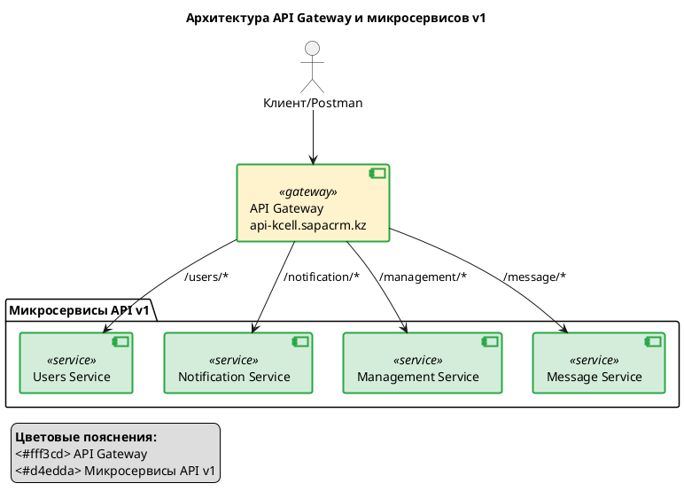

* **Data Import Service:** Изолирует процесс парсинга. Использует библиотеку `Alembic` для миграций и `HikariCP` для управления пулом соединений. Жесткий лимит `DB_POOL_SIZE=10` гарантирует, что массовый импорт не заберет на себя все ресурсы PostgreSQL, оставив коннекты для работы операторов в реальном времени.
* **Doc Service:** Работает как S3-прокси. Он не отдает прямые ссылки на файлы (это небезопасно), а генерирует **Presigned URLs** — временные зашифрованные ссылки, которые "живут" несколько минут.
* **Message Service:** Асинхронный шлюз (`https://api-kcell.sapacrm.kz/message/`), который отвечает за доставку SMS и уведомлений, разгружая основной API от ожидания ответа от внешних провайдеров.

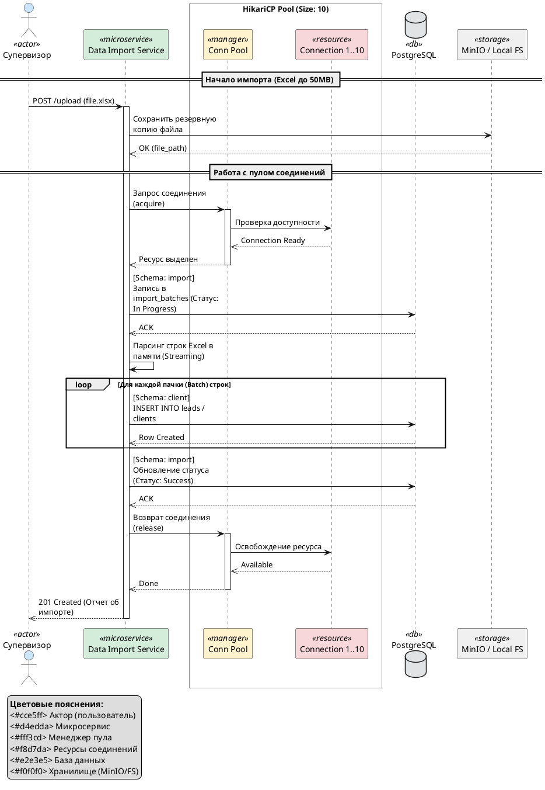

---

## Глава 6. Инфраструктура и Развертывание

### Нарратив: Где живет SapaCRM?

Система живет в современном «контейнерном» парке (Kubernetes). Это значит, что она может автоматически восстанавливаться после сбоев.

**Для бизнеса:**
Управление справочниками стало проще. Если нужно добавить новый город или новый маркетинговый канал, администратор делает это в микросервисе `management`. Изменения мгновенно разлетаются по всей системе без перезагрузки и помощи программистов.

**Для специалистов:**
Развертывание идет через Helm-чарты.

* **БД:** PostgreSQL 14+. Тестовый IP: `5.35.107.71`.
* **Конфигурация:** Все настройки (пароли к БД, секреты Keycloak) передаются через переменные окружения (`.env`), монтируемые из Vault.
* **Миграции:** Liquibase временно отключен в конфигах (`enabled: false`), управление схемами идет через ручные SQL-скрипты для полного контроля над структурой `client`, `users` и `management`.

### Технические параметры тестовой среды:

* **База данных:** Единый инстанс PostgreSQL (`5.35.107.71:5432`) с базой данных `kcell_test_db`.
* **Стратегия миграций (Liquibase):** В системе принята гибридная политика. Для сервиса `task` включен автоматический контроль схем (`spring.liquibase.enabled: true`) для управления динамической логикой задач. Для остальных сервисов (client, management) миграции отключены в пользу ручного контроля DDL, что минимизирует риски блокировок при обновлении.
* **Управление ресурсами (HikariCP):** Для предотвращения исчерпания пула соединений БД и блокировок (Deadlocks), установлен жесткий лимит `maximum-pool-size: 10` на каждый микросервис.

### Визуализация: Карта развертывания

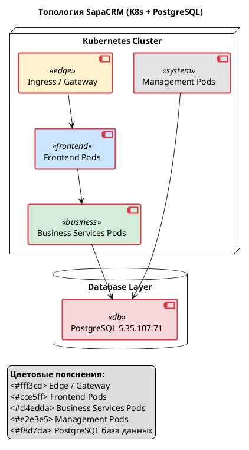

---

**Документ составлен для АО «Kcell».**
*Все технические параметры (IP, URL, Port) соответствуют актуальному состоянию тестового окружения.*

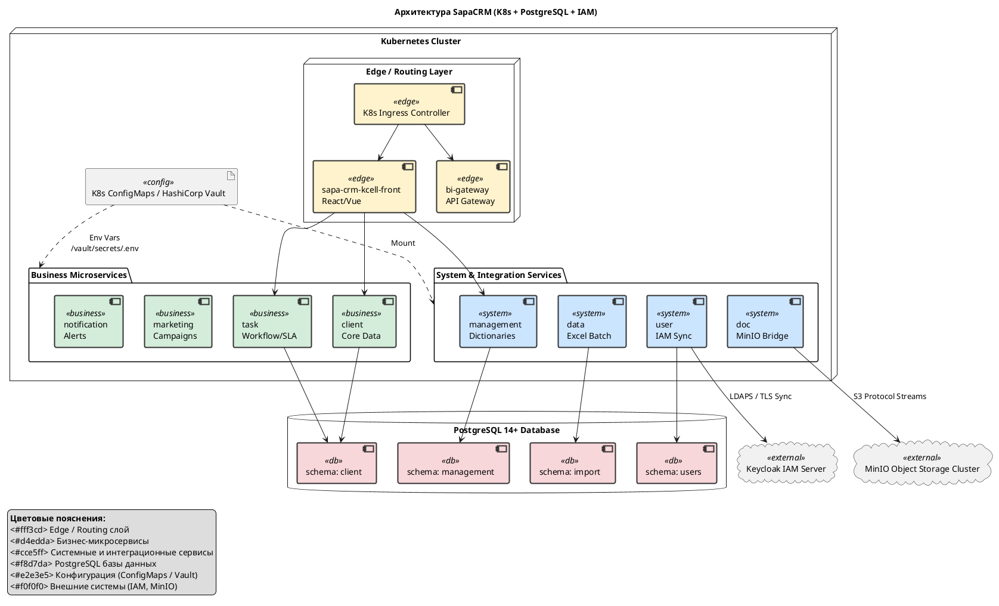
