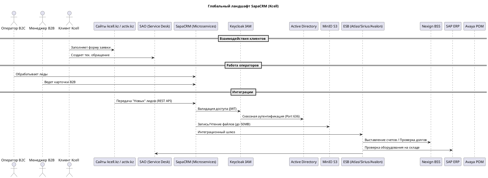

**Глава 1. Бизнес-контекст и глобальный ландшафт системы (SapaCRM)**

 1. Нарратив: Роль SapaCRM в экосистеме Kcell

Представьте себе кровеносную систему крупного телеком-оператора. Ежедневно генерируются тысячи обращений: физические лица (B2C) заказывают новые смартфоны на сайте `kcell.kz`, а крупные корпорации (B2B) запрашивают расширение выделенных VPN-каналов или закупку сотен M2M SIM-карт. До внедрения единой платформы эти процессы могли быть разрозненными. **SapaCRM** спроектирована как единый цифровой хаб, который консолидирует управление продажами, обслуживанием и документооборотом.

С точки зрения бизнеса, система решает три фундаментальные задачи:

1. **Омниканальный сбор и маршрутизация Лидов:** Лиды поступают из веб-витрин (`kcell.kz`, `activ.kz`), интегрированных систем (OMNI, SAO), IVR или массово импортируются через Excel супервизорами. Далее они распределяются между сотрудниками. Например, лиды сегмента B2C Online Shop распределяются строго поровну между свободными операторами, а лиды B2B Strategic Accounts (SA) направляются напрямую руководителю подразделения.
2. **Контроль жизненного цикла (SLA):** Вы предоставили статусную модель. Теперь мы четко видим воронку: Лид рождается как  **«Новый»** , берется **«В работу»** (с жестким таймером SLA — 15 минут для B2C и 8 часов для B2B), может быть переведен в  **«Отложенный»** , упасть в **«Просроченный»** (если таймер истек) и, наконец, завершиться как **«Успешный»** (продажа/контракт) или **«Закрытый»** (отказ).
3. **Единое окно клиента (Схема `client`):** Сбор всей информации в одной сущности — от контактных лиц и доверенностей до активированных продуктов (Cloud PBX, интернет) и активных блокировок (например, из-за задолженности).

**Архитектурный вызов (График релизов)**
Как Lead Enterprise Architect, я обязан подсветить главный риск ландшафта:  **временной разрыв внедрения** . Согласно Приложению №6, ядро SapaCRM стартует в марте 2026 года. Однако телефония (Avaya POM), необходимая для контакт-центра B2C, появится только в июле 2026, а критически важные мастер-системы (SAP ERP для складов и бухгалтерии, DWH для исторических данных) — в феврале 2027 года. Это означает, что первый год своей жизни SapaCRM будет работать в условиях "информационного голода", компенсируя отсутствие интеграций ручным импортом данных (микросервис `data`) и деградированными режимами работы.

---

 2. Визуализация: C4 System Context Diagram

Ниже представлена диаграмма системного ландшафта (уровень C4 Context). Она показывает, где именно находится SapaCRM, кто ей пользуется и с какими смежными системами телекома она общается.

