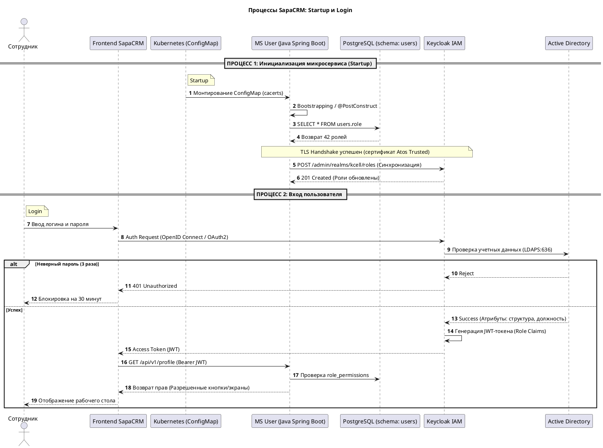

## Ответ Gemini

**Глава 2. Подсистема IAM и Безопасность (Как устроен доступ)**

### 1. Нарратив: Многоуровневая безопасность и синхронизация ролей

В системе масштаба SapaCRM, где одновременно работают операторы B2C (Online Shop), администраторы B2B (SME), юристы по взысканию задолженностей и топ-менеджмент, критически важно разделить доступ к данным. Бизнесу нужна уверенность, что оператор Telesales не сможет увидеть финансовые контракты крупного корпоративного клиента, а уволенный сотрудник моментально потеряет доступ ко всем системам.

Для решения этой задачи в SapaCRM реализована гибридная многоуровневая модель IAM (Identity and Access Management):

**Уровень 1: Аутентификация (Кто ты?)**
Источником правды (Master Data) для учетных записей является корпоративная  **Active Directory (AD)** . CRM не хранит пароли пользователей (несмотря на наличие legacy-поля `password` в БД, оно не используется для входа). Когда сотрудник пытается войти в CRM, запрос маршрутизируется в брокер  **Keycloak** . Keycloak по протоколу LDAPS (порт 636) стучится в AD, проверяет логин/пароль и статус блокировки (правило 3 попыток и блокировка на 30 минут). Если всё верно, Keycloak генерирует зашифрованный JWT-токен и отдает его фронтенду.

**Уровень 2: Авторизация (Что тебе можно?)**
Получив токен, Frontend делает запросы к Backend API (через API Gateway). Авторизация внутри SapaCRM построена на жестком RBAC (Role-Based Access Control) в изолированной схеме базы данных `users`:

* Таблица `users.api` содержит реестр всех модулей системы (например, `TASK_MANAGER` с корневым путем `/task-manager`).
* Таблица `users.role` содержит 42 бизнес-роли (например, `B2B_SUP_LEAD`, `DB_LAW_USR`).
* Матрица `users.role_permissions` связывает роли и API, задавая конкретные CRUD права (`create`, `read`, `update`, `delete`).

**Архитектурное решение инцидента с SSL/TLS (Реверс-инжиниринг)**
Ранее мы столкнулись с цикличным падением микросервиса `sapa-crm-kcell-user`. При старте контейнера срабатывал класс `KeycloakRoleInitializer`, который пытался по REST API автоматически создать в Keycloak роли из базы данных CRM. Так как Keycloak защищен корпоративным сертификатом (выпущенным центром `Atos TrustedRoot 2011`), стандартная JVM Java 17 отказывалась доверять этому соединению, выбрасывая ошибку `PKIX path building failed`.

Вы подтвердили классическое и надежное Kubernetes-native решение:

1. Создается ConfigMap из бинарного файла хранилища сертификатов:
   `kubectl create configmap cacerts --from-file=cacerts=cacerts`
2. Этот ConfigMap монтируется внутрь пода микросервиса `user` (перезаписывая дефолтный `cacerts` внутри JRE или передаваясь через `JAVA_OPTS="-Djavax.net.ssl.trustStore=..."`).
   Теперь микросервис легитимно устанавливает TLS-хэндшейк с Keycloak и автоматически синхронизирует все 42 бизнес-роли при каждом деплое. Ручной импорт ролей больше не требуется.

---

### 2. Визуализация: Sequence Diagram (Инициализация и Вход)

Ниже представлена диаграмма последовательности, иллюстрирующая два ключевых процесса: технический старт микросервиса (с применением вашего решения по `cacerts`) и бизнес-процесс входа пользователя.

