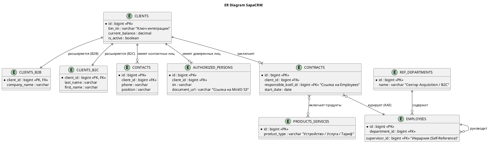

## Глава 3. Ядро системы — Доменная модель «Карточка Клиента» (Первая итерация ТЗ на БД)

### 1. Нарратив: Устройство клиентских данных и оргструктуры

Сердцем платформы SapaCRM является микросервис `client` и его база данных. Из 51 таблицы в схеме `client` формируется полное представление о том, кто такой клиент Kcell, какими продуктами он пользуется и кто из сотрудников имеет право с ним работать.

**1.1. Паттерн наследования клиентов (Class Table Inheritance)**
В телекоме данные физических лиц (ИИН, пол) кардинально отличаются от данных юридических лиц (БИН, название компании). Чтобы база данных оставалась нормализованной (3НФ), разработчики применили паттерн наследования:

* Таблица `clients` выступает «ядром». В ней хранятся общие финансовые метрики (балансы, лимиты), флаги активности и суррогатный ключ `id`. Внешнего ключа биллинга (Nexign) на данный момент нет, идентификация идет строго по полю `bin_iin`.
* Специфичные атрибуты вынесены в таблицы-расширения: `clients_b2b` (связывается 1:1 по `client_id`) и `clients_b2c`.

Таблица `clients`

**1.2. Организационная структура и маршрутизация**
SapaCRM — это не просто хранилище, это инструмент workflow. Таблица `employees` хранит всех сотрудников и связана со справочником `ref_departments`. Самое важное здесь — поле `supervisor_id` (ссылающееся на эту же таблицу). Именно благодаря этой рекурсивной связи система понимает иерархию: если лид сегмента B2B Strategic Accounts (SA) должен упасть на руководителя, Backend API делает рекурсивный SQL-запрос, находя сотрудника с нужным `department_id`, у которого `supervisor_id` равен `NULL` (или указывает на директора дирекции).

**1.3. Архитектурный долг: Контакты и Доверенные лица**
В текущей реализации ТЗ заложен риск рассинхронизации данных. Существуют две физически не связанные таблицы:

* `contacts` — Контактные лица (LPR, технические специалисты).
* `authorized_persons` — Доверенные лица с прикрепленными PDF-сканами из MinIO.
  Если один и тот же человек (например, Технический директор) является и контактом, и доверенным лицом, система создаст две разные записи. При смене его номера телефона оператору придется обновлять данные в двух разных вкладках карточки клиента.

### 2. Визуализация: ER-диаграмма домена "Клиент"

Ниже представлена структура базы данных, описывающая логику хранения карточки клиента, его продуктов и контактов.

### 3. Динамический блок вопросов (Для перехода к Главе 4)

В **Главе 4** мы будем описывать  **Управление бизнес-процессами: Лиды, Активности и SLA** . Благодаря вашей прошлой подсказке, у меня есть статусы лидов («Новый», «В работе», «Отложенный», «Просроченный», «Успешный», «Закрытый»). Для формирования технического дизайна логики Task Manager Service, ответьте на следующие 2 вопроса:

1. **Таймеры SLA:** Отсчет времени SLA (15 минут для B2C и 8 часов для B2B) начинается в момент создания лида (статус «Новый») или в момент, когда оператор берет его «В работу»?
2. **Трекинг Активностей:** В предоставленной ранее таблице `client.activities` (которая хранит звонки, email, встречи) физически отсутствует поле `status`. Однако в бизнес-требованиях B2C сказано, что *активность* может быть в статусе «запланирована». Где именно хранятся статусы активностей — планируется добавление колонки в таблицу `activities`, или этим управляет отдельный микросервис Task Manager в своей изолированной БД?
