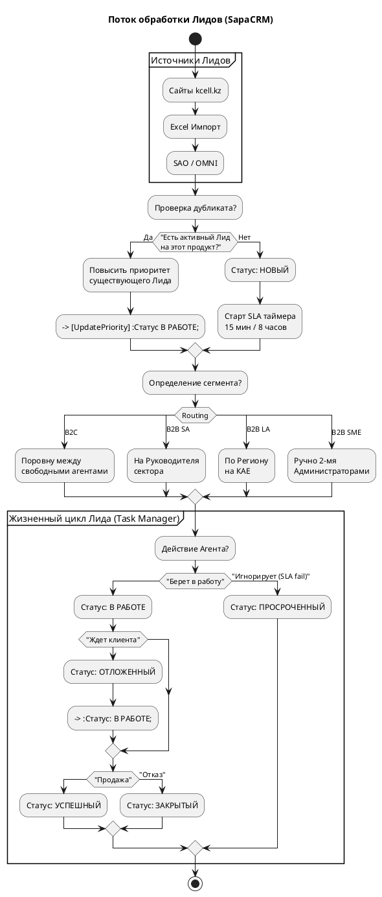

**Глава 4. Управление бизнес-процессами: Лиды, Активности и SLA**

### 1. Нарратив: Жизненный цикл продаж и обслуживание

Сердце любой CRM-системы — это способность провести клиента от первого касания до успешной сделки, не потеряв его по пути. В SapaCRM этот процесс управляется через две ключевые сущности: **Лиды** (потенциальные сделки) и **Активности** (коммуникации с клиентом).

**1.1. Омниканальное поступление и Маршрутизация (Routing)**
Лиды в систему поступают из множества источников: интеграция с витринами `kcell.kz`/`activ.kz`, тикеты из SAO, OMNI, IVR (входящие звонки) или через массовый импорт Excel-файлов супервизорами.
Как только Лид попадает в систему, микросервис `task` (Task Manager) или `client` применяет жесткие правила маршрутизации в зависимости от сегмента:

* **B2C (Telesales / Online Shop):** Лиды распределяются автоматически и строго поровну между операторами, у которых установлен статус «Онлайн» (Готов к работе).
* **B2B SME (Малый и средний бизнес):** Лиды падают в общий пул, где два выделенных администратора распределяют их вручную.
* **B2B SA (Стратегические клиенты):** Лиды направляются напрямую Руководителю подразделения (вычисляется по `supervisor_id` из Главы 3), который затем спускает их подчиненным.
* **B2B LA (Крупный бизнес):** Автоматическое распределение КАЕ (Ключевым аккаунт-менеджерам) на основе привязки к региону клиента.

**1.2. Статусная модель Лида и SLA (Воронка)**
На основе предоставленных вами данных, мы фиксируем следующую конечный автомат (State Machine) для Лида:
Каждый новый лид получает статус  **«Новый»** . В этот момент включаются жесткие SLA-таймеры: 15 минут для B2C и 8 часов для B2B. Задача сотрудника — перевести лид в статус  **«В работе»** . Если он этого не делает, лид переходит в статус  **«Просроченный»** .
В процессе работы лид может быть временно  **«Отложенный»** , а финальным этапом всегда является резолюция: **«Успешный»** (договор подписан, продукт выдан) или **«Закрытый»** (отказ клиента или недозвон).

**1.3. Архитектурный долг: Активности без статусов (As-Is)**
Помимо Лидов, сотрудники создают Активности (Звонки, Встречи, Email, SMS). В бизнес-требованиях B2C строго указано:  *"в случае, если активность находится в статусе «запланирована» в течение n времени... перераспределить активности автоматически"* .
Однако, как Lead Architect, я фиксирую критический риск реализации «Как есть»: в базе данных (таблица `client.activities`)  **физически отсутствует колонка статуса** . Сейчас база может хранить только тип (`call`, `meeting`), тему, описание и автора. До тех пор, пока разработчики не добавят статусы активностей в БД или не вынесут их в отдельную таблицу микросервиса `task`, автоматическое перераспределение звонков Telesales работать не будет.

---

### 2. Визуализация: Flowchart (Маршрутизация и Жизненный цикл Лида)Ниже представлена ди

аграмма, описывающая путь Лида от источника до финального статуса, включая проверку дубликатов (дедупликацию), которая повышает приоритет текущего лида вместо создания нового.

**Фрагмент кода**

