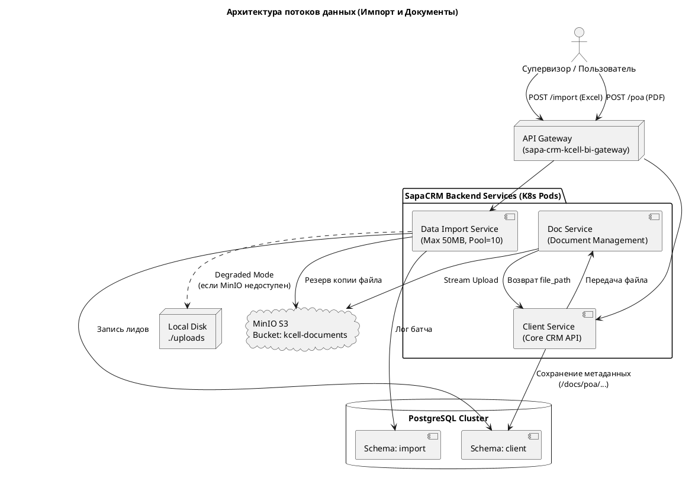

 **Глава 5. Интеграционный слой и Хранилище документов**

 1. Нарратив: Взаимодействие с внешним миром и тяжелыми данными

CRM-система не живет в вакууме. SapaCRM вынуждена ежедневно "переваривать" гигабайты данных: от тяжелых сканов доверенностей до массовых Excel-выгрузок с базами для обзвона. Для изоляции этой тяжелой нагрузки от основного бизнес-процесса выделены специализированные микросервисы.

**1.1. Data Import Service (Массовая загрузка данных)**
Этот микросервис отвечает за парсинг и импорт лидов/клиентов (например, когда Супервизор загружает базу B2C для Telesales).
Архитектурно сервис спроектирован с учетом жестких лимитов, чтобы защитить ядро базы данных от перегрузки (OOM и исчерпания пула соединений):

* **Жесткие ограничения (NFRs):** Зафиксирован лимит `UPLOAD_MAX_SIZE_MB=50` на один файл. Пул соединений с БД жестко ограничен (`DB_POOL_SIZE=10`, `DB_MAX_OVERFLOW=20`).
* **Кросс-схемная запись:** Сервис пишет историю загрузок в свою изолированную схему `import`, но при этом имеет права на вставку бизнес-данных напрямую в целевую схему `client`.
* **Отказоустойчивость (Degraded Mode):** В конфигурации заложен важнейший паттерн выживаемости. Если объектное хранилище MinIO падает или недоступно по сети, сервис не "умирает", а переходит в *degraded-режим* (сохраняя файлы локально в `UPLOAD_DIR=./uploads`), продолжая обеспечивать бизнес-процесс загрузки лидов. Для отложенной обработки используется встроенный планировщик (`SCHEDULER_COALESCE=true`).

**1.2. Doc Service и объектное хранилище (MinIO)**
Реляционная СУБД PostgreSQL (схема `client`) не предназначена для хранения бинарных файлов (PDF, JPG). Поэтому сканы договоров и доверенностей хранятся в S3-совместимом хранилище  **MinIO** .
В базе данных (в таблицах `client.documents` и `client.authorized_persons`) сохраняется только легковесная метаинформация: имя файла, размер, статус и путь (например, `/docs/poa/18/utemisov.pdf`). Сами файлы физически лежат в бакете `kcell-documents`. Микросервисы CRM ходят в MinIO по ключам `MINIO_ACCESS_KEY` и скачивают/загружают файлы по запросу фронтенда.

**1.3. Шлюз ESB (Atlas/Sirius/Avalon) и статус-кво интеграций**
Для связи с legacy-системами Kcell (Nexign BSS, CEIR, SMSC, Solar, SAP) будет использоваться корпоративная шина данных (ESB).
На данный момент (Фаза 1) интеграционный слой представляет собой архитектурный "черный ящик". В таблице `client.tickets` мы успешно сохраняем внешние идентификаторы (например, `SAO-2026-20451`), но контракты обмена (REST/SOAP, Push/Polling) с ESB находятся на стадии сбора требований (зафиксировано в файле `Вопросы_краткие_по_интгерации.md`). До реализации этих контрактов CRM будет работать в изолированном режиме, общаясь с миром только через сервисы Data Import и пользовательский интерфейс.

---

 2. Визуализация: Component Diagram (Импорт и Хранилище)

Ниже представлена диаграмма компонентов, показывающая процесс загрузки тяжелого Excel-файла с лидами и скана доверенности, а также работу паттерна Degraded Mode.

