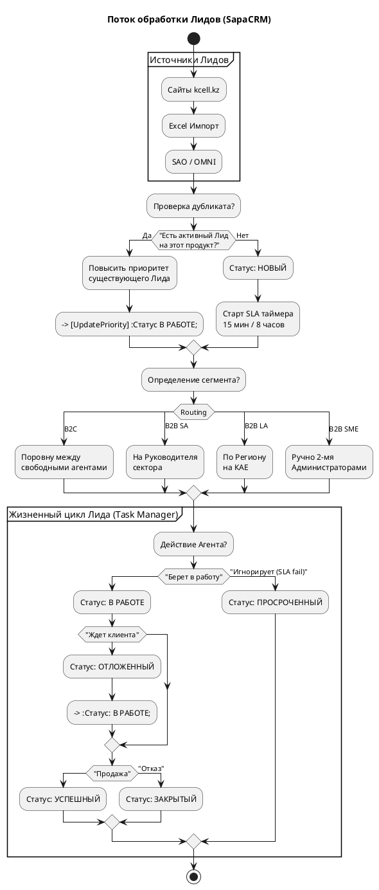

 Динамический блок вопросов (Для перехода к Главе 5)

В **Главе 5** мы будем рассматривать  **Интеграционный слой и Хранилище документов** . Мы разберем микросервисы `data` (Импорт) и `doc` (Документы), а также асинхронное взаимодействие с внешними системами.

Для детального описания интеграционных механизмов мне нужны ответы на следующие 2 вопроса:

1. **Обработка ошибок при массовом импорте (Data Import Service):** Когда супервизор загружает Excel-файл с базой B2C-лидов (до 50 МБ), что должна сделать система, если в середине файла обнаруживается 10 строк с невалидными номерами телефонов? Стратегия *Fail-Fast* (остановить импорт и откатить весь файл) или *Skip-and-Continue* (импортировать правильные строки и выдать пользователю отчет об ошибках)?
2. **Интеграция с SAO (Тикеты):** В файле `12_activities_tickets.sql` мы видели, что CRM хранит `sao_id` и статус (`open`, `resolved`). Как именно CRM узнает о том, что статус тикета в SAO изменился на `resolved`? SAO присылает нам асинхронный Webhook (Push) через ESB, или SapaCRM должна сама регулярно опрашивать (Polling) шину ESB по активным тикетам?

---
