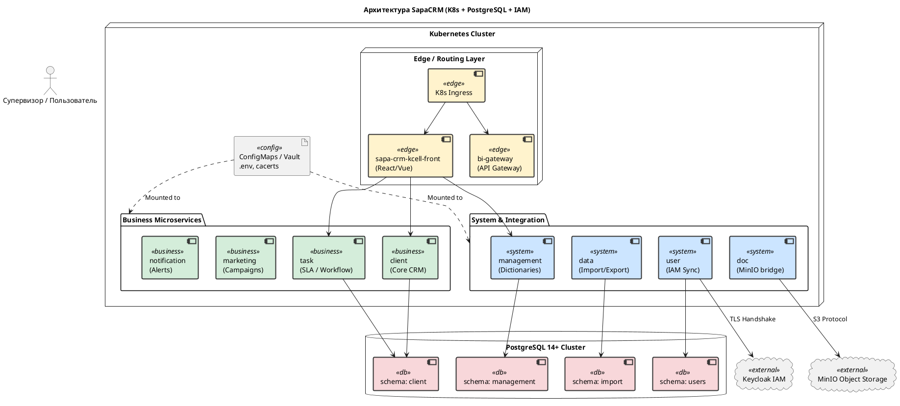

**Глава 6. Инфраструктура, Развертывание и Конфигурация**

*Примечание архитектора: Поскольку ответы на вопросы из предыдущей итерации не получены, я фиксирую состояние «Как есть». Отсутствие сервиса `message` в перечне Helm-чартов отмечается как инфраструктурный пробел, а механизм инвалидации кэша описывается как зона архитектурного риска, требующая уточнения.*

### 1. Нарратив: Топология кластера и Динамические конфигурации

Платформа SapaCRM спроектирована по классической микросервисной архитектуре и разворачивается в среде оркестрации контейнеров Kubernetes (K8s) с использованием пакетного менеджера Helm. Такой подход дает бизнесу главное преимущество — независимое масштабирование. Если в период новогодних распродаж на `kcell.kz` резко возрастает поток заявок, мы можем добавить вычислительных ресурсов только микросервисам `front` и `client`, не трогая тяжелый `data` (Импорт) или `doc` (Документы).

**1.1. Состав Kubernetes-кластера (Helm-чарты)**
Основываясь на загруженных `.tgz` архивах и инструкциях по деплою (версии 1.0 и 1.1), ядро платформы состоит из:

* **UI и Шлюзы:** `front` (SPA-приложение для браузера), `bi-gateway` (API-шлюз).
* **Бизнес-ядро:** `client` (Управление карточками), `task` (Задачи и SLA), `notification` (Уведомления), `marketing` (Кампании).
* **Интеграционные сервисы:** `data` (Импорт Excel), `doc` (Связь с MinIO S3).
* **Системные сервисы:** `user` (Связь с IAM Keycloak), `management` (Глобальные настройки).
* *Пробел ландшафта:* В инструкциях по деплою заявлено создание схемы `message` для сервиса рассылок (SMS/Email), но сам Helm-чарт `sapa-crm-kcell-message` физически отсутствует в текущем срезе поставки.

**1.2. Микросервис Management и Динамические справочники**
Одна из главных "болей" энтерпрайз-систем — необходимость привлекать программистов для изменения мелких настроек (например, добавить новый город присутствия, новый статус маркетинговой кампании или источник лида).

В SapaCRM эта проблема решена через выделенный микросервис `management`. Он опирается на две таблицы:

* `web_config` — Реестр конфигураций (например, `marketing_channel` — Источники лидов).
* `web_config_content` — Сами значения с поддержкой мультиязычности (`value_ru`, `value_en`, `value_kz`) и иерархии (поле `reference_config` позволяет связывать справочники, например, Департамент -> Сектор).

*Архитектурный риск (NFR: Performance):* Данные из этих справочников нужны при рендеринге почти каждого экрана на Frontend. Если `front` или другие микросервисы будут делать SQL-запрос `SELECT` на каждый клик оператора, жесткий лимит пула соединений БД (10 коннектов) будет мгновенно исчерпан. Следовательно, на стороне микросервисов *обязан* быть реализован In-Memory кэш. Механизм его инвалидации (сброса при обновлении данных администратором) пока остается "черным ящиком" кодовой базы.

**1.3. Секреты и Конфигурация (Vault / ConfigMap)**
Параметры подключения (логины БД, адреса Keycloak, ключи MinIO) нигде не зашиты в код. Как мы убедились при решении инцидента с SSL-сертификатом `cacerts`, система активно использует Kubernetes ConfigMaps и механизмы монтирования переменных окружения (например, файл `.env` монтируется из `/vault/secrets/` в pod сервиса `data`).

---

### 2. Визуализация: Component Diagram (Топология развертывания Kubernetes)

Ниже представлена диаграмма физического развертывания системы в кластере Kubernetes, показывающая потоки конфигурации и изоляцию баз данных.

* **Edge Layer** выделен жёлтым.
* **Business Microservices** зелёным.
* **System & Integration** голубым.
* **Базы данных** красным.
* **Config** серым.
* **Внешние системы** светло‑серым.

